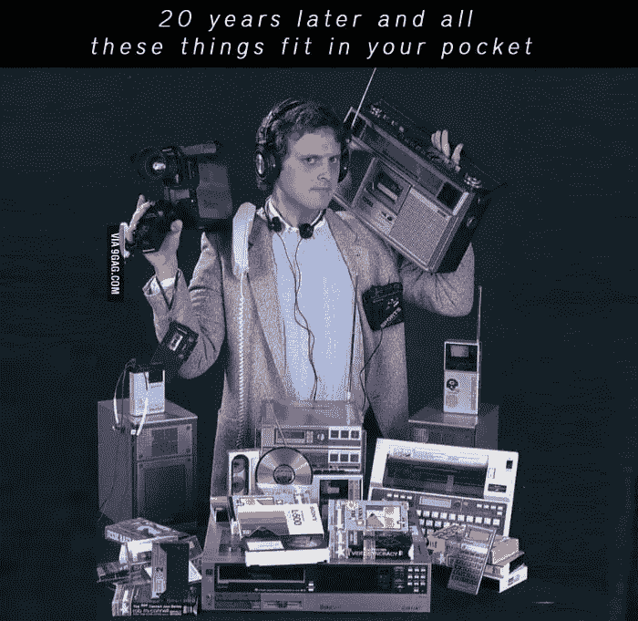

# 360 IT 检查# 45-大规模技术裁员，苹果破纪录的 Q1 2022，等等！

> 原文：<https://medium.com/geekculture/360-it-check-45-massive-tech-layoffs-apples-record-breaking-q1-2022-and-more-4dfac1bd20c?source=collection_archive---------15----------------------->

# 后疫情时代的“重置”导致了技术领域的大规模“裁员”

如果你关注股票&加密货币市场，你的投资可能会比你预期的下跌更多。美联储政策的变化，加上地缘政治局势和封锁的结束，导致科技公司在股市上遭受重创。

这反过来意味着一些技术人员可能会失业，或者他们已经失业了。在第一波锁定期间，科技公司的价值飙升，其股票出现可观的涨幅。当谈到新冠肺炎时，有了疫苗和疫苗接种，世界上大多数人现在告别了限制，可以像疫情只是一个可怕的噩梦一样生活。俄罗斯入侵乌克兰导致包括网飞在内的多家公司退出俄罗斯市场，从而降低了它们的利润。

对于科技工作者来说，噩梦现在开始了。随着一些科技公司的业绩最近大幅下滑，这些公司需要采取行动来改善财务表现。削减成本的计划开始滚动进行，减少员工数量排在第一位。世界上最大的两个网络应用程序 Meta 和网飞都分别采取了冻结和裁员的措施。其他公司不得不解雇 25%的员工。).这也是因为许多科技公司是由风险资本家资助的，他们决定慢慢来，稍微收缩一下。[引用华尔街日报](https://www.wsj.com/articles/the-tech-industrys-epic-two-year-run-sputters-11652002382?mod=hp_lead_pos1):

> *不断上升的利率已经开始抑制资本在科技投资中寻求高回报。实体餐馆和商店的重新开业削弱了对在线订购商品的需求，促使电子商务公司重新调整其扩张。*

**底线**

这些公司苦苦挣扎的事实绝不是失去工作的人的错。可悲的是，他们是受到高层糟糕的财务规划打击的人。公平地说，科技工作者是世界上收入最高的专家。有些人甚至会说他们的薪水高得有点失控。

尽管如此，裁员潮肯定会对招聘市场造成巨大冲击。鉴于对软件工程师服务的需求将会下降，他们的工资可能会有所下降，而与此同时，这类专家的供应却在稳步增长。

*更新:*优步刚刚宣布冻结招聘，从现在起[“招聘将被视为‘特权’”](https://www.businessinsider.com/uber-ceo-dara-khosrowshahi-cutting-costs-hiring-privilege-incentive-spend-2022-5?IR=T)。

# 币安获准在法经营

全球最大的加密货币交易所币安在收购了 Twitter 的部分股份后，已经获得了法国监管部门的批准。获得的许可证将允许币安在该国作为数字资产服务提供商运营。

这对币安来说是一个重大进展，因为这是该交易所首次获得官方批准在欧洲国家运营。

币安也宣布投资 1 亿€给[支持法国区块链和密码产业](https://www.binance.com/en/blog/leadership/binance-announces-objective-moon-100m-eur-crypto--blockchain-initiative-in-france-421499824684902998)的发展。

该倡议将在法国建立一个币安研发中心，并与 OpenClassroom 和 Ledger 合作推出一个新的在线教育项目，以培养区块链和加密行业的人才。

该倡议被恰当地命名为“月球行动”。

**底线**

尽管币安在声明发布前已经在法国运营，但它现在可以合法地为其服务做广告。这也将使他们更广泛地接触潜在客户，加速大规模采用。

继去年中国的加密禁令后，币安争先恐后地在中国以外寻找新的总部，据报道，它仍在寻找新的总部。该公司在 12 月表示，将撤回其许可证申请，并关闭在新加坡的业务，这些业务实际上是在 2021 年与许多其他中国加密公司一起转移到新加坡的。

在法国政府授予该公司在当地提供服务的权利后，他们最近决定将巴黎作为他们新的欧洲中心。这一举措可能会为其在欧洲更重要的存在和合法性铺平道路。

# 苹果预计将宣布破纪录的 Q1 2022

当谈到在科技世界的成功时，苹果公司不可否认地处于他们游戏的顶端。在过去的一个季度，这家来自加州的公司公布了创纪录的 1239 亿美元的收入和 346 亿美元的季度净利润，这无疑让他们的股东感到高兴。

苹果继续在 Mac 销售上创造可观的收入，有史以来首次突破 100 亿美元大关。随着 Apple Music、Apple TV+和 App Store 产品的流行，他们的服务业务增长了 195 亿美元。来自 iPad 系列的收入落后于历史最高水平。据报道，更大的供应限制阻碍了这些成果。

创造收入的最大份额仍然是 iPhone 的流行，受 iPhone 13 的推动，他们的[手机占收入的 50%以上](https://www.macrumors.com/2022/01/27/apple-1q-2022-earnings/)。苹果手机仍然是该公司提供的产品中的佼佼者。

**底线**

社会已经变了，对于我们大多数人来说，浏览网络或观看猫的视频不再发生在我们的电脑上。我们通常只在工作、教育和网上购物时使用电脑。

一家电脑公司成为手机和可穿戴设备制造商，同时又是流媒体业务的重要参与者，这并不奇怪。

根据宽带搜索追踪的[数据，现在全球 56%的互联网流量发生在移动设备上，比 2015 年增长了 21%。我们大多数人使用社交媒体和手机上的信使。甚至 LinkedIn 的商务用户也主要使用手机。](https://www.broadbandsearch.net/blog/mobile-desktop-internet-usage-statistics)

部分由于疫情，设备的非接触式支付在过去几年也出现了大幅增长，增加了 iPhone 和 Apple Watch 可以提供的众多功能。

Source: [https://miro.medium.com/max/700/0*H-q9P_DSjgTr7Kd6.jpg](https://miro.medium.com/max/700/0*H-q9P_DSjgTr7Kd6.jpg)

苹果的战略使其成为科技的标志，无论你喜欢还是讨厌它们。但根据他们的收入记录，他们正在采取正确的措施来满足客户不断增长的需求。

# 埃隆·马斯克的推特传奇就此结束了吗？

亿万富翁、SpaceX、特斯拉的创始人、EDM 生产商埃隆·马斯克(Elon Musk)已经同意以 440 亿美元的股票收购 Twitter，使其成为一家私营公司。他现在将控制他自我推销的主要渠道，宣传他的企业，张贴迷因，并揭露他最新的泵和转储计划。

马斯克多年来一直直言不讳地批评 Twitter，称审查是他的主要抱怨之一，但他认为这个平台作为一个交流思想的地方有很大的潜力。

" Twitter 是一个数字化的城市广场，在这里人们可以讨论对人类未来至关重要的问题."马斯克[在一份声明中说](https://www.prnewswire.com/news-releases/elon-musk-to-acquire-twitter-301532245.html)。

在马斯克的所有权下，Twitter 将继续作为一个独立的实体运营，重新关注安全和用户体验。

**底线**

首先是股票购买。

迄今为止，70 亿美元的投资来自一群高调的投资者，包括科技大亨拉里·埃里森、卡塔尔国家投资基金和世界最大的加密货币交易所币安。如果马斯克的储蓄罐干涸，他找不到其他人加入投资集团，如果他终止协议，他将面临 10 亿美元的损失。

马斯克计划暂时管理公司的日常事务，收购消息的宣布几乎立刻影响了特斯拉的股价。

所以，生意越来越稳定；接下来是什么？

他表示希望 Twitter 的直接消息(DM)像 Signal 一样使用[端到端加密，这是隐私和安全的一个胜利。](https://thehackernews.com/2022/04/twitters-new-owner-elon-musk-wants-dms.html)

然而，最重要的提议改变是增加了一个编辑按钮，这将会引起轰动。

现在谈谈道德。我们允许每个人都有发言权吗，不管是什么？

马斯克过去一直直言不讳地批评推特禁令，最明显的是对特朗普总统的账户被封感到不安。关于对他至关重要的利益，马斯克对言论自由有自己的看法，但这是否意味着 Twitter 不知道如何在不被错误信息充斥的情况下允许不同的想法?[?时间会证明一切。](https://www.bloomberg.com/news/articles/2022-04-28/why-spam-bots-are-top-of-elon-musk-s-twitter-hit-list-quicktake)

# 新雷迪斯

Redis 是一个数据库，主要用于缓存。通常，升级你正在使用的软件是一件痛苦的事，因为会有大范围的突破性变化。Redis 的情况并非如此，[因为向后兼容一直是 Redis 项目的一个设计原则。](https://redis.com/blog/redis-7-generally-available/)“总的来说，新版本”包括了几乎每一个方面的改进。”

**底线**

改进的 Redis 意味着许多 web 应用程序的缓存机制现在更好了。首先，“7.0 版本增加了近 50 个新的命令和选项来支持这一演变并扩展 Redis 的现有功能”，尽管真正的 MVP 是你看不到或无法与之交互的功能。

> *[T]在这个版本中，真正的“无名英雄”是努力使 Redis 更加高效、稳定和精简。我们开发人员的很大一部分脑力劳动都投入到 Redis 的运作中，通过关注其性能和所使用的资源来提高其效率。Redis 7.0 对它管理的几乎每个子系统都进行了大量改进，包括内存、计算、网络和存储。*

# C# 11 的新特性

C# 11，微软编程语言的最新版本(它绝对不是微软的 Java)，即将升级。NET 7。

C#是最常见的开发语言。NET 平台。虽然，是的，技术上你可以使用 F#或 VB.NET，但实际上，很少有人这样做。至于为什么会这样，那是另一篇文章的主题。

回到 c# 11——有几个特性应该让开发人员感到兴奋:

*   对字符串的改进
*   更好的模式匹配
*   运行时性能的改进

可悲的是，有一个特性可以让检查空参数变得轻而易举，但是……它被移除了。为什么？[团队解释说](https://github.com/dotnet/csharplang/blob/main/meetings/2022/LDM-2022-04-13.md)“这不是我们通常希望看到的 C#特性的绝大多数，特别是像这个特性一样广泛适用的特性。”一方面，没有人可以责怪团队以这种方式根据他们的数据行事。另一方面，这个特性的增加并不会消除检查 *null 的其他方法。毫无疑问，社区的反应可以被看作是奇怪的。*

**底线**

新引入的特性和变化感觉很好，尽管失去了用两个字符而不是一整行来执行常用检查的方法的余味感觉并不好。我们动作中的苦涩味道将会被甜美的性能提升所抵消，而不需要我们付出任何努力，以及对弦乐处理方式的改进。

# 。网毛伊岛和 Tizen

Tizen 是三星的一项失败投资。你看，回到手机早期，有一个操作系统，Bada OS。它首次出现在市场上运行在三星波。这是一部很棒的手机，尽管操作系统是个问题。Bada(在很大程度上)是不稳定的，而应用程序的缺乏肯定没有帮助。几年后，三星意识到了他们的错误，将 Bada 更名为 Tizen，并改变了用途，例如让操作系统在电视上运行。在那里找到他们的家，这使得该系统非常受欢迎，因为三星电视被认为是最好的电视品牌之一。

。由于三星. NET. Tizen 团队的巨大努力，NET MAUI 现在增加了对以电视为中心的操作系统的支持。

给予。NET MAUI a shot，按照[https://docs . Microsoft . com/dot NET/MAUI/get-started/first-app](https://docs.microsoft.com/dotnet/maui/get-started/first-app)上的指南安装 Visual Studio 2022 Preview。

**底线**

没有人会对微软的新框架支持三星的操作系统感到惊讶。很棒的是，来自雷德蒙的公司设法保留了相同数量的平台，同时使工具更加有组织。开发团队和 solo 开发者会感谢三星将 Tizen 作为目标的努力。

**奖励主题:**

1.  jQuery 如何改变了 web 开发的世界。

2.你是围棋开发者吗？为了继续使用这种语言，你必须对自己撒谎吗？

致所有的 Go 开发者:你可能会对阅读这篇文章感兴趣:[阿莫斯](https://twitter.com/fasterthanlime)写的“我们告诉自己继续使用 Golang 的谎言”。

‍

【https://www.itmagination.com】最初发表于**。**