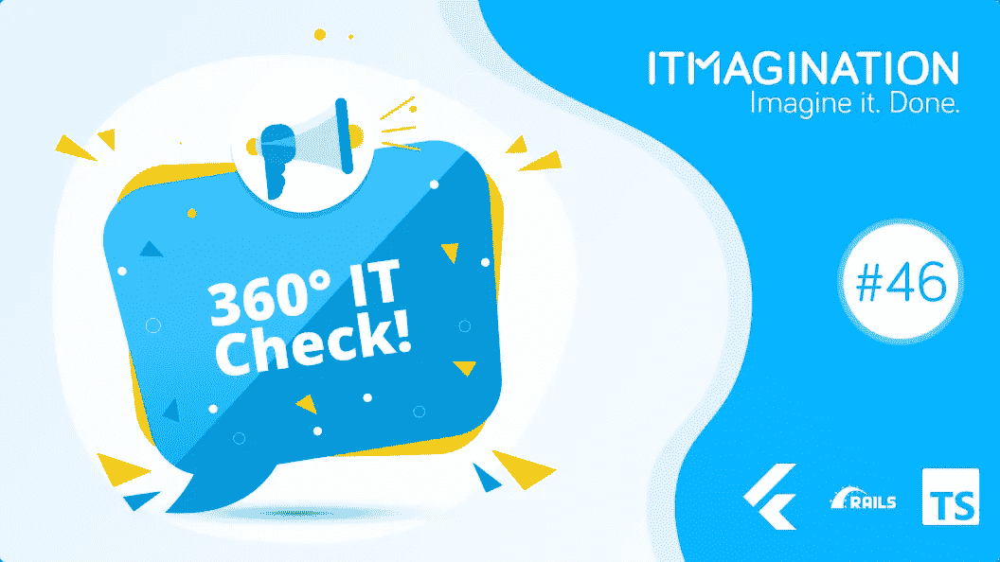

# 360 IT Check #46 —将 370 万行代码迁移到 TypeScript、Flutter 3 等等！

> 原文：<https://medium.com/geekculture/360-it-check-46-migrating-3-7-million-lines-of-code-to-typescript-flutter-3-and-more-eef70ad2ac80?source=collection_archive---------14----------------------->

# 将数百万行代码迁移到 TypeScript

最著名的支付处理服务背后的公司 Stripe 分享了一篇关于他们从 JavaScript (JS) & Flow 迁移到 TypeScript (TS)的博文。用他们一名员工的话说:

> *严重虚幻。我记得不久前，我还在嘲笑 TypeScript 曾经登陆 Stripe 的想法，然后我在圣诞节的周一早上醒来，它就在这里了。*

迁移超过 370 万行(是的，真的)代码一定是一个令人厌倦的漫长过程…在某种程度上的确如此。该公司利用了其他公司，即 Zapier 和 Airtable，从 Flow 迁移到 TS 的经验。他们还重用了他们的自动化工具，将确保类型安全的一种方式转变为另一种方式。在工具的最初阶段，它发现了比 Flow 更多的问题。

仪表板代码库的首次通过创建了超过 97，000 个错误抑制。通过我们更新 *codemod* 的迭代方法，我们能够将这个数字降低到 37，000，或者大约每千行代码一个。作为比较，流代码有大约 5000 个错误抑制。

错误抑制不好，因为这意味着实际检查的代码行更少，除了……尽管如此，TypeScript 比 Flow 更有用！Stripe 的团队将此归因于卓越的第三方支持。

在迁移的前一周，Stripe 的团队开始对他们的持续集成(CI)和测试环境进行更改。他们在前进的道路上确实遇到了一些坎坷；然而，正如该团队所承认的那样，收益远远超过了挣扎。

现在，新的工程师们很享受能够在他们熟悉的环境中工作，并且在这样的环境中工作更舒服。

**底线**

随着越来越多的工程团队开始转向 TypeScript，对 Flow 的记忆开始逐渐消失。这是有充分理由的— [微软的项目更加成功，是一个更好的解决方案，有更好的第三方支持](https://www.itmagination.com/blog/the-complete-history-of-javascript-typescript-and-node-js#typescript-comes-to-the-rescue)。

正如 Stripes 的案例所示，即使如此庞大的代码库(370 万行代码)也可以毫无障碍地迁移到 TS。整个工作花了一年时间，尽管看起来很长，但事实上并不算长。

重要的是，[该公司还公开分享了他们在任务中使用的工具](https://github.com/stripe-archive/flow-to-typescript-codemod)。在许可的 MIT 许可下，它可以在 GitHub 上免费获得。

# 颤动 3

来自谷歌的跨平台应用框架 Flutter 获得了新的重大升级。有了它，这家来自加州山景城的公司承诺了许多新功能，也许最重要的是，它承诺了来自单个代码库的移动、[、桌面和嵌入式应用。](https://flutter.dev/#:~:text=mobile%2C%20web%2C%20desktop%2C%20and%20embedded%20apps%20from%20a%20single%20codebase)

为这么多平台开发的能力本身就能节省大量时间。跨平台助手背后的团队确保继续他们帮助开发人员的传统。例如，Flutter 一直对开箱即用的组件的深度印象深刻(与 React Native 形成鲜明对比)。

Flutter 3 有什么新功能？

*   稳定支持 macOS 和 Linux
*   折叠式手机支架
*   iOS 可变刷新率支持
*   现在，浏览器中的图像解码速度明显加快

此外，开发团队正在努力开发一个名为叶轮的新渲染后端，旨在减少 iOS 上的“jank”。

**底线**

Flutter 是一款令人印象深刻的工具，用于创建具有本土感觉的应用程序。它的承诺很好地实现了，许多团队使用它在无数设备上创造伟大的体验。不过，这个框架有几个问题。承诺确实兑现了。

问题是它如何做到这一点。为了能够管理这么多平台，团队不得不求助于在不使用任何本地组件的情况下创建您在屏幕上看到的一切。当然，这让一些开发者感到有些失望。

另一个方面是对谷歌材料设计框架的强制选择。尽管这是一个非常灵活的设计系统，但是你没有选择就选择了它。是的，你确实得到了一套丰富的组件，但是你的应用程序可能会使用类似谷歌的应用程序；除非你大量定制每一位。

然后就是所谓的“镖”的问题。Dart 是一种设计非常好的编程语言，感觉类似于 Java 和 JavaScript。开发人员在 VS 代码和 Intellij 系列 ide 中获得了很好的工具，空安全也是现成的。然而，它是一种完全不同的语言。它的问题是，你必须有一个专门的 Dart 开发团队，而不是更紧密集成的全栈 JavaScript 团队。

到目前为止，Flutter 的受欢迎程度有点令人失望，尽管该框架可能需要引入 Fuchsia，这是谷歌的神秘操作系统。据传，上述工具将成为创建应用程序的默认方式。

# 首席信息官成功并购技术整合指南

并购(M&A)是一个棘手的问题。法律部门有一项艰巨的工作要做，IT 部门通常也有一段艰难的时间。

企业代码库的大部分需要整合。[正如 Stackshare.io 指出的，很少有共同的痛点](https://stackshare.io/posts/the-cios-guide-to-successful-m-and-a-technology-integration-in-2022):

*   不准确的预算
*   更高的安全风险
*   无效工具的冗余

该公司还分享了两份清单:合并前和合并后要完成的步骤。[要阅读它们，请参考博客原文。](https://stackshare.io/posts/the-cios-guide-to-successful-m-and-a-technology-integration-in-2022)

**底线**

40%的情况下，M&A 进程的成功取决于首席信息官的工作效率，或者他们是否有一席之地。[正如出版物 *CIO* 所强调的](https://www.cio.com/article/221670/why-cios-need-a-seat-at-the-ma-table.html)，这就是 IT 整合问题导致 M &未能交付收益的频率。

它不止于此。例如，使用人工智能进行尽职调查可以节省大量时间。此外，如果你的公司打算购买的公司运行过时的软件怎么办？还有更多的方面需要首席信息官的参与。

最后，首席信息官需要认真对待这些流程，并抓住机会[实现其技术体系的现代化](https://www.itmagination.com/blog/refactoring-code)。毕竟，还有什么时间比一切都可以被分解以获得更广泛兼容性的时间更好呢？

# “数字化转型 101”——stack share 对首席信息官们在 2022 年取得成功所需具备的条件的看法

[https://stack share . io/posts/digital-transformation-101-首席信息官在 2022 年及以后取得成功的必备条件](https://stackshare.io/posts/digital-transformation-101-what-cios-need-for-success-in-2022-and-beyond)

从 2020 年开始，全球数字化转型市场预计将在 2025 年以 16.5%的 CAGR 增长超过 1 万亿美元。但是你从哪里开始，你的公司是否需要首先这样做呢？

**什么是“数字化转型”？**

很简单，数字化转型是使用数字技术创建新的或改进的业务流程、产品和服务的过程。这可以是从自动化手动流程到改善客户体验的任何事情。其结果是创造了新的商业模式和改进的收入流。

# 创建坚实的数字化转型框架

首先，成功转型的最重要因素之一是高管团队的认同。如果财务、运营和文化观点不一致，成功的机会就很渺茫。

既然我们已经得到了管理层的认可，那么创建一个可靠框架的下一步将需要对业务和流程的当前状态、公司数据以及确定目标的答案。

对于任何企业来说，数字化转型都是一项艰巨且成本高昂的任务，在决定是否或何时开始这一旅程之前，有一个坚实的框架至关重要。

*   完全可见
*   数据驱动的决策
*   迅速行动
*   确定未来目标
*   行动计划

## 完全可见

当您的团队寻找数字解决方案时，组织需要了解其当前的流程和运营。这将有助于确定业务优先级并解决最关键的因素。通过采取系统的方法，你可以确保业务的所有方面都得到考虑和理解。一旦你有了这些信息，你就可以开始制定改变的计划了。

## 数据驱动的决策

很多时候，团队根据直觉或意见做出决策。虽然使用你的直觉没有错，但是用数据来补充它是必要的。通过将您的决策建立在可量化的事实基础上，您的选择将会带来更好的结果，并给团队成员注入信心。

## 快速执行

组织需要确保他们的团队能够快速准确地执行战略决策。为您的团队提供简化的流程和有限的繁文缛节将使员工能够独立做出决策。数字化转型的解决方案有许多可以改变的途径，允许员工灵活使用将加快这一过程。

## 确定未来目标

了解业务的未来状态以及它试图向数字化方向发展是至关重要的。一旦知道了想要到达的目的地，就更容易确定到达目的地必须采取的步骤。创建一个不考虑如何在内部或客户端使用的系统会适得其反，浪费时间和资源。

## 创建行动计划

没有计划就设定目标，就像没有舵就扬帆起航；你可能会到达某个地方，但很可能不是你想去的地方。企业的数字化转型也是如此。为了实现特定的目标，你需要一个详细的行动计划，列出你需要采取的步骤。这应该包含一个数字化转型路线图，它将帮助您将新技术集成到您的业务中。通过花时间规划你的道路，你会增加成功达到目标的机会。

**底线**

很多时候，我们想要别人都有的闪亮的新玩具。随着许多客户和公司寻找新的业务方式，我们想要的比实际需要的多，这是合理的。

对你的业务重点和你试图解决的问题进行详细的分析是非常重要的。确保您已经确定了自己的优势和劣势，这将为您创建一个知情的数字化转型之旅奠定坚实的基础。

# Ruby on Rails 在今天仍然是一个好的选择吗？

[Vinted 是一家提供二手服装在线市场的公司，该公司写了一篇关于他们后端堆栈的文章。他们在捍卫自己的选择。事实证明，他们使用的是 Ruby on Rails(“RoR”)——最具标志性和最流行的框架之一。](https://vinted.engineering/2022/05/10/why-is-ruby-our-main-backend-language/)

它的主要卖点是易用性和开发速度。原型制作过程变得更快了，开发人员收到的文本界面也适合快速搭建。

除了 Vinted，许多公司都在 RoR 上运营:也许最著名的是 Twitter。不过，现在不是了。Twitter 的后端性能有很大问题。每当他们的服务失败，一条鲸鱼就会出现。可悲的是，这种事情发生得太频繁了，降低了平台用户的满意度。

该公司随后切换到另一个框架，并且……鲸鱼出现的次数少了很多。

**底线**

他们说编程语言和框架只是解决问题的工具。这是真的，这是毋庸置疑的。然而，重要的是我们是否能有效地解决问题。

Ruby on Rails 不再是最好的工具了。它缓慢而沉重。当然，这对许多公司都有用。此外，它还将用于快速原型制作。Ruby 的 big pro 是一种自然的语法。它类似于 Python 的，尽管可以说更加易读。

程序员应该不会很难适应，他们也没有。有些刚加入 Vinted 的人之前没有编写 Ruby 的经验。“大多数新人两周就开始写代码，几个月就能熟练了。”

赞成者的名单到此为止。首先，Ruby 是。**真的**。**缓慢。** [**它甚至可能比 JavaScript 慢 27 倍。其次，社区支持与 JavaScript、Java 或 C#的支持相比相形见绌。最后，如果这还不够，它的未来很可能是暗淡的。Ruby 从来都不是最流行的编程语言。受欢迎程度在 2008 年年中达到顶峰，从那以后，要么停滞，要么下降。如今，它是一种边缘编程语言，充其量只能归功于 Rails。**](https://benchmarksgame-team.pages.debian.net/benchmarksgame/)

然而，Rails 背后的概念是一个很好的概念，至少对于初创企业来说是这样。最近推出的一个框架， [Redwood.js](https://redwoodjs.com/) ，想要成为新的 Ruby on Rails，有一个非常具体的目标。这个工具背后的团队只有一个目标:为初创企业创造一个工具，让它们从副业项目变成全职项目。

# 额外话题:

## GitHub 上 Markdown 中的数学

[https://github.blog/2022-05-19-math-support-in-markdown/](https://github.blog/2022-05-19-math-support-in-markdown/)

## iOS 16 中的辅助功能

[https://9 to 5 MAC . com/2022/05/18/IOs-16-可访问性-功能-益处/](https://9to5mac.com/2022/05/18/ios-16-accessibility-features-benefits/)

‍

*原载于***。**