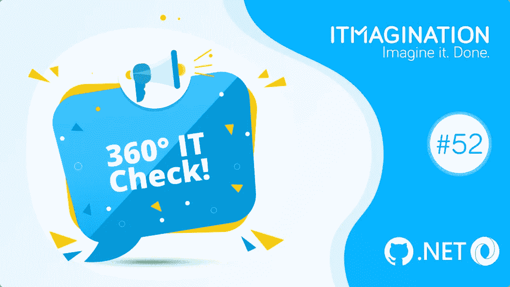

# 360 IT 检查# 52–9000 万部 iPhone 14s，恶意克隆充斥 GitHub，等等！

> 原文：<https://medium.com/geekculture/360-it-check-52-90-million-iphone-14s-github-flooded-by-malicious-clones-and-more-b2915dda16b0?source=collection_archive---------16----------------------->

# 9000 万 iPhone 14s？

苹果公司意识到它即将打出一个全垒打。这家总部位于加州库比蒂诺的公司已经订购了 9000 万部 iPhone 14s，与上一次订购的 iPhone 13s 数量持平。该组织预计，尽管其他生产商正在经历放缓，但对其最新款手机的需求将会很强劲。

就价格而言，它将比早期型号的初始价格高出 15%。我们将在 9 月中旬发现一切，那时苹果将举行他们通常的发布会。

**底线**

很难夸大 iPhones 对该公司的重要性。[他们贡献了大约 50%的收入](https://www.statista.com/statistics/382260/segments-share-revenue-of-apple/)，这也许是总部在库比蒂诺的企业如此热衷于提供服务的原因，例如 Apple TV+或 Apple Music，这是一个越来越重要的产品。首映的分量是巨大的。一次发射失败，主管们就有了紧急情况。幸运的是，服务业开始在这块蛋糕中占据越来越大的份额。截至 2022 年的 Q2，这部分收入占公司收入的 20%。

# 恶意克隆人充斥 GitHub

如果你经常使用 GitHub，你可能会发现一个奇怪的现象。这个平台充斥着合法软件库的恶意拷贝。这个奇怪的现象，可能是一个更大计划的一部分，首先被软件开发人员斯蒂芬·莱西发现。

存储库将具有相同或相似的名称，尽管由另一个组织托管。代码基本上是相同的，尽管在 npm 脚本、docker 文件等中有恶意软件。最初发现这一噱头的人进行了快速搜索，发现了超过 35，000 个等待窃取你的数据的存储库。

**底线**

像这样的特技是大胆的。这种规模的攻击令人印象深刻。不管是否令人印象深刻，只有(或大部分)我们能控制在我们没有受损的笔记本电脑上安装什么。安装未经验证的代码，你不知道是一个伟大的方式成为这样一个噱头的受害者。

安装第三方库或框架时，请确保从合法来源安装。我们甚至不会提到，首先，也是最重要的，你必须确保 a)你真的需要它，b)它没有被感染。

# 亚马逊收购 Roomba

这家总部位于西雅图的在线公司，或许以其在线市场而闻名，正以每股 60 美元的价格收购 iRobot，整个交易总计 17 亿美元。

不久前，你可能拥有其 Roomba 的这家公司显示，其收入较上年同期下降了 30%。该组织的首席执行官 Colin Angle 宣布在整个企业范围内裁员 10%,因为成本在上升，收入在下降。

一旦交易向公众宣布，iRobot 的股价飙升了 19%,而亚马逊的股价仅下跌了 1%。此次收购仍需获得股东和监管机构的批准。

**底线**

亚马逊正在扩大其产品组合，这些产品是预先注定要生活在你家的。继 Alexa、Ring、Astro 机器人和其他机器人之后，现在是圆形机器人的时代了。这次购买与其他操作稍有不同。iRobot 的 Roombas 通常是智能吸尘器的同义词，最重要的是，亚马逊现在有可能复制它在 Echo 扬声器上的成功。

然而，这项收购并不受所有人的欢迎。正如《卫报》报道，“[周五，主张更严格反垄断监管的团体呼吁监管机构阻止 iRobot 合并，认为这让亚马逊更多地进入消费者的生活，并进一步巩固其在智能家居市场的主导地位。](https://www.theguardian.com/technology/2022/aug/05/amazon-buy-roomba-maker-irobot-vaccum)“更广泛地进入顾客的生活是引起一些担忧的一部分。毕竟，打扫我们房子的机器人有可能为我们的房子绘制地图。

# 毛伊岛来到 Visual Studio 2022

随着 Visual Studio 17.3 版本的发布，[微软终于发布了。NET MAUI](https://devblogs.microsoft.com/dotnet/dotnet-maui-visualstudio-2022-release/)——用 C#创建令人惊叹的高性能跨平台应用的新框架。这一举措是微软为交付该框架而投入的相当长的开发时间的终结。全世界的. NET 开发者。然而，它终于来了，是时候看看它给我们带来了什么，以及等待是否值得。

**底线**

。NET MAUI 是较新的 Xamarin.Forms，它与我们以前的没有本质上的不同，尽管那从来不是我们的目标。新框架允许团队交付 Android、iOS、Windows、Mac 和 Tizen 应用程序，最后一个由三星维护。

如果你想尝试新工具，请参考[官方文档，](https://docs.microsoft.com/en-us/dotnet/maui/)如果你卡住了，请参考[故障排除指南。净毛伊岛](https://docs.microsoft.com/en-us/dotnet/maui/troubleshooting)。

# 奖金

**JSON 如何发音由 JSON 的创作者本人**

[https://www.youtube.com/watch?v=uR-f4b0G9lo](https://www.youtube.com/watch?v=uR-f4b0G9lo)

**Go 1.19 发布**

[https://go.dev/blog/go1.19](https://go.dev/blog/go1.19)

*原载于*[*https://www.itmagination.com*](https://www.itmagination.com/blog/360deg-it-check-52-90-million-iphone-14s-github-flooded-by-malicious-clones-and-more)*。*