# 38 网站材料设计界面

> 原文：<https://medium.com/geekculture/38-material-design-ui-for-website-b9bb70500048?source=collection_archive---------18----------------------->

# 材料设计卡

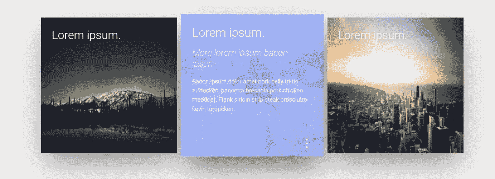

Material Design Card

请看下面的项目成果！

[链接](https://codepen.io/mkurapov/pen/qNQXxz)

# 材料设计选项卡

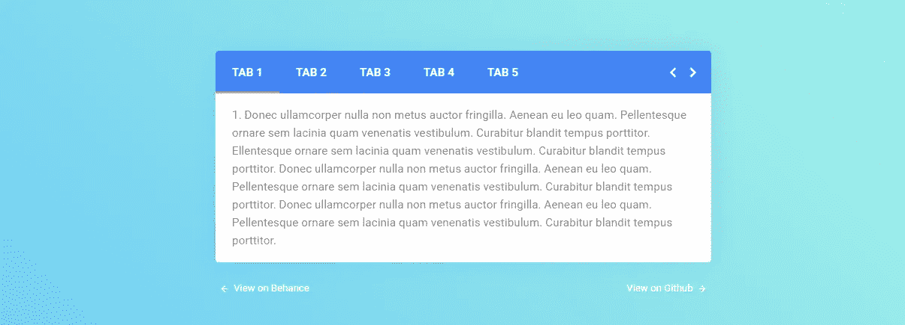

Material Design Tab

请看下面的项目成果！

[链接](https://codepen.io/andytran/pen/zvMGXr)

# 材料设计输入

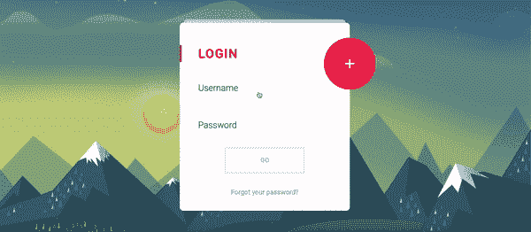

Material Design Input

请看下面的项目成果！

[链接](https://codepen.io/yusufbkr/pen/RPBQqg)

# 卡片界面的材质设计

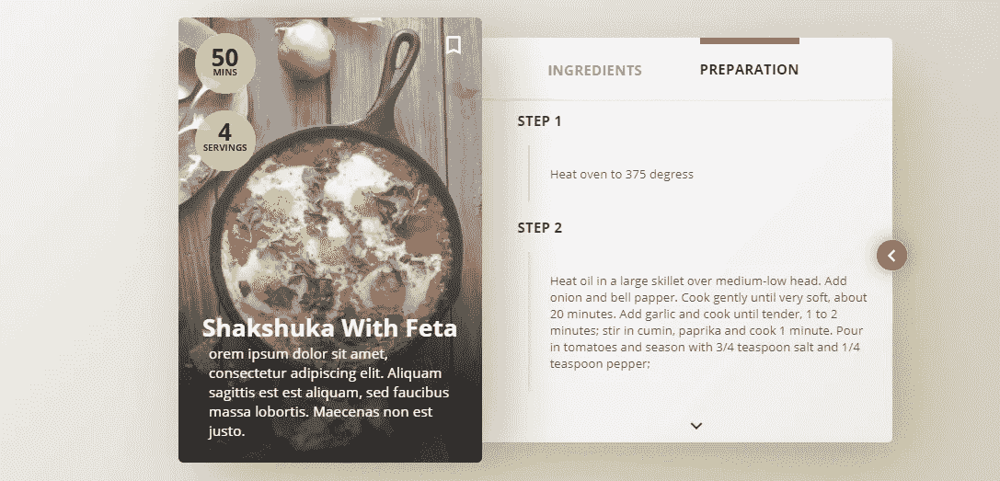

Material Design For Card UI

请看下面的项目成果！

[链接](https://codepen.io/iMax723/pen/aNKQyE)

# 复选框和单选输入的材料设计

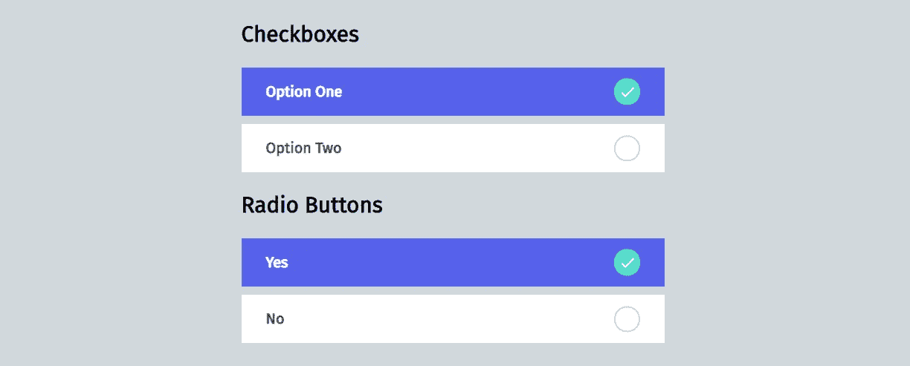

Material Design For Checkbox And Radio Input

请看下面的项目成果！

[链接](https://codepen.io/BuddyLReno/pen/boGRPO)

# CSS 卡的材料设计

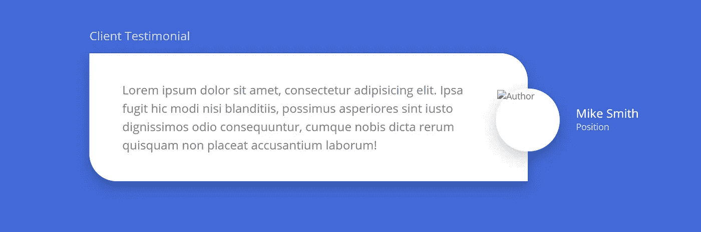

Material Design For CSS Cards

请看下面的项目成果！

[链接](https://codepen.io/asistapl/pen/GqqNLG)

# HTML CSS 实现的物料卡片界面

Material Card UI By HTML CSS

请看下面的项目成果！

[链接](https://codepen.io/asistapl/pen/GqqNLG)

# 图标的材料设计动画

Material Design Animation For Icon

请看下面的项目成果！

[链接](https://codepen.io/woodwoerk/pen/adbyvG)

# 输入材料设计

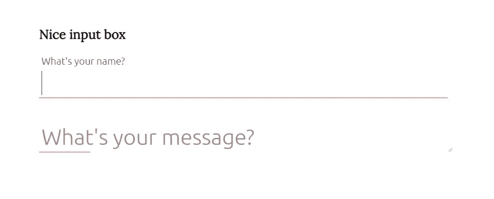

Input Material Design

请看下面的项目成果！

[链接](https://codepen.io/atunnecliffe/pen/gpKzQw)

# 材料设计单选按钮 CSS

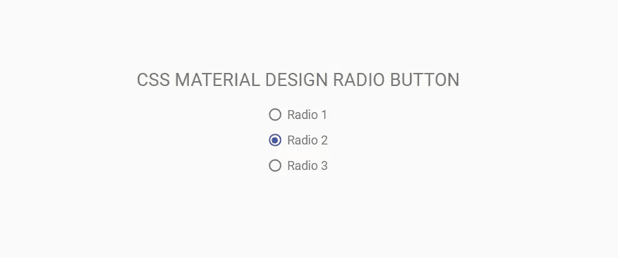

Material Design Radio Button CSS

请看下面的项目成果！

[链接](https://codepen.io/sajran/pen/wGXJQp)

# 表单材料设计 CSS

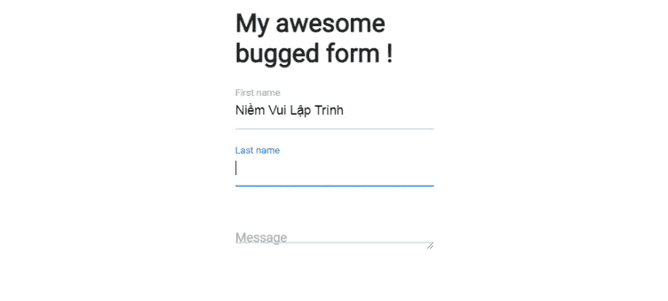

Form Material Design CSS

请看下面的项目成果！

[链接](https://codepen.io/Alex-D/pen/ByZLeg)

# 材料设计阴影

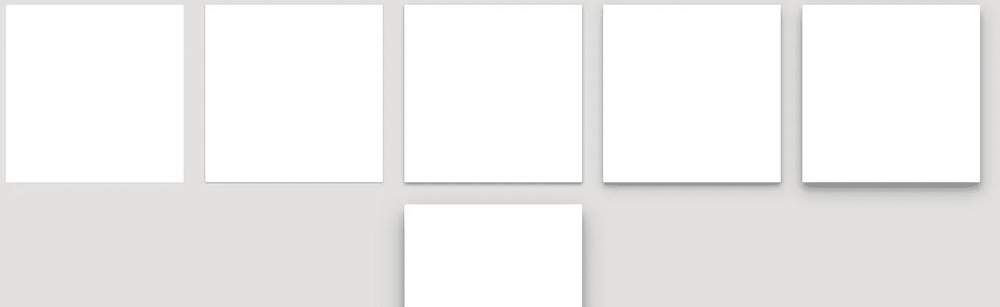

Material Design Shadow

请看下面的项目成果！

[链接](https://codepen.io/sdthornton/pen/wBZdXq)

# 材料设计菜单

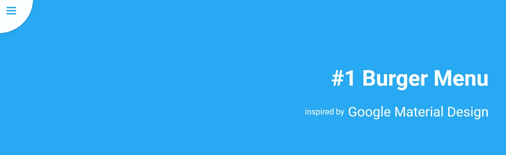

Material Design Menu

请看下面的项目成果！

[链接](https://codepen.io/victorfreire/pen/QywRNM)

# 链接的动画素材设计

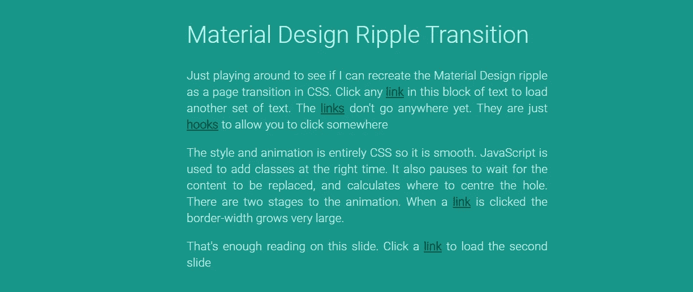

Animation Material Design For Link

请看下面的项目成果！

[链接](https://codepen.io/djmarland/pen/CxEbK)

# 材料设计下拉菜单 CSS

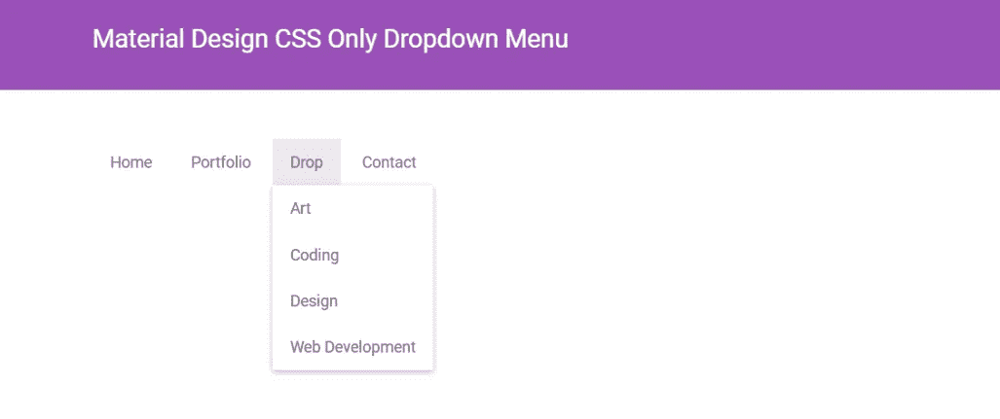

Material Design Dropdown CSS

请看下面的项目成果！

[链接](https://codepen.io/mildrenben/pen/RPwQEY)

# 材料设计导航

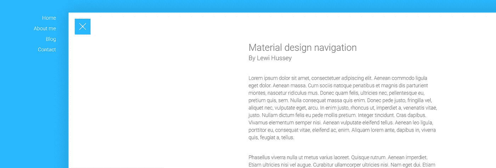

Material Design Navigation

请看下面的项目成果！

[链接](https://codepen.io/Lewitje/pen/tyGdf)

# 材料设计登记表

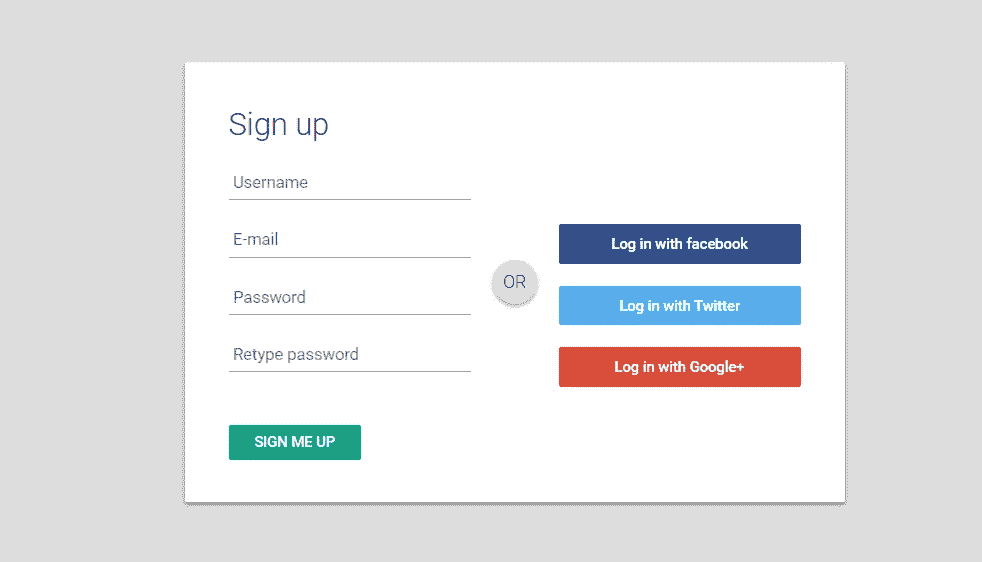

Material Design Registration Form

请看下面的项目成果！

[链接](https://codepen.io/KovJonas/pen/BoPOPY)

# 材料设计按钮

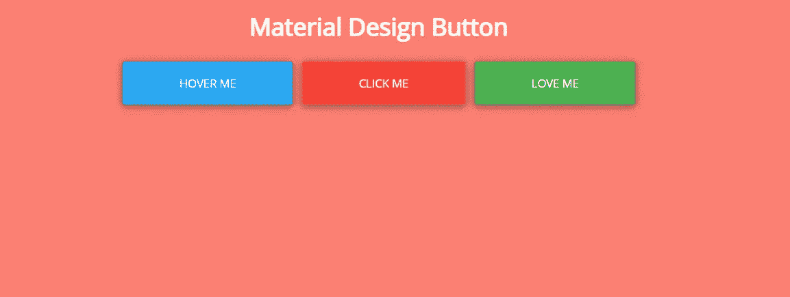

Material Design Button

请看下面的项目成果！

[链接](https://codepen.io/legeoffrey/pen/PwYeGo)

# 材料设计颜色选择器

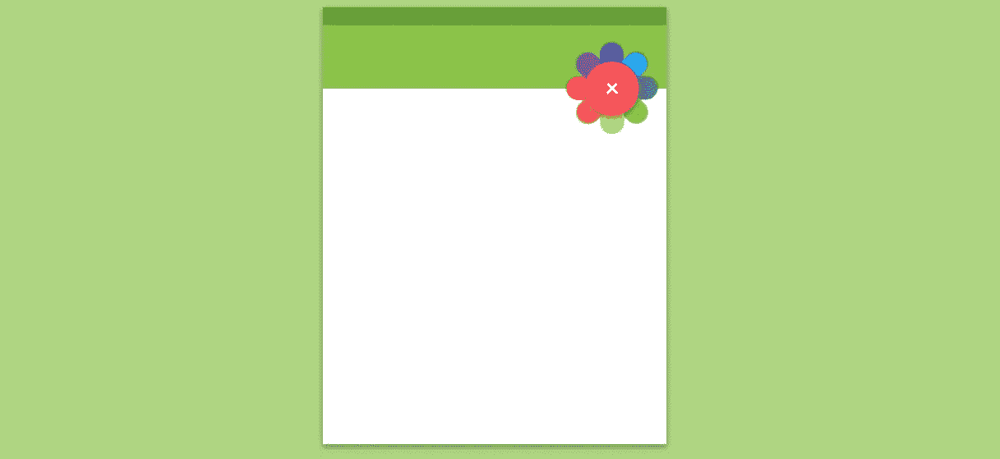

Material Design Color Picker

请看下面的项目成果！

[链接](https://codepen.io/yusufbkr/pen/JdBxpj)

# 响应式时间线材料设计

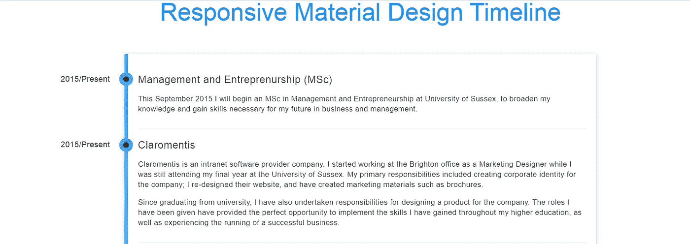

Responsive Timeline Material Design

请看下面的项目成果！

[链接](https://codepen.io/haycuoilennao19/pen/poyGNbr)

# 按材料设计弹出菜单

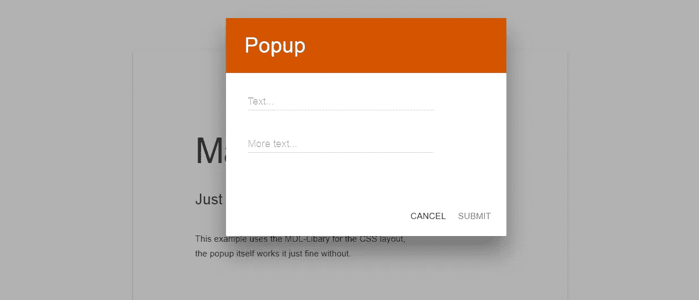

Popup By Material Design Popup

请看下面的项目成果！

[链接](https://codepen.io/arcs/pen/BodWvJ)

# 材料设计组件

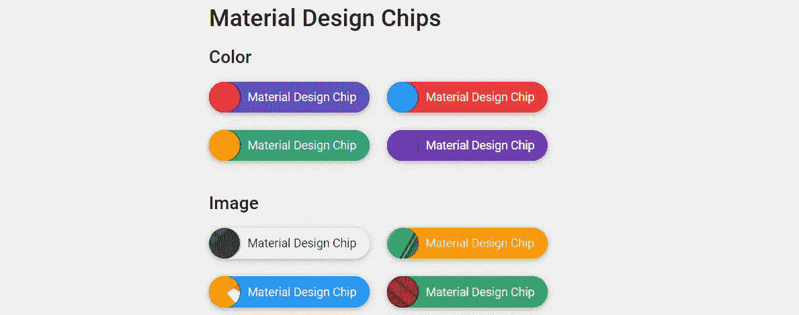

Material Design Component

请看下面的项目成果！

[链接](https://codepen.io/moso/pen/EjEgQY)

# 音频播放器的材质设计用户界面

Material Design UI For Audio Player

请看下面的项目成果！

[链接](https://codepen.io/michael-zhigulin/pen/NGZGma)

# 材料设计卡

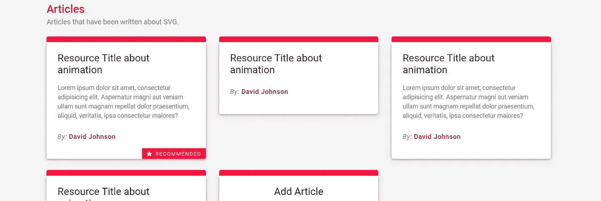

Material Design Cards

请看下面的项目成果！

[链接](https://codepen.io/vincebrown/pen/emJoga)

# 上传文件谷歌材料设计

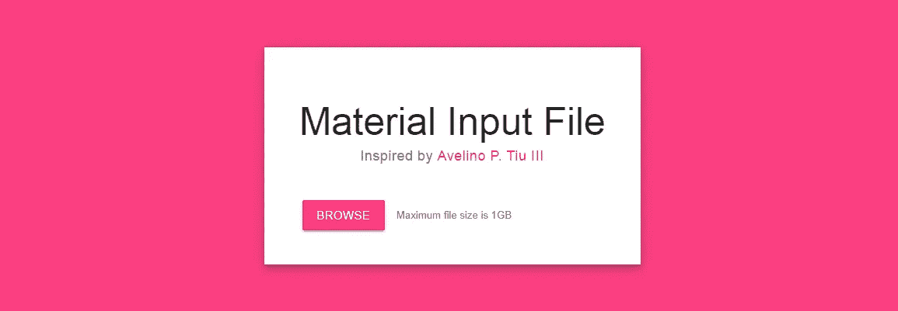

Upload File Google Material Design

请看下面的项目成果！

[链接](https://codepen.io/Josantonius/pen/BzNwXz)

# 批量报价材料 CSS

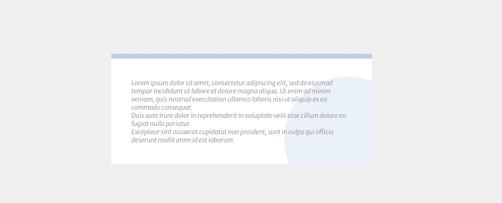

Blockquote Material CSS

请看下面的项目成果！

[链接](https://codepen.io/MichaelMammoliti/pen/EjoyQz)

# 材料设计卡动画效果

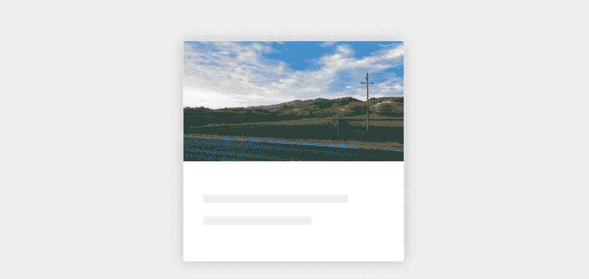

Material Design Card Animation Effects

请看下面的项目成果！

[链接](https://codepen.io/ehellman/pen/BLyoRE)

# 谷歌材料设计输入框

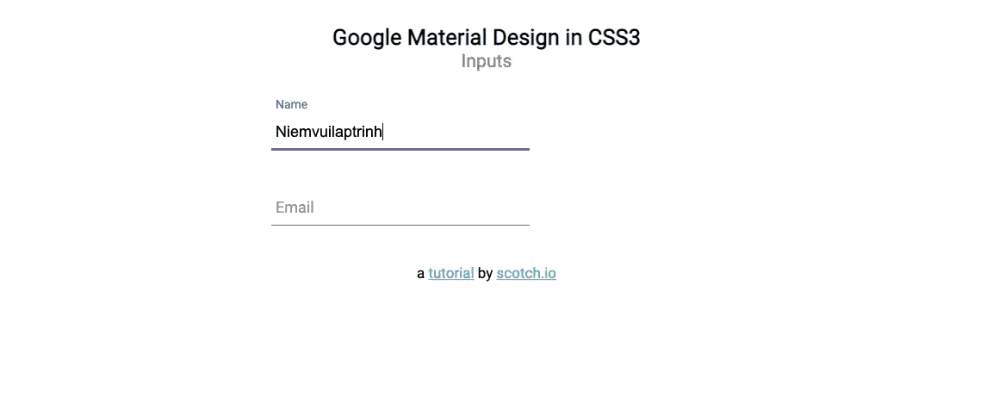

Google Material Design Input Boxes

请看下面的项目成果！

[链接](https://codepen.io/chris__sev/pen/IdGKH)

# 材料设计导航栏

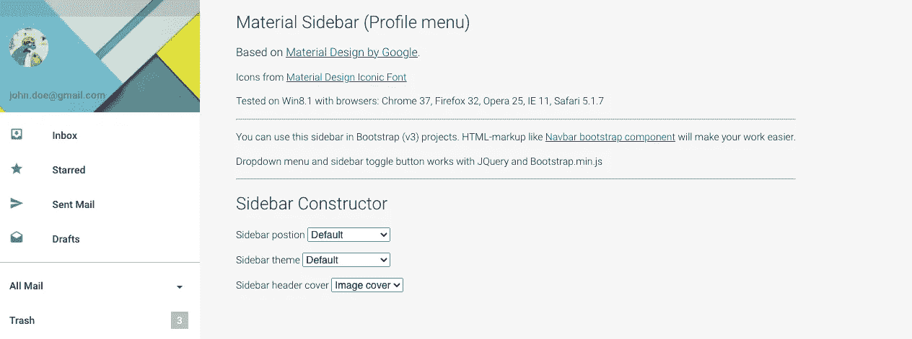

Material Design navigation bar

请看下面的项目成果！

[链接](https://codepen.io/zavoloklom/pen/dIgco)

# 材料设计汉堡

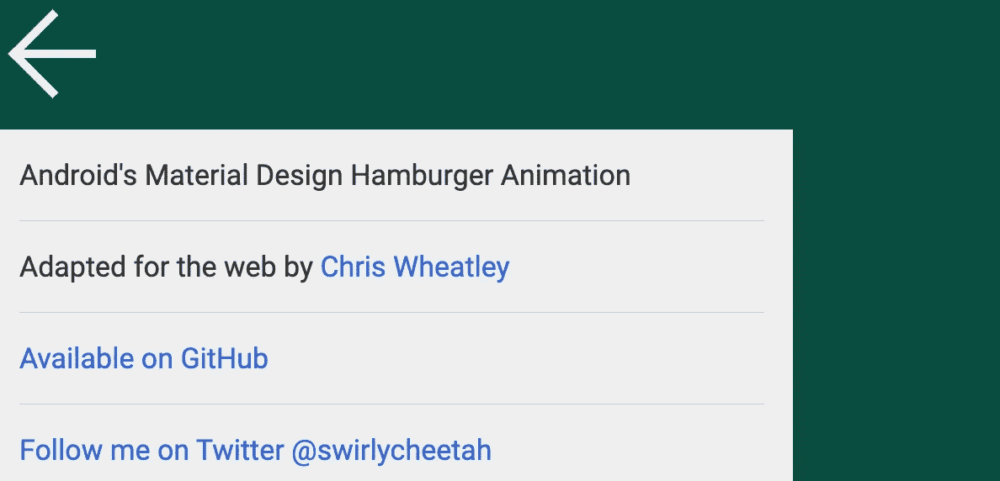

Material Design Hamburger

请看下面的项目成果！

[链接](https://codepen.io/chrisdwheatley/pen/cFtzb)

# 材料设计按钮

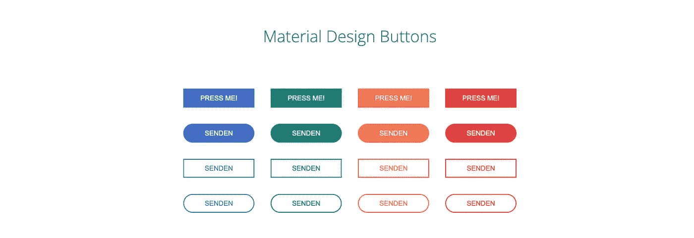

Material design buttons

请看下面的项目成果！

[链接](https://codepen.io/Fischaela/pen/ahgIy)

# 响应模态设计

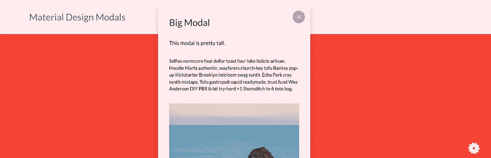

Responsive Modal Design

请看下面的项目成果！

[链接](https://codepen.io/ettrics/pen/Jdjdzp)

# 谷歌材料设计

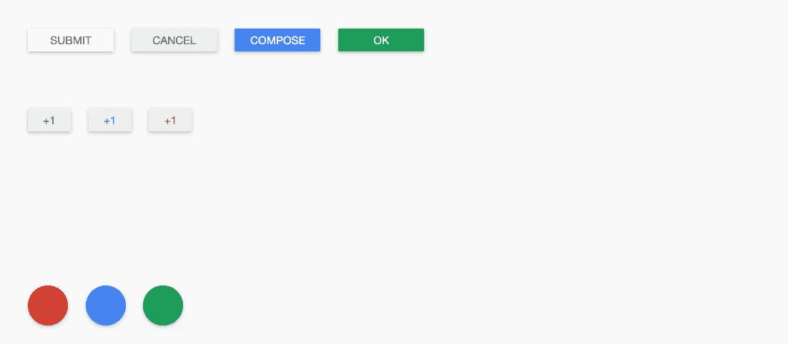

Google Material Design

请看下面的项目成果！

[链接](https://codepen.io/iraycd/pen/dHrxv)

# 材料选择框

Material select box

请看下面的项目成果！

[链接](https://codepen.io/pudgereyem/pen/PqBxQx)

# 材料设计卡 css

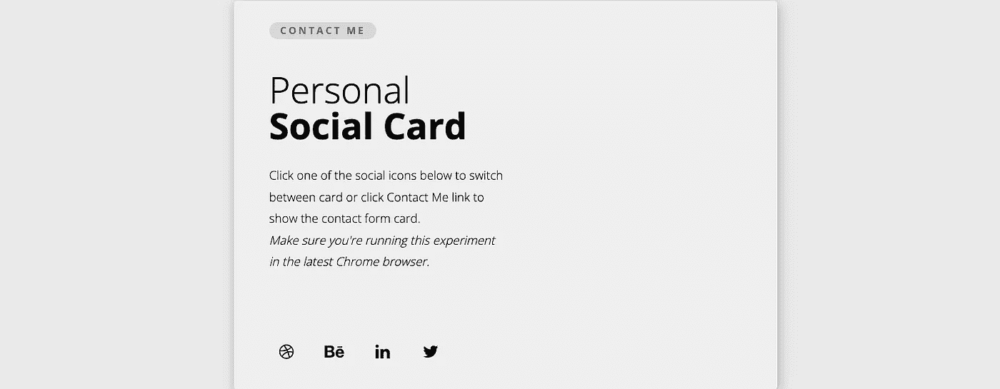

Material design card css

请看下面的项目成果！

[链接](https://codepen.io/ariona/pen/JYGzBB)

# 材料登记表

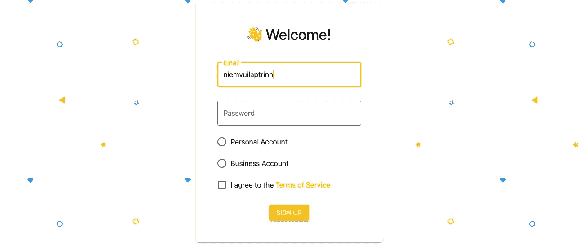

Material Registration Form

请看下面的项目成果！

[链接](https://codepen.io/finnhvman/pen/jQbVeR)

# 材料设计仅 CSS 选项卡

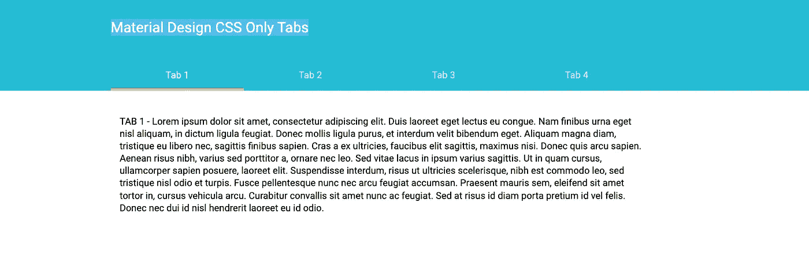

Material Design CSS Only Tabs

请看下面的项目成果！

[链接](https://codepen.io/mildrenben/pen/bdGdOb)

# 材料登录表单模板

Material login form template

请看下面的项目成果！

[链接](https://codepen.io/ibrahimozturkme/pen/pbaRoY)

# 摘要

我希望这篇文章将为你提供美丽和有用的材料设计的发展，网页，如果你有任何问题，只需发送电子邮件，我会尽快作出回应。希望大家继续支持网站，让我能写出更多好文章。祝您愉快！

相关文章:

*   [网页设计暗模式示例](https://us.niemvuilaptrinh.com/article/15-dark-mode-examples-for-web-design)
*   [网页设计的 CSS 布局模板](https://us.niemvuilaptrinh.com/article/39-layout-designs-for-websites)
*   [网站的变形设计 UI](https://us.niemvuilaptrinh.com/article/23-neumorphism-design-ui-for-website)