# Unity 中的 3D 角色动画

> 原文：<https://medium.com/geekculture/3d-character-animations-in-unity-80d6f6ad71ce?source=collection_archive---------7----------------------->

这篇文章将展示如何在 Unity 中建立一个 3D 角色模型，包括空闲、奔跑和跳跃的动画；如果你没有一个被操纵的角色，那不是问题。你可以在[我之前的文章](https://kwpowers.medium.com/setting-up-3d-character-in-unity-with-mixamo-c0dd9d159fad)中看到如何使用 [Mixamo](https://www.mixamo.com) for Unity 来操纵你的角色。

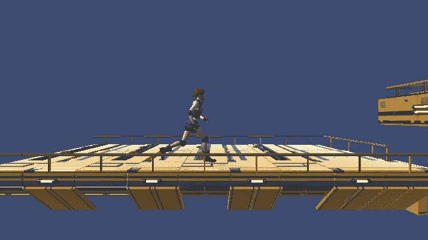

对于运动，这个角色使用在[上一篇文章](https://kwpowers.medium.com/creating-a-physics-based-character-controller-in-unity-fe6a4e1cec2a)中设置的简单角色控制器运动。

## 设置动画制作人

你需要做的第一件事是创建一个 Animator 控制器，如果我们还没有的话，然后把它分配给模型上的 Animator 组件。然后，您可以将角色的动画拖动到控制器的 Animator 窗口中。

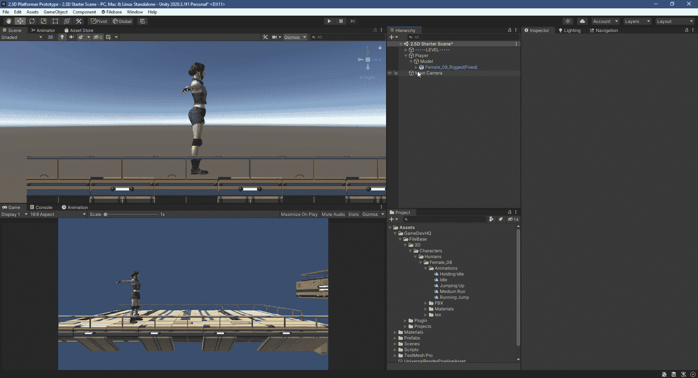

现在，如果进入播放模式，将播放设置为默认状态的动画。

## 切换到跑步

接下来，为速度创建一个浮动参数，该参数将控制从空转到运行的变化。然后从空转过渡到运行，并添加速度大于 0 的条件。之后，在速度小于 0.1 的条件下，从运行返回到怠速进行另一次转换。要进行即时转换，disable 在每个上有退出时间。

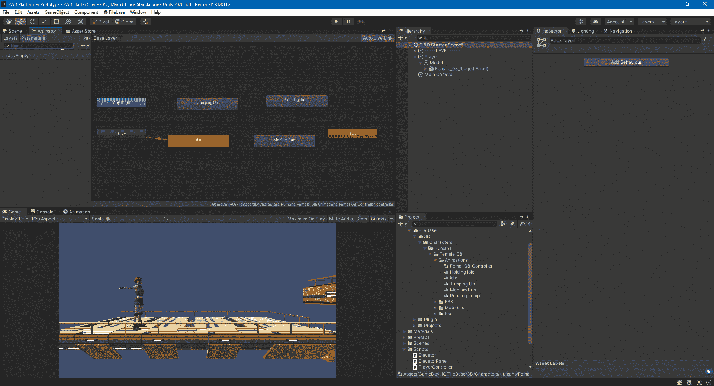

如果不希望动画更改根骨骼的位置，请确保禁用“应用根运动”。通常情况下，您不希望它被启用。

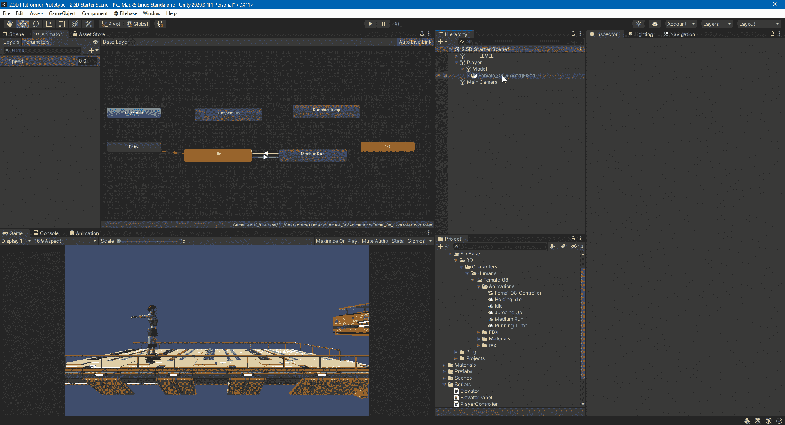

要访问速度参数并更改动画，您需要在播放器脚本中引用动画师。然后在 Start 中抓取组件。

水平输入将决定运行或空闲动画的播放。GetAxisRaw 不会随着时间的推移而变得平滑，所以它会在使用时给你一个即时的动画变化。然后将浮点参数 Speed 设置为水平输入的绝对值，因此-1 返回 1。

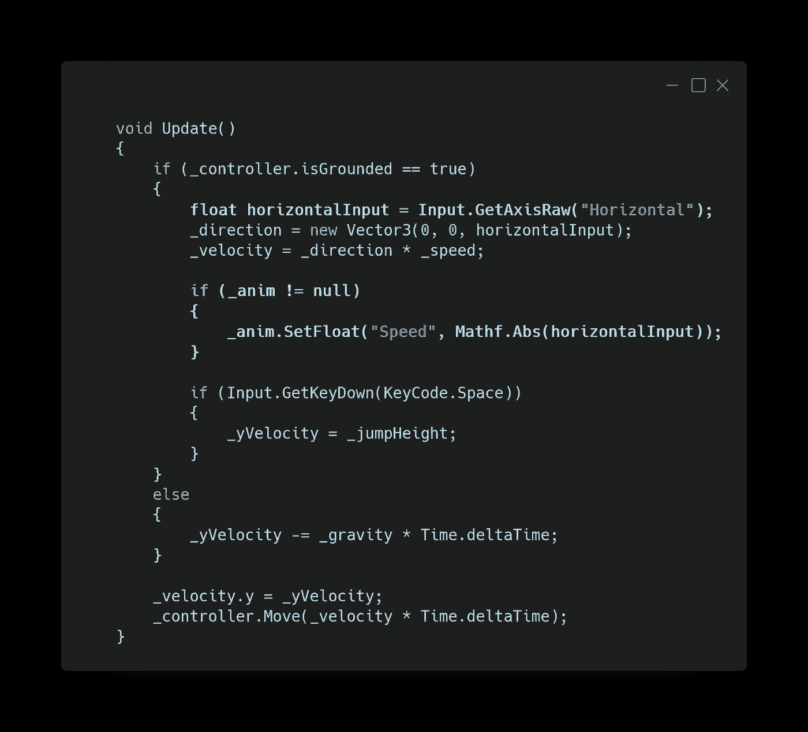

现在，当有水平输入时，播放器会运行，但它不会根据您移动的方式来翻转方向。

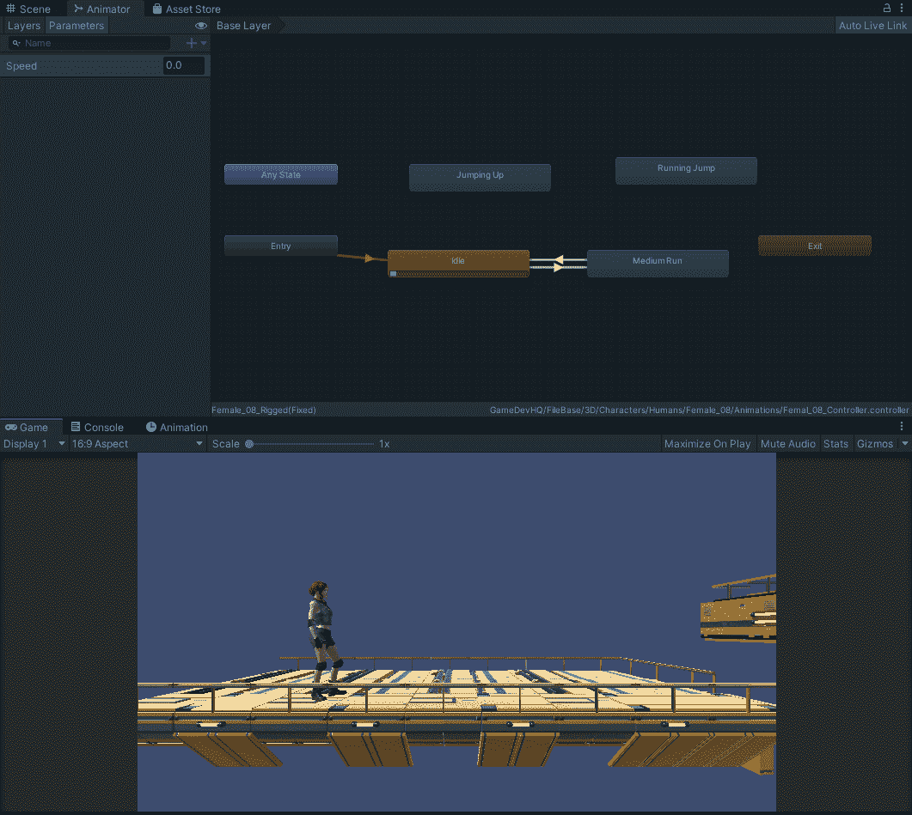

## 翻转播放器

要控制播放器的翻转，您需要添加一个 bool。

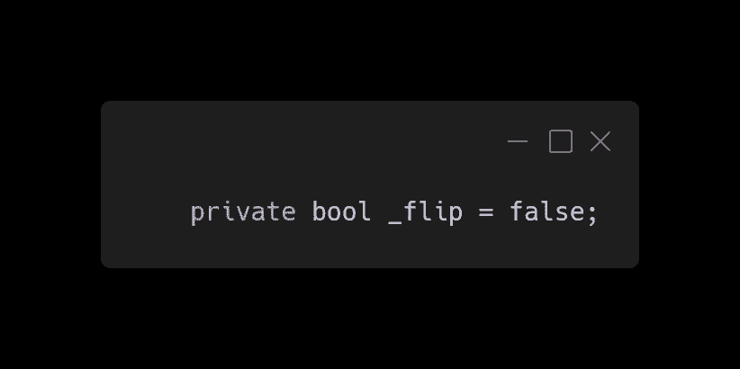

要翻转播放器，您将在 0 到 180 度之间更改 y 轴旋转。向右移动时，它将为 0 且不反转(正水平)，向左移动时，它将翻转 180(负水平)。

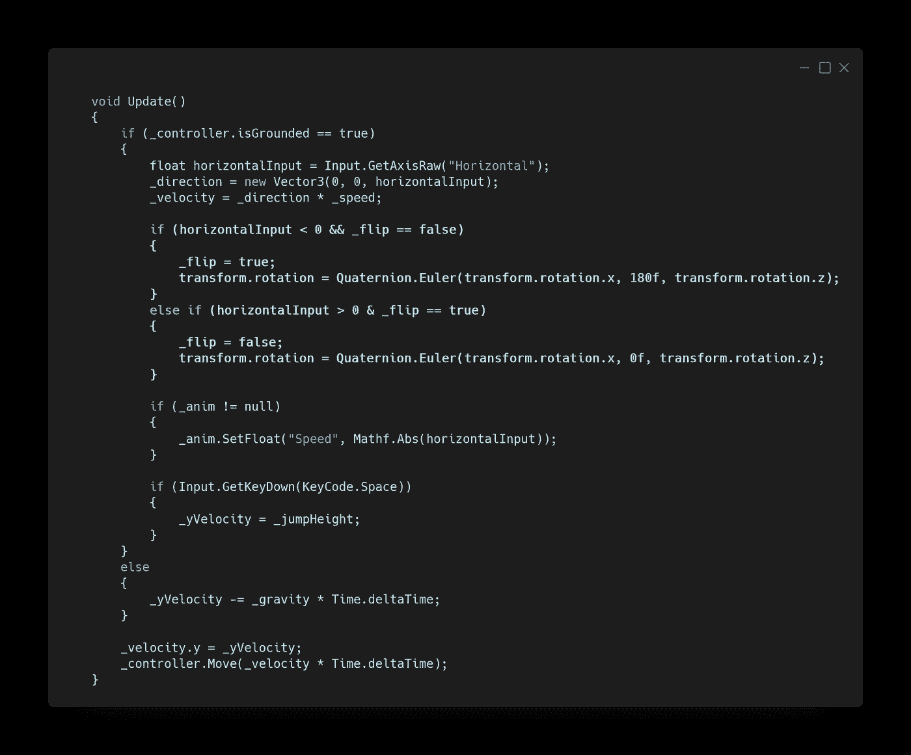

玩家现在将翻转到移动的方向。

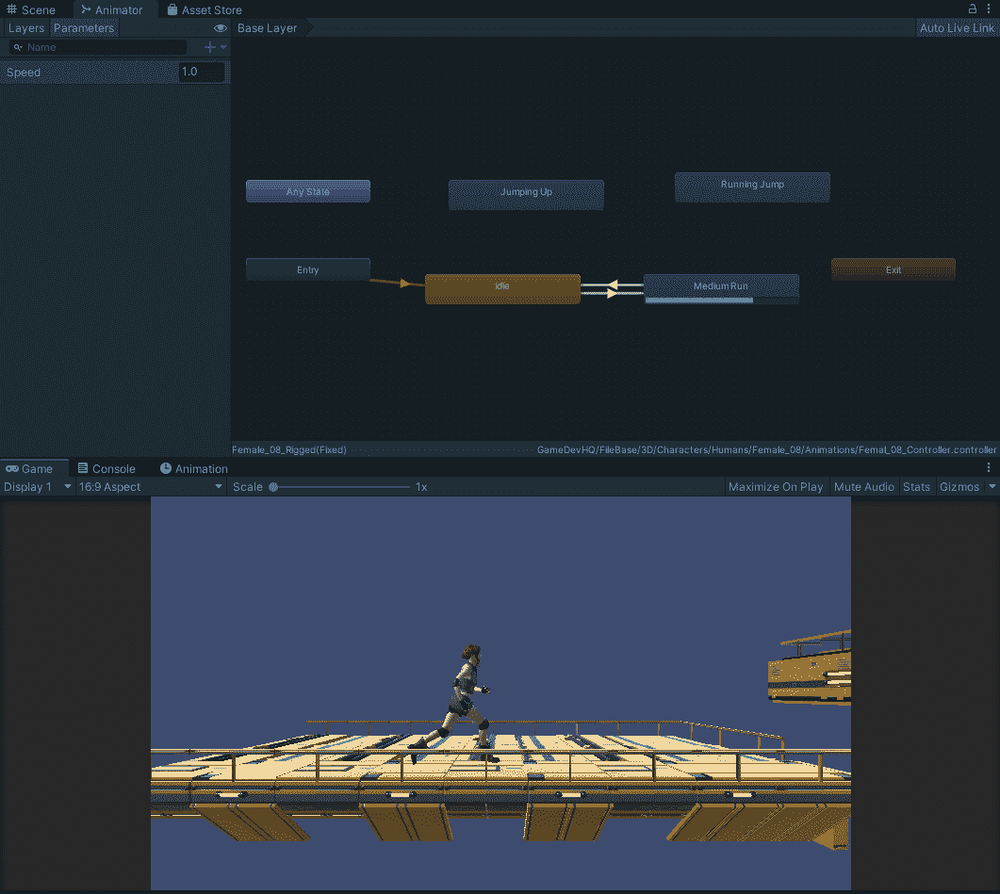

## 跳跃的

为了控制何时播放跳转动画，可以使用 Trigger 或 Bool 参数。如果玩家在动画结束前接触到地面，使用 Bool 可以让你在任何时候停止动画。有了触发器，动画将继续，直到切换前完成。对于转换回空闲或运行，您可以添加另一个速度条件来确定它是否直接进入空闲或运行动画。

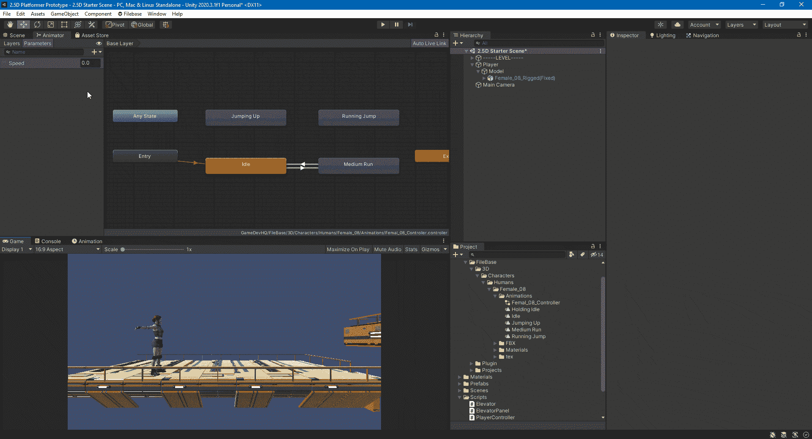

所以脚本不会每帧都设置跳转参数；你需要加一个 bool 来知道玩家是否在跳。

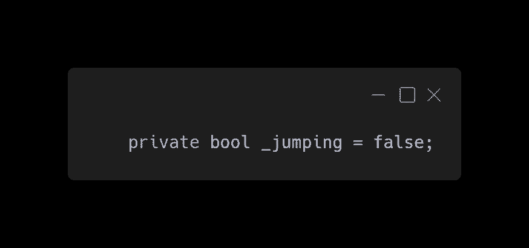

如果玩家在地上跳跃，你设置跳跃布尔为假，并告诉动画师通过设置布尔跳跃为假来切换出跳跃动画。然后，当玩家按下空格键时，您将 jumping 更改为 true，并告诉动画师通过将 Bool Jump 设置为 true 来启动跳跃动画。

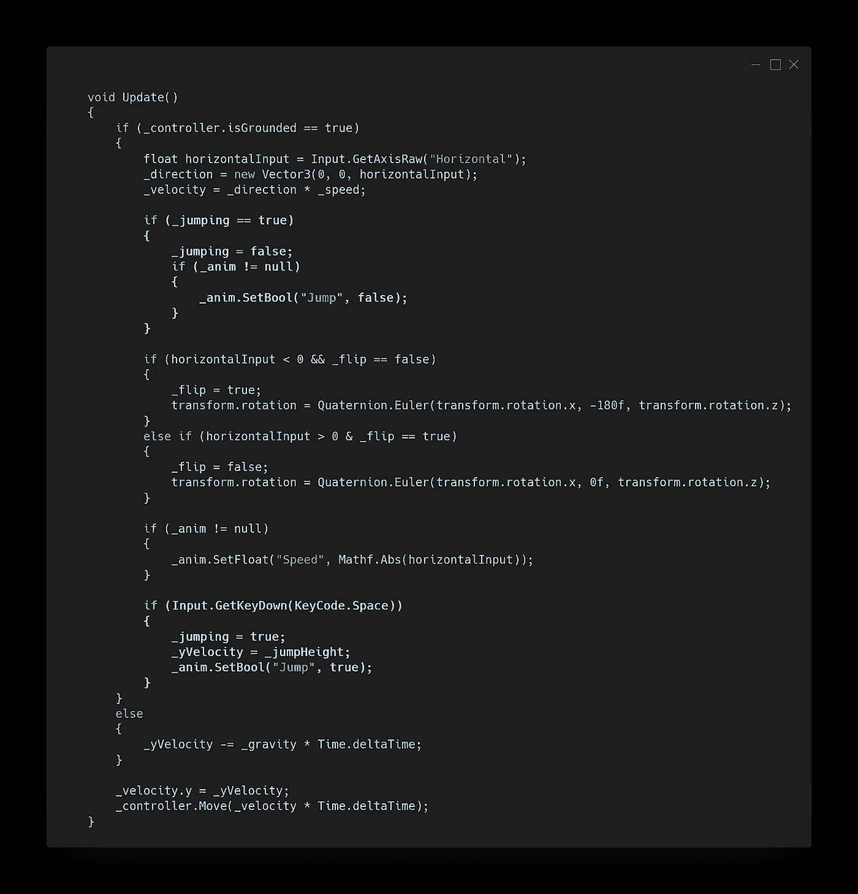

玩家现在进入和退出跳跃动画。

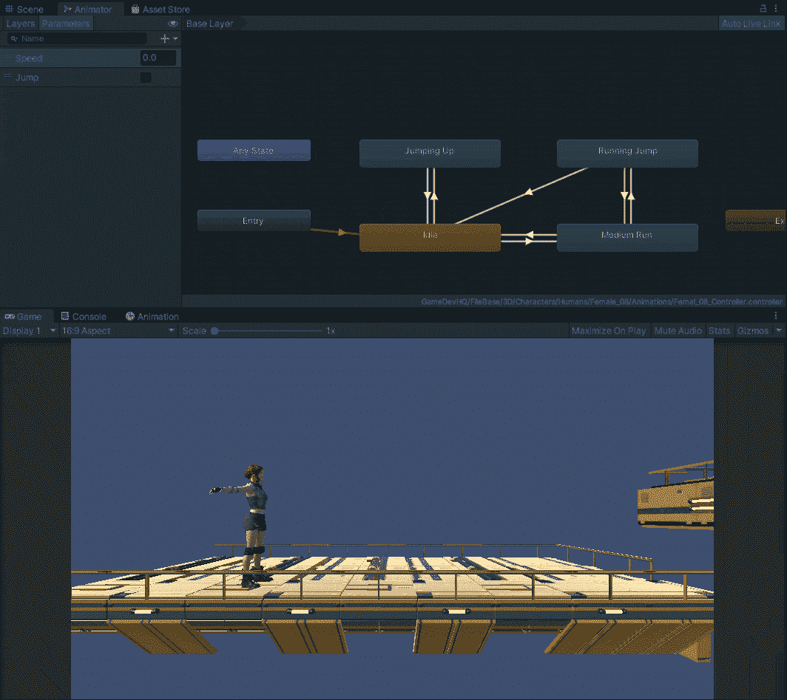