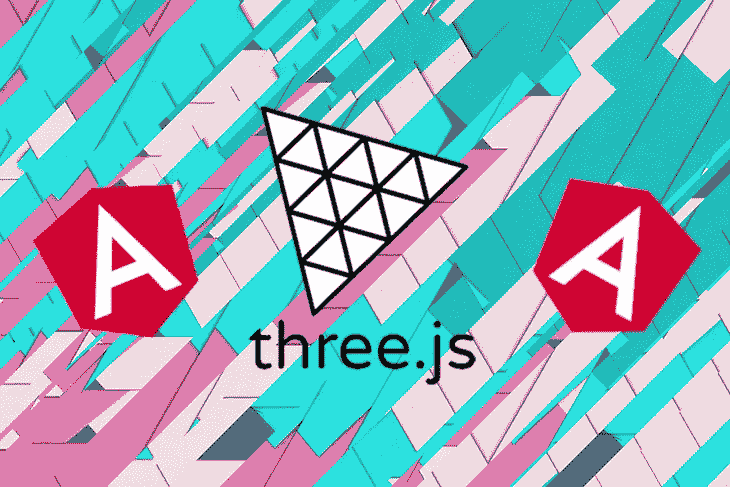
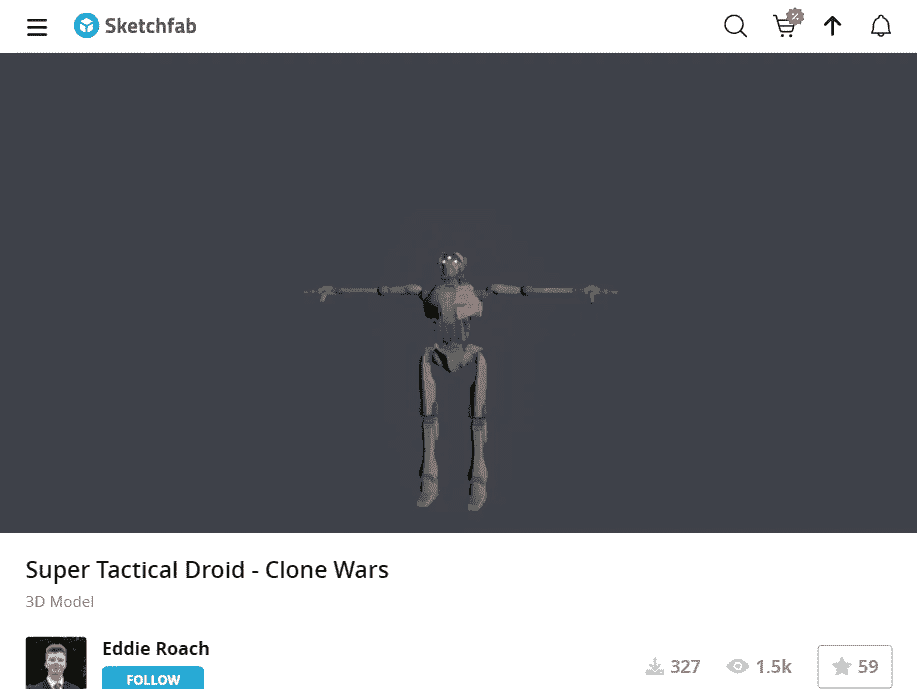
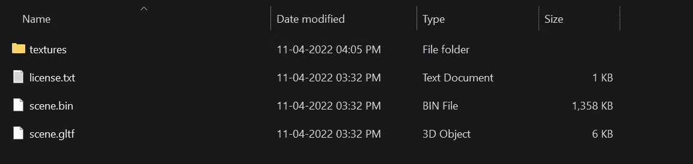
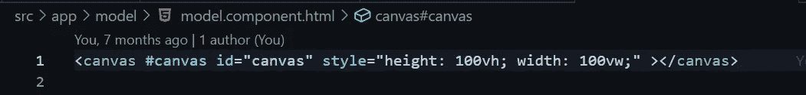
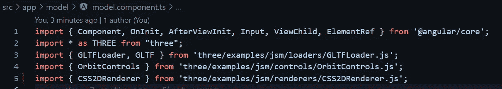
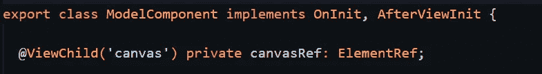
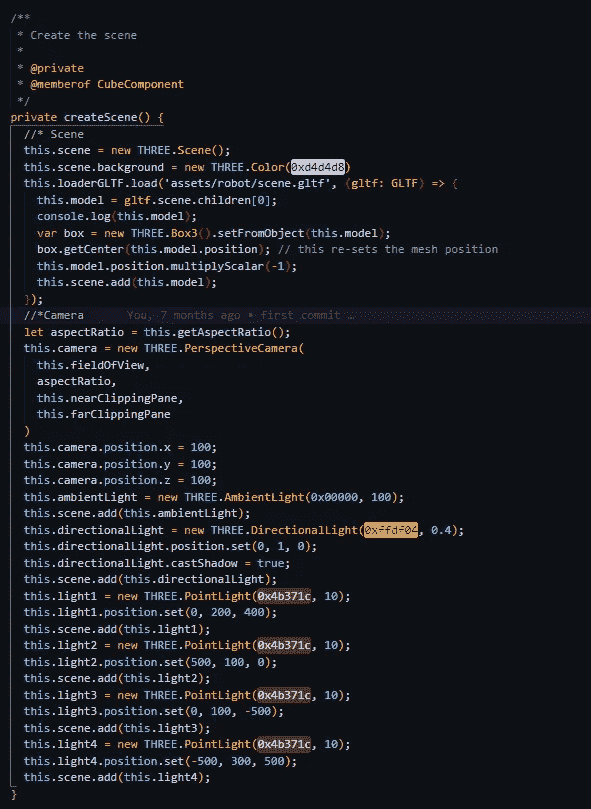
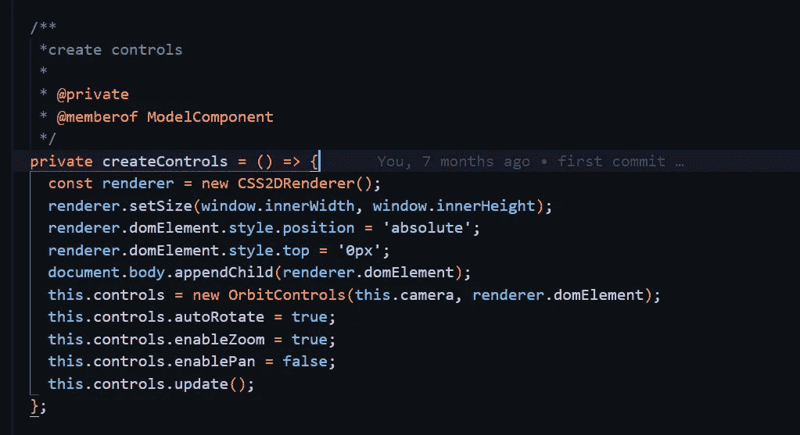
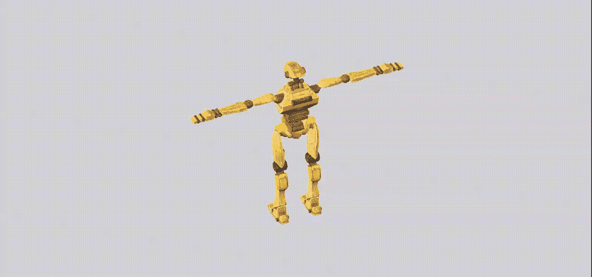

# 3D 模型:THREE.js 角度场景

> 原文：<https://medium.com/geekculture/3d-model-three-js-scene-in-angular-7bcbc0d00c31?source=collection_archive---------3----------------------->

Three.js 是一个 JavaScript 库，用于在 web 浏览器上创建和显示动画 3D 计算机图形，与 HTML5 canvas 元素、WebGL 和 SVG 兼容。

往期教程:[你好█████魔方:THREE.js 场景中的 Angular | by Anurag Srivastava |极客文化| Medium](/geekculture/hello-cube-your-first-three-js-scene-in-angular-176c44b9c6c0)

3d Model: THREE.js Scene in Angular

在上一个教程中，我们学习了 Three.js 的基础知识，并在 Angular 中集成了 Three.js 场景。在本教程中，我们将渲染一个 3D 模型。

## **模型**

首先，我们需要找到一个合适的 3D 模型。网上有很多免费的模型。我们将使用 GLTF 格式，因为它的文件小，效率高。three.js 也支持 FBX 和 obj 文件。这里有一个免费模型【sketchfab.com[《超级战术机器人——克隆人战争》——下载艾迪·罗奇(@ Eddie . Roach)【617367 b】](https://sketchfab.com/3d-models/super-tactical-droid-clone-wars-617367b06c9d438d81c6a883df9c4014)的免费 3D 模型

Super Tactical Droid — Clone Wars (Eddie Roach [https://sketchfab.com/eddie.roach](https://sketchfab.com/eddie.roach))

将下载的模型文件放入 assets 文件夹中(您必须给予所有者[适当的信任](https://creativecommons.org/licenses/by/4.0/#))。

Downloaded Model Files

在[之前的教程](/geekculture/hello-cube-your-first-three-js-scene-in-angular-176c44b9c6c0)中，我们已经学习了如何在 angular 中建立一个 three.js 项目，所以请浏览最后一个教程，因为我不会在这里讨论它。

让我们首先创建一个 angular 组件，它由一个 HTML 文件和一个 **Typescript** 文件(**)组成。ts** )，我们将在其中导入 Three.js 功能和一个 CSS 或 SCSS 风格的文件。键入下面的命令创建一个 ***模型组件*** 。

> ng 生成组件立方体

打开 HTML 文件，添加一个画布到我们的空场景中。我们可以在 HTML 模板中添加我们需要的任何大小的画布。

adding canvas in model.component.html

迈出这一小步后，我们可以将注意力转移到 Typescript 文件上，实际的工作仍然需要完成，以获得我们的 3D 场景设置。

## 对 Three.js 场景进行编程

现在，要将 Three.js 与 Angular 和 load 3D 模型集成，您必须将 Three.js 库和我们将讨论的附加模块导入到您要渲染 3D 对象的组件中，即***model . component . ts .***

importing modules

**GLTF:** [glTF](https://www.khronos.org/gltf) (GL 传输格式)是一种[开放格式规范](https://github.com/KhronosGroup/glTF/tree/master/specification/2.0)，用于高效交付和加载 3D 内容。资产可能以 JSON(.gltf)或二进制(。glb)格式。外部文件存储纹理(。jpg，。png)和附加的二进制数据(。bin)。glTF 资源可以提供一个或多个场景，包括网格、材质、纹理、皮肤、骨架、变形目标、动画、灯光和/或摄像机。

GLTFLoader: 这是一个 three.js 模块，它读取 GLTF 文件并将其导入到我们的场景中。

**轨道控制:**轨道控制允许摄像机围绕目标旋转。

**CSS 2d rendered:**CSS 2d renderer 是 CSS3DRenderer 的简化版。唯一支持的转换是转换。如果您想将基于 HTML 的标签与 3D 对象结合起来，渲染器非常有用。在这里，相应的 DOM 元素被包装到一个 CSS2DObject 实例中，并被添加到场景图中。

使用以下命令获取我们在 HTML 文件中添加的画布的引用

> [*@ view child*](https://angular.io/api/core/ViewChild)*(' canvas ')私有 canvasRef:*[*element ref*](https://angular.io/api/core/ElementRef)*；*

canvas reference

让我们现在创建场景，场景是我们将添加不同的元素，我们想与像相机，三维模型等工作。创建如下所示的函数:

creating the scene

现在让我们创建控件。控件将帮助我们旋转模型。创建如下所示的函数:

create controls

最后，调用 ngAfterViewInit()中的 createScene()、startRenderingLoop()和 createControls()函数，在终端中使用 ***ng serve*** 启动项目。

Final working demo

下载源代码，运行项目，然后到 localhost:4200/model 查看演示。

# 您已经准备好使用 Angular 将 3d 模型加载到 Three.js 项目中。祝编程愉快！！！

**GITHUB 链接**对于这个项目:-[**srivastavaanurag 79/angular-three:在本教程中，我们将通过一个简单的例子。我们将渲染一个 3D 立方体，我们将学习 Three.js 的基础知识，并将 Three.js 场景集成到 Angular 中。**(github.com)](https://github.com/srivastavaanurag79/angular-three)

*参考资料:* [*Three.js 教程—如何在浏览器中渲染 3D 对象(freecodecamp.org)*](https://www.freecodecamp.org/news/render-3d-objects-in-browser-drawing-a-box-with-threejs/)

[加载 3D 模型— three.js 文档(threejs.org)](https://threejs.org/docs/index.html#manual/en/introduction/Loading-3D-models)

[5 分钟内将 3D 模型添加到网站— Three.js 教程—红色订书机](https://redstapler.co/add-3d-model-to-website-threejs/)

[SketchFab](https://sketchfab.com/3d-models/super-tactical-droid-clone-wars-617367b06c9d438d81c6a883df9c4014) ( [超级战术机器人——克隆人战争——免费下载埃迪·罗奇的 3D 模型(@埃迪·罗奇)](https://sketchfab.com/3d-models/super-tactical-droid-clone-wars-617367b06c9d438d81c6a883df9c4014))