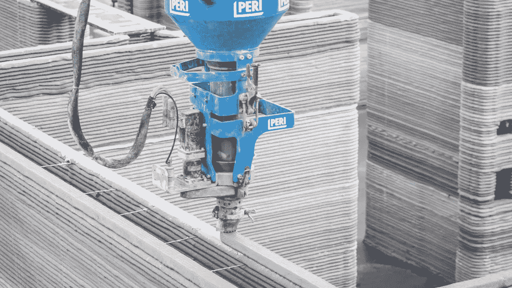

# 3D 打印是建筑行业的未来

> 原文：<https://medium.com/geekculture/3d-printing-is-the-future-of-the-construction-industry-b05350ffe64?source=collection_archive---------14----------------------->

建筑行业正在接近一个新的黎明，因为公司不断证明 3D 打印房屋比传统建筑房屋有许多好处。

3D 打印房屋几乎在各个方面都更好，它们建造起来更便宜、更快、更可持续。

有了这些优越的优势，很自然地认为我们未来的家会…