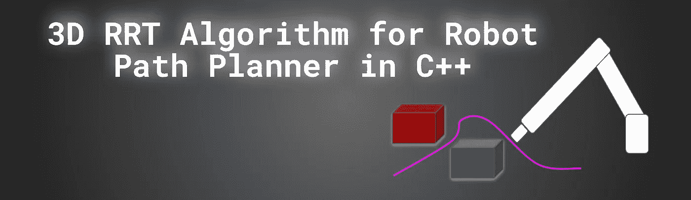
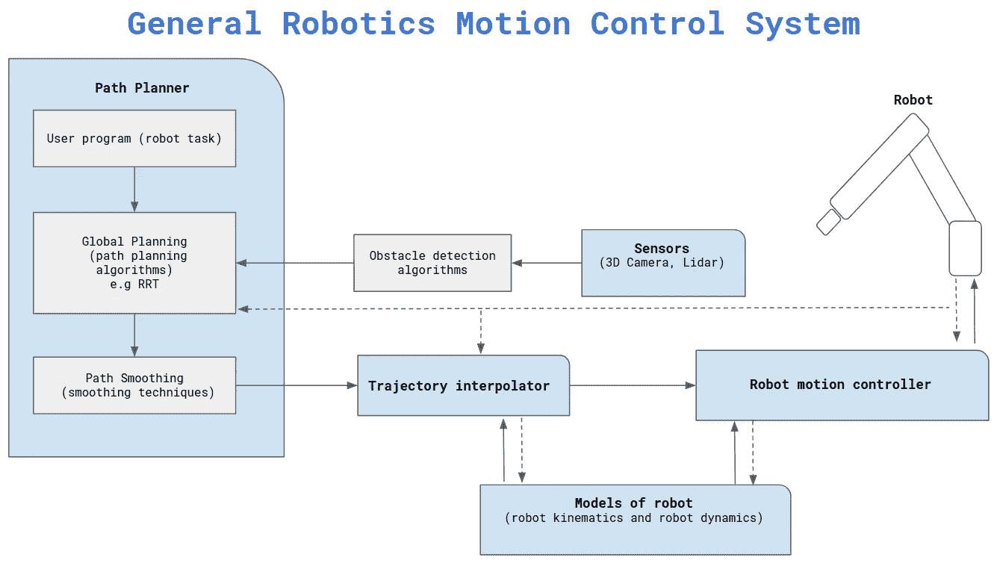
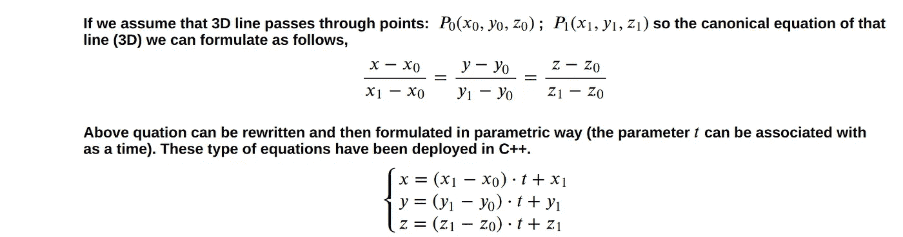
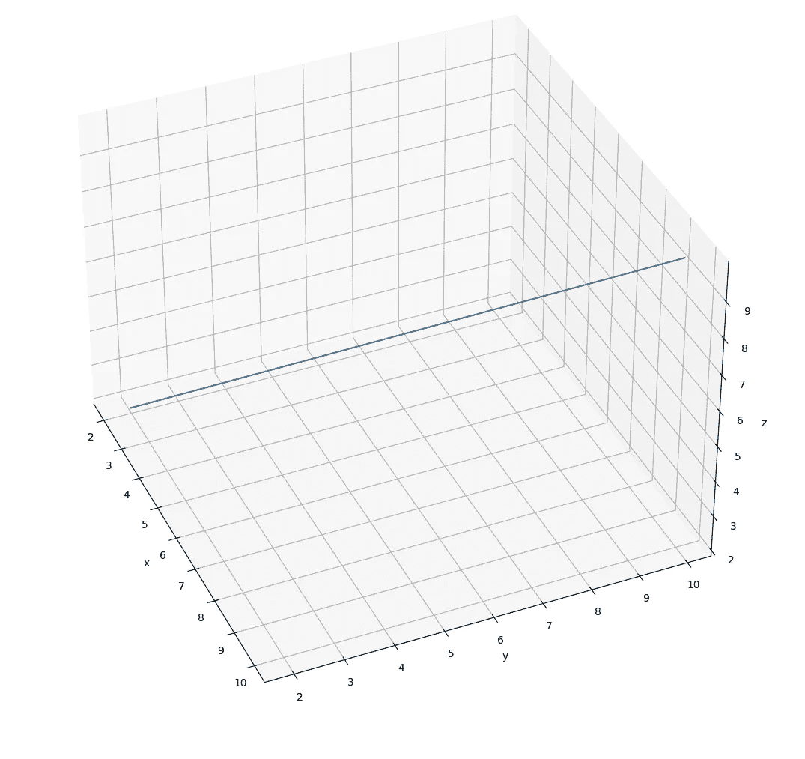
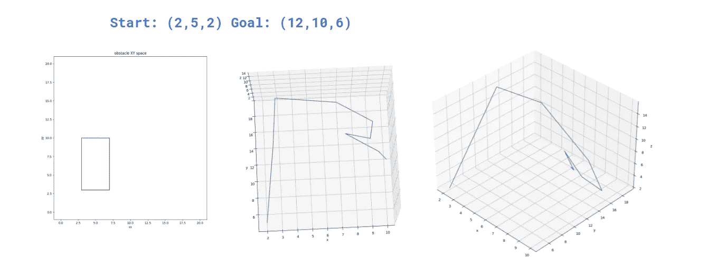

# C++中机器人路径规划的三维 RRT 算法。

> 原文：<https://medium.com/geekculture/3d-rrt-algorithm-for-robot-path-planner-in-c-222133509d28?source=collection_archive---------5----------------------->



by author

下面的文章可以被认为是我之前的 [**文章**](/geekculture/robot-path-planning-rrt-algorithm-d836fb52cb38) 的延续，在那里你可以熟悉 RRT 算法的概念和在 C++中的实现。
本文扩展了之前的讨论，并介绍了如何在 3D 空间中实现机器人路径规划(工业机器人、无人机)。正如你可以假设以前的文章和软件实现的 RRT 算法主要用于在 2D 空间操作的机器人(例如移动机器人)。
本文的源代码可以在我的 [**Github**](https://github.com/markusbuchholz/3D_RRT_robot_path_planner_cpp) 上找到。

正如在之前的结果可视化相关文章中所演示的，我使用 matplotlib 库。
C++代码可以编译并运行如下。
[头文件](https://github.com/lava/matplotlib-cpp)(用于绘图库)必须在与你的 cpp 相同的文件夹中。

```
//compile
g++ my_prog.cpp -o my_prog -I/usr/include/python3.8 -lpython3.8//run
./my_prog//folder tree
├── my_prog
├── my_prog.cpp
├── matplotlibcpp.h
```

本文不讨论理论方法，因为 RRT 算法的原理已经展示过了。

# **通用机器人运动控制系统**

关于机器人运动控制的概述，尤其是本文中 RRT 算法的“逻辑位置”如下图所示。
请注意，执行重复性工作(根据程序)的工业机器人不包括执行路径规划算法(如 RRT、A*、Dijkstra 或其他)的“模块”。
根据任务规范，路径被离线编程。



by author

当机器人可以改变路径时，由于机器人环境可能是动态的(可变的)并且可能出现障碍，机器人运动控制系统可以包括具有所述路径规划算法的路径规划器。
在这种情况下，只要前一条路径无法利用(被障碍物阻挡)，路径规划算法就会搜索替代路径。

当计算并平滑机器人自由路径时，基于可用机器人模型(运动学和动力学)的**轨迹插补器**计算机器人控制器的参考值。您可以将插补器想象成一个轨迹优化器，它考虑了计算的自由路径、编程的速度，并将它们与实际的机器人性能(可用扭矩、机器人结构约束、机器人尺寸等)相关联。)来自机器人的反馈，例如来自编码器、加速度计或力传感器的位置信号，被用于整个系统的控制回路中。

本文讨论 RRT 算法可以(实时)使用来自 3D 相机、激光雷达或其他设备的信号(用于障碍物检测)。

请注意，以上描述仅是对真实机器人运动控制系统的简化，该系统通常是特定于机器人和应用的。

# **三维 RRT 方法**

在这一节中，我将描述 2D 和 3D RRT 算法之间的主要实现差异。
因为你可以假设 3D 需要考虑额外的维度，所以节点结构后面的 RRT 类已经扩展了 Z 方向的维度。这里我们需要注意的是，三维空间的扩展需要更多的计算能力(这里是 CPU ),因为预期的空间更大。
根据应用的障碍物、3D 空间的大小、起点和终点(目标),算法迭代的次数必须延长。讨论算法随机生成新节点，因此除了适当定义的初始条件之外，RRT 算法在寻找空闲路径(开始-目标)时可能会“失望”。
由于当前的 RRT 算法在 3D 空间中运行，因此在计算当前节点和随机生成节点之间的距离时也考虑了 Z 空间(欧几里德距离)。我们还需要应用额外的 3D 线方程，因为我们必须验证新的随机生成的节点是否没有超出最大允许扩展距离，如果是，则最终减少距离。
3D 线的方程可指定如下。



使用上述公式(检查我的代码)，我们可以绘制示例线。



by author

正如我上面提到的，3D 线穿过 3D 中的两个点的方程是必要的，因为我们正在寻找**先前的节点**，其位于(在 3D 空间中)最接近随机生成的新节点(我们正在寻找新生成的节点和树的现有节点之间的最小距离)。

正如您所记得的，最小距离(现有的树节点—新随机生成的节点)是与我们可以扩展树的最大距离相比较的。如果所考虑的节点之间的计算距离超过允许的扩展距离，则新节点被移动到满足距离条件的位置(在 3D 空间中)。
这里 3D 线方程发挥作用了。等式为计算节点的新位置和确保扩展距离条件提供了极好的机会。你可以假设最后一步是验证新节点(到新节点的线)是否与障碍物碰撞。如果是，则牺牲随机节点。

3D RRT 的 C++实现你将在我的 Github 上看到。下面我描述了 3D 空间中两个已定义目标的预期测试结果。请注意，我无法生成 3D 形状(障碍物),所以障碍物仅在 2D 空间绘制。


by author



by author

感谢您的阅读。