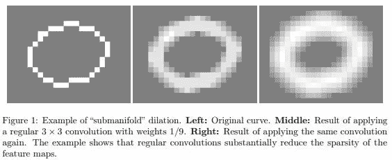
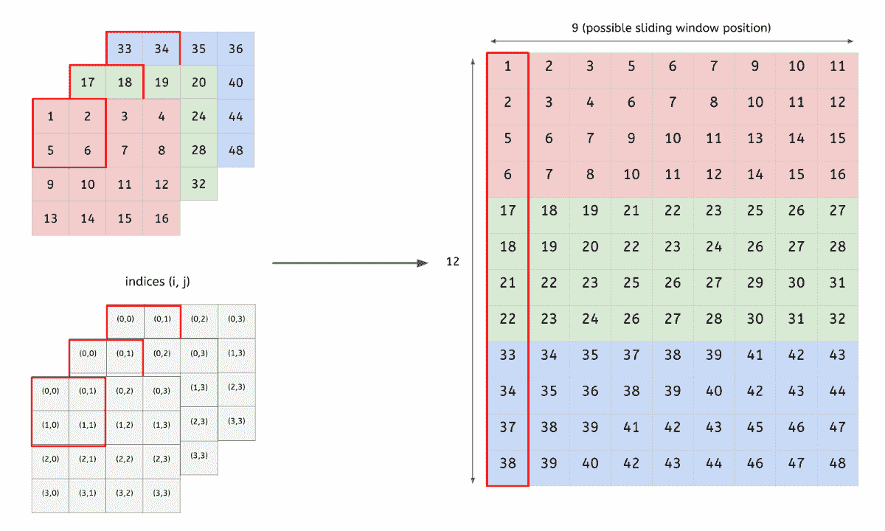
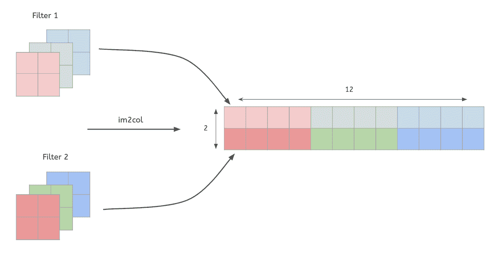
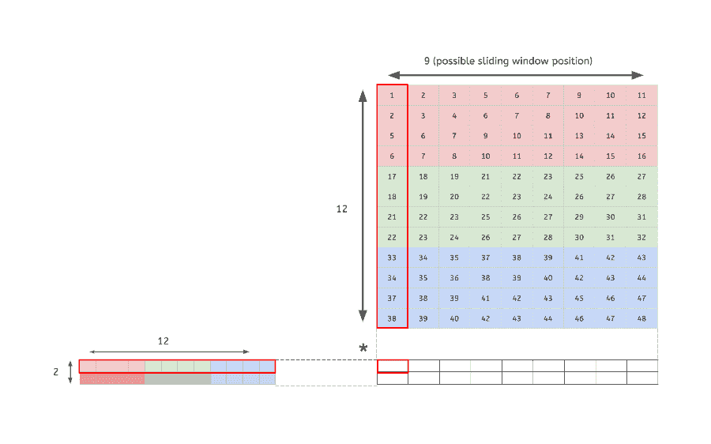
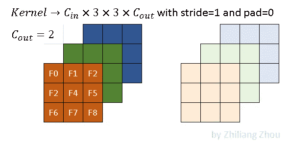
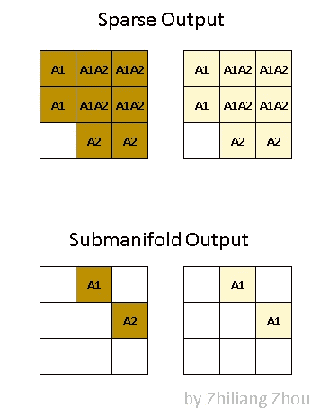
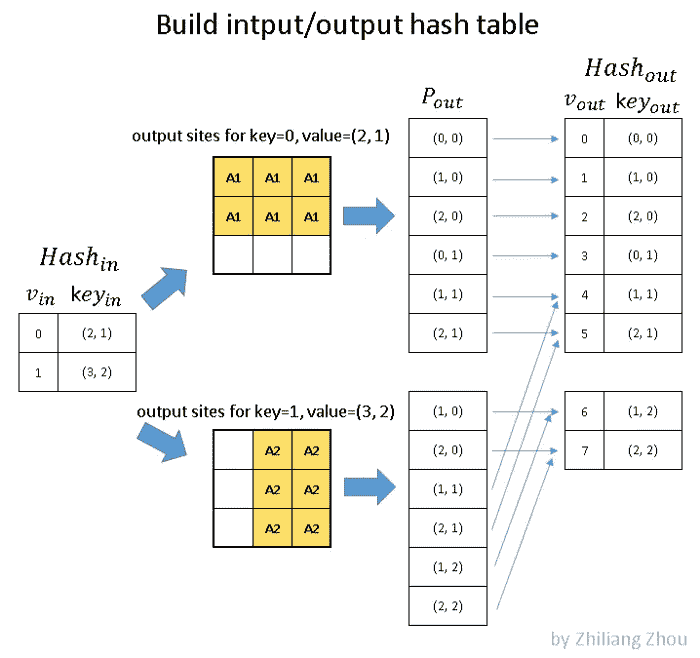
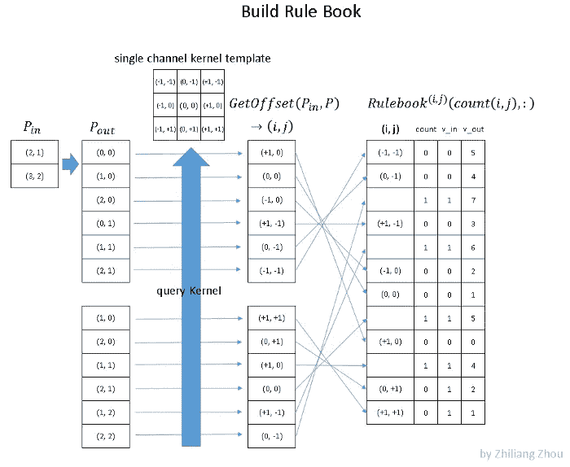
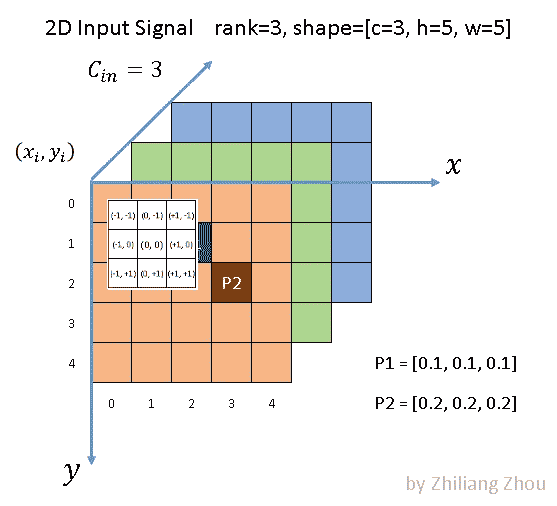

# 稀疏 sab 流形卷积

> 原文：<https://medium.com/geekculture/3d-sparse-sabmanifold-convolutions-eaa427b3a196?source=collection_archive---------1----------------------->

没有稀疏子流形 3D 卷积，用于实时激光雷达点云处理的 CNN 是不完整的。

# 回旋

卷积是计算机视觉深度学习中处理数据最常见的操作。卷积神经网络(CNN)类似于基于深度学习的计算机视觉是如此普遍。

卷积是具有可学习参数的过滤器(矩阵/向量),用于从输入数据中提取低维特征。它们具有保留输入数据点之间的空间或位置关系的属性。卷积神经网络通过在相邻层的神经元之间实施局部连接模式来利用空间局部相关性。

卷积运算不限于图像。卷积运算可应用于 1D 序列数据、2D 相机图像或 3D 激光雷达点云。稀疏卷积在激光雷达信号处理中起着重要的作用。

> 一个解释稀疏子流形 3D 卷积的 [*博客*](https://towardsdatascience.com/how-does-sparse-convolution-work-3257a0a8fd1) *已经在 TDS 上可用。然而，当我浏览博客时，我觉得它本身是不完整的。在这篇博客中，我试图将理解稀疏子流形卷积概念所需的所有信息放在一起。*

# 2D 卷积

在图像数据集上，CNN 架构中主要使用 2D 卷积滤波器。2D 卷积的主要思想是卷积滤波器在 2 个方向(x，y)上移动，以从图像数据中计算低维特征。输出形状也是二维矩阵。

# 三维卷积

3D 卷积将三维过滤器应用于数据集，过滤器沿 3 个方向(x，y，z)移动以计算低级要素制图表达。它们的输出形状是三维体积空间，例如立方体或长方体。它们有助于视频中的事件检测、3D 医学图像、激光雷达点云处理等。

# 当我们已经有 3D 卷积时，为什么还要有子流形稀疏卷积？

3D 卷积运算利用了三维过滤器。这些 3D 过滤器很快增加了模型参数，使得模型过于庞大和缓慢，无法做任何有用的事情。

而且由于图片、视频等常用数据大多可以看成是规则的密集网格，卷积也是基于这种密集结构的特点。当数据结构稀疏时，直接对这些数据应用传统的稠密卷积会由于在空的空间中进行无效的计算而浪费大量的计算资源，所以利用稀疏性来处理这些数据是非常重要的。

随着卷积层的加深，数据的稀疏性无法保持。例如，如果输入数据包含单个 ***活性位点**** ，那么在应用 3×3 卷积后，将有 3×3 活性位点。应用相同大小的第二个卷积将产生 5×5 个活性位点，依此类推。

> 活动站点是指实际包含一些数据的空间中的点。想象在一张白纸上画一个圆。只有存在圆边界的纸张部分是活动的。参考下面的图 1，同性恋区域可以被认为是一张 2D 纸，白色圆圈边界是 2D 平面上的活动点。

***Figure 1: Submanifold expansion*** [Source: [https://arxiv.org/abs/1706.01307](https://arxiv.org/abs/1706.01307)]

如上面的图 1 所示，输入数据是二维空间中的一维曲线。但是经过传统卷积后，提取的特征不再稀疏。“子流形稀疏卷积网络”的作者将这种现象称为子流形扩展问题。子流形是指稀疏的输入数据，比如二维空间的一维曲线，二维曲面，三维空间的点云。它们并不占据它们所在的整个空间。

为了更好地理解这些子流形稀疏 3D 卷积的工作，有必要回顾一下常规卷积是如何操作以及它们是如何实现的。

# 如何实现常规/普通卷积

为了理解正则卷积和稀疏卷积之间的区别，让我们简单地看一下正则卷积是如何实现的。

是的，我知道你只需要调用 torch.nn.Conv2D 或 tf.nn.conv2d，然后有一些 DL 向导魔法和 puff，卷积就完成了。但是理解卷积算法实际上是如何工作的，以及它们在大多数标准 DL 库中是如何实现的，真的很有趣，也很重要。

> 我推荐浏览一下[这个博客](https://hackmd.io/@bouteille/B1Cmns09I)，它很好地解释了卷积是如何从头开始实现的。所有很酷的 gif 都是从那个博客上摘下来的。

我们需要做回旋，快。为了做到这一点，您不能进行嵌套循环实现。GPU 不太喜欢循环，卷积在使用循环的 CPU 上非常慢(相信我)。所以…我们需要对卷积进行矢量化，以便它们可以利用由一些非常聪明的人(不像我)编写的 GEMM(通用矩阵乘法)算法。

**步骤 1:将我们的输入图像转换成一个矩阵(im2col)**

*   首先，我们制作一个 3D 输入图像 2D。怎么会？很酷的 GIF 描述了这是如何做到的。这个过程被称为 im2col。

***Figure 2: im2col*** [Source: [https://hackmd.io/@bouteille/B1Cmns09I](https://hackmd.io/@bouteille/B1Cmns09I)]

*   如果你有 ***M*** 个图像( ***M*** > 1)，你将有相同的矩阵但是水平堆叠 ***M*** 次。
*   对中间特征地图也进行类似的操作。

**步骤 2:重塑我们的内核(展平)**

*   就像图像一样，但是对于卷积核。

***Figure 3: im2col convolution kernel*** [Source: [https://hackmd.io/@bouteille/B1Cmns09I](https://hackmd.io/@bouteille/B1Cmns09I)]

*   如您所见，每个过滤器都被展平，然后堆叠在一起。因此，对于 ***X*** 滤镜，我们将把 ***X*** 滤镜展平并叠加在一起。

**步骤 3:整形输入和内核之间的矩阵乘法**

*   解释 GEMM 需要一个博客本身。为了让它超级容易理解，它是一个非常快速，易于并行化的矩阵乘法算法。

***Figure 4: convolution operation using GEMM*** [Source: [https://hackmd.io/@bouteille/B1Cmns09I](https://hackmd.io/@bouteille/B1Cmns09I)]

*   完成这一计算后，我们进行与步骤 1 相反的操作。这个过程通常被称为 col2im。

# 稀疏卷积如何工作

传统卷积使用 FFT 或 im2col(如上所示)来构建计算流水线。这使得这些卷积中涉及的操作易于并行化。

与传统卷积不同，子流形稀疏卷积处理不能直接应用 GEMM 的稀疏数据。它收集所有的原子操作 w.r.t 卷积核元素，并将它们作为计算指令保存在规则手册中，然后并行执行以获得加速。

子流形稀疏卷积有两个部分:

1.  **卷积运算后不添加到活动位置的子流形卷积**
2.  **稀疏卷积**与常规卷积非常相似，但通过利用输入数据的稀疏性节省了大量计算。

> 还记得子流形膨胀问题(博客开头提到的)吗？为了避免这种情况，我们需要考虑稀疏性，子流形卷积有助于实现这一点。

**稀疏输入数据**

为了解释稀疏卷积的概念，以 2D 稀疏图像处理为例。由于稀疏信号用数据表和索引表表示，2D 和 3D 稀疏信号没有本质区别。

***Figure 5: Sparse data representation*** [Source: [https://towardsdatascience.com/how-does-sparse-convolution-work-3257a0a8fd1](https://towardsdatascience.com/how-does-sparse-convolution-work-3257a0a8fd1)]

如上图所示，我们有一个带有 3 个通道的 5x5 图像。除了两点 P1 和 P2，所有的像素都是(0，0，0)。这种非零元素也被称为**有效输入位置。** 在稠密形式下，输入张量具有 NCHW 阶的形状【1x3x5x5】。稀疏形式下，数据表为[[0.1，0.1，0.1]，[0.2，0.2，0.2]]，索引表为[[1，2]，[2，3]]，YX 顺序。

**稀疏卷积核**

***Figure 6: Sparse convolution kernel*** [Source: [https://towardsdatascience.com/how-does-sparse-convolution-work-3257a0a8fd1](https://towardsdatascience.com/how-does-sparse-convolution-work-3257a0a8fd1)]

稀疏卷积的卷积核与传统卷积的卷积核相同。上图就是一个例子，内核大小为 3x3。深色和浅色代表两种滤镜。

**稀疏卷积输出**

稀疏卷积的输出与传统卷积完全不同。根据所应用的卷积类型，稀疏卷积有两种输出定义，即子流形卷积输出和稀疏卷积输出。

1.  **稀疏卷积输出:**这个类似于常规卷积输出定义。就像普通卷积一样，只要内核覆盖一个输入站点，就计算输出站点。稀疏卷积和常规卷积的区别在于，与常规卷积不同，稀疏卷积放弃了对非活动区域的任何计算。换句话说，如果卷积核覆盖输入上没有任何活动点的区域，则不会为该区域计算输出。
2.  **子流形卷积输出:**对于该卷积，当且仅当输入处的位置是活动的时，才会计算输出，即只有当内核中心覆盖输入位置时，才会计算卷积输出。

***Figure 7: Sparse and Submanifold convolution output*** [Source: [https://towardsdatascience.com/how-does-sparse-convolution-work-3257a0a8fd1](https://towardsdatascience.com/how-does-sparse-convolution-work-3257a0a8fd1)]

上图说明了这两种输出之间的区别。A1 代表有效输出位置，即来自 P1 的卷积结果。类似地，A2 代表从 P2 计算的活动输出站点。A1A2 代表活动输出站点，是 P1 和 P2 输出的总和。深色和浅色代表不同的输出通道。

所以在稠密形式下，输出张量具有 NCHW 阶的形状[1x2x3x3]。在稀疏形式中，输出有两个列表，一个数据列表和一个索引列表，它们类似于输入表示。

稀疏卷积，就像规则卷积增加活性位点一样，那么我们为什么要使用它们呢？

在网络中仅使用子流形卷积的一个潜在问题是，网络可能不会接收到分类输入数据所需的所有信息，特别是，两个相邻的连通分量被完全独立地对待。这个问题可以通过使用某种形式的池或步长卷积来解决。这种操作在稀疏卷积网络中是必不可少的，因为它们允许信息在输入中不相连的组件之间流动。组件在空间上越接近，组件在中间表示中“通信”所需的步进操作就越少。

换句话说，子流形卷积独立地处理输入中的所有活动位置，并为每个活动位置产生输出，因此如果只使用子流形卷积，将会丢失活动输入位置之间的空间关联。当使用稀疏卷积时，生成的输出中使用了多个输入活动部位，这增加了活动部位之间的空间关联。

# 如何实现稀疏卷积

传统卷积通常使用 im2col(如上图)将卷积重写为稠密矩阵乘法问题。然而，稀疏卷积使用索引生成算法和规则手册来调度和执行所有原子操作，而不是 im2col。涉及的步骤如下所述。

**哈希表生成**

我们创建一个哈希映射，包含关于活动输入站点和相应活动输出站点的信息，按照实现考虑稀疏或子流形卷积定义。

***Figure 8: Input-Output hash map generation*** [Source: [https://towardsdatascience.com/how-does-sparse-convolution-work-3257a0a8fd1](https://towardsdatascience.com/how-does-sparse-convolution-work-3257a0a8fd1)]

在上图中，Hashin 是输入哈希表。它存储所有输入活动站点，其中中的 V *是哈希表的索引，而*中的关键字*描述了活动输入站点的空间位置。
输出位置描述了根据稀疏卷积规则，在稀疏输入数据上卷积卷积核时产生的输出【参见图 5 和图 7】。P *out* 保存这些输出活动点的空间位置。
最后，生成一个输出哈希表 Hash *out* ，它保存所有的输出空间位置以及关键字。*

在上面的图 8 中，哈希表中的 V 值是哈希键，键是哈希值。这随着索引生成算法的实现方式而改变。

**规则书生成**

一旦生成了哈希表，我们就有了关于活动输入站点以及它们将生成的相应活动输出站点的信息。现在第二步是建立规则手册。Rulebook 的目的类似于 im2col，即将卷积运算从数学形式(迭代滑动窗口运算)转换为高效的可编程形式。Rulebook 收集卷积中涉及的所有原子操作，并将它们关联到相应的内核元素。

***Figure 9: Rulebook generation*** [Source: [https://towardsdatascience.com/how-does-sparse-convolution-work-3257a0a8fd1](https://towardsdatascience.com/how-does-sparse-convolution-work-3257a0a8fd1)]

在上图中，中的 P *是描述活动输入点空间位置的输入列表。P *out* 保存通过用卷积核卷积活动输入位点而生成的活动输出位点的空间位置。Rulebook 使用此信息从卷积计算过程的 w.r.t .内核元素中收集所有原子操作。*

在上图中，单通道内核模板描绘了单通道 3x3 卷积内核。该模板的每个网格中填充的索引描述了卷积核所跨越的相对空间位置，卷积核的中心位于其原点(参见图 10)。
卷积运算时，卷积核中心位于空间位置(1，1)。在这种情况下，活动输入位置 P1 将在空间位置(0，0)生成活动输出位置，卷积核的索引(+1，0)与活动输入位置 P1 相互作用。当所描述的卷积核索引与活动输入站点交互时，输出的计算是一个原子操作，并被重新编码到规则手册中。

***Figure 10: Sparse Convolution Atomic Operation***

图 9 中最右边的表格是规则手册。规则手册的第一列保存如上所述的卷积核元素索引。规则手册的第二列是关于这个卷积核元素涉及多少原子操作的计数器和索引。第三和第四列分别是这个原子操作中涉及的输入和输出哈希表键。

**计算流水线**

下面的图 11 描述了稀疏卷积的完整计算流水线。

***Figure 11: Sparse Convolution Computation pipeline*** [Source: [https://towardsdatascience.com/how-does-sparse-convolution-work-3257a0a8fd1](https://towardsdatascience.com/how-does-sparse-convolution-work-3257a0a8fd1)]

红色和蓝色箭头表示两个计算实例。红色箭头处理内核元素(-1，-1)的第一个原子操作。从 Rulebook 中，我们知道这个原子操作的输入来自位置(2，1)的 P1，输出来自位置(2，1)。类似地，蓝色箭头表示另一个原子操作，它共享同一个输出站点。红色箭头实例和蓝色箭头实例的结果可以相加。

规则书中的计算可以在 GPU 中并行展开。

# 结论

是的，稀疏子流形卷积很难理解，但它们是有效的。第二次推出了第一个基于 GPU 的规则书生成算法，将使用 3D 卷积的 CNN 引入实时推理领域，从那时起，这种 CNN 就一直在发展。

子流形稀疏 3D 卷积现在正被几乎所有其他激光雷达 3D 对象检测模型使用，以高精度实时进行 3D 对象检测，这是自动驾驶汽车所必须的。

# 参考

*   [利用子流形稀疏卷积网络的 3D 语义分割](https://arxiv.org/abs/1711.10275)
*   [子流形稀疏卷积网络](https://arxiv.org/abs/1706.01307)
*   [第二:稀疏嵌入卷积检测](https://www.researchgate.net/publication/328158485_SECOND_Sparsely_Embedded_Convolutional_Detection)
*   [稀疏卷积是如何工作的？](https://towardsdatascience.com/how-does-sparse-convolution-work-3257a0a8fd1)
*   [带 Numpy 的卷积神经网络](https://hackmd.io/@bouteille/B1Cmns09I)