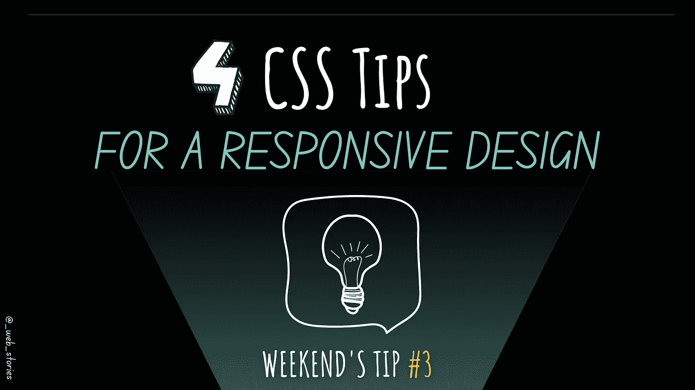

# CSS 中响应式设计的 4 个最佳技巧

> 原文：<https://medium.com/geekculture/4-best-tips-for-responsive-design-in-css-43f3a3de286c?source=collection_archive---------3----------------------->

## 让它处处漂亮！

By FAM

## 你好👋

该是周末小费的时候了。这一次，我将与你分享制作响应性网页的最佳技巧！

# #1-媒体查询

要使网页具有响应性，您必须根据一些断点来调整您的设计。你会有…