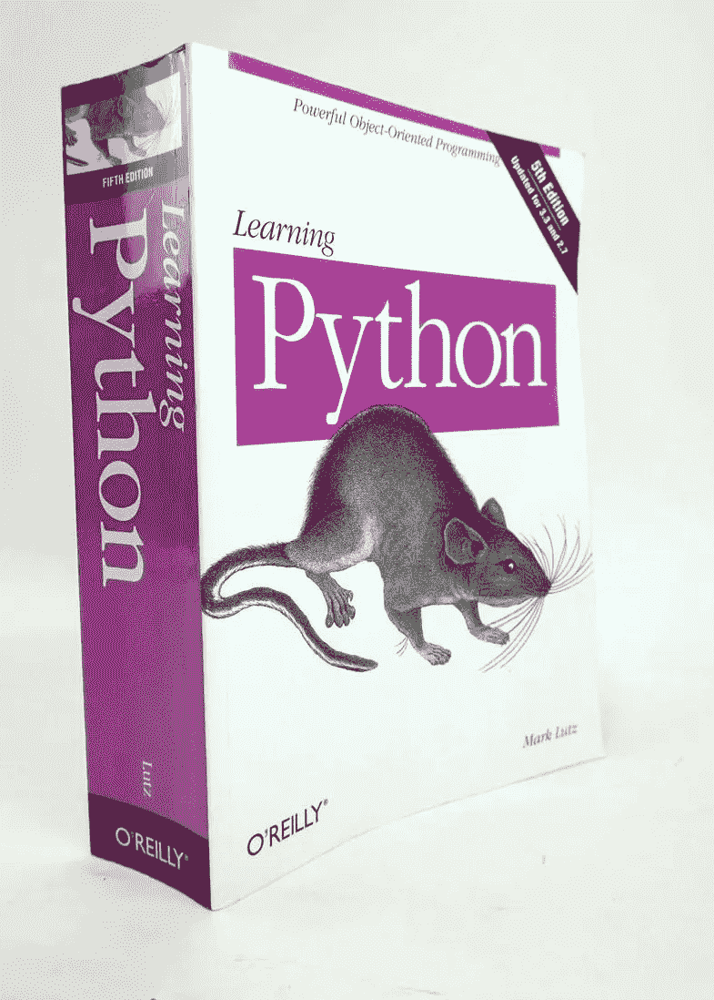
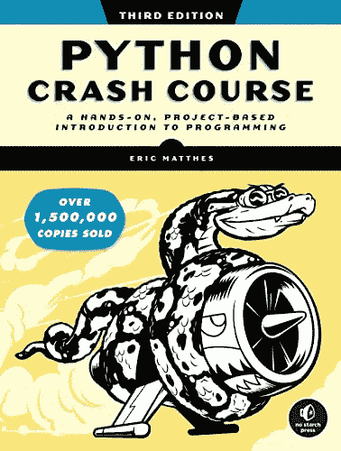
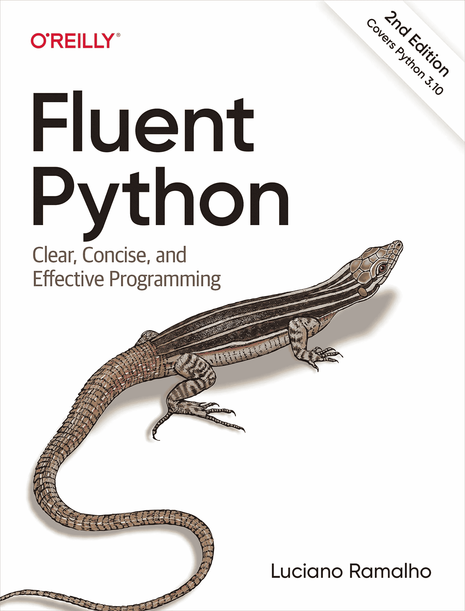
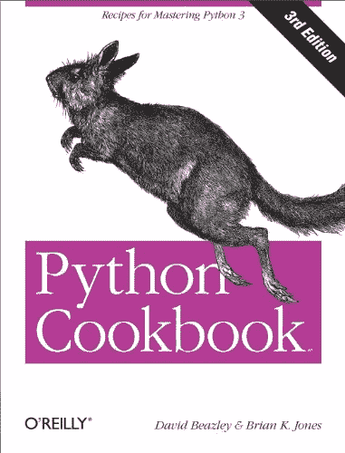

# 掌握 Python 的 4 本书

> 原文：<https://medium.com/geekculture/4-books-to-master-python-85a7a917831a?source=collection_archive---------7----------------------->

image generated by deep.ai

对于任何对从事技术职业感兴趣或者只是想提高解决问题的技能的人来说，学习 Python 是一项有价值的技能。它是一种多功能的语言，可以用于广泛的目的，从 web 开发和数据分析到人工智能和科学计算。

有许多资源可用于学习 Python，包括在线课程、教程和书籍。在这篇博文中，我们将重点介绍四本书，它们能够并将帮助您，Python 大师。这些书涵盖了一系列的技能水平和主题，所以你可以选择最适合你的需求和目标。

无论您是希望开始学习 Python 的初学者，还是希望扩展技能的有经验的程序员，这些书籍都可以提供 Python 编程的坚实基础，并帮助您精通这门语言。那么，让我们更详细地看看这四本书。

## 马克·卢茨的《学习 Python》

马克·卢茨的《学习 Python》是一本全面的 Python 编程指南，涵盖了基础和更高级的主题。它适合初学者和有经验的程序员。

这本书从 Python 语言的全面介绍开始，包括它的语法、数据类型和控制结构。然后，它转向更高级的主题，如面向对象编程、数据争论以及使用 Python 的内置模块和库。

“学习 Python”的优势之一是其清晰简洁的写作风格，这使得它很容易跟上和理解所呈现的概念。这本书还包括许多例子和练习，以帮助你练习和巩固你对材料的理解。

总的来说，“学习 Python”对于任何想要学习 Python 编程的人来说都是一个极好的资源，无论他们是刚刚开始还是想要加深对这门语言的理解。

## Eric Matthes 的“Python 速成班”

这本书是对 Python 编程的快速、全面的介绍，非常适合初学者。它涵盖了所有的基本概念，并包括练习，以帮助您实践和巩固您的理解。

这本书从 Python 编程的基础开始，包括如何安装和设置 Python，如何使用变量、数据类型和控制结构，以及如何编写和运行 Python 程序。然后，它转移到更高级的主题，如使用列表、字典和类，以及使用模块和库。

“Python 速成班”的一个主要特点是它侧重于实际例子和动手练习。这本书包括大量的练习和项目，让你能够应用你所学的知识，并作为一名 Python 程序员建立你的技能。

总的来说,“Python 速成班”对于任何想要开始学习 Python 编程的人来说都是一个很好的资源。它的快节奏、实践方法使得学习基本概念和开始编写 Python 代码变得很容易

## 卢西亚诺·拉马尔霍的《流畅的蟒蛇》

这本书的目标读者是中高级 Python 程序员，重点是帮助你更流利地使用 Python。它涵盖了广泛的高级主题，包括数据结构、并发性和元编程。

这本书从探索 Python 数据模型以及如何使用它来编写富有表现力和高效的代码开始。然后，它继续讨论更高级的主题，如编写面向对象的代码、使用生成器和异步编程，以及使用数据持久性和序列化。

“流利的 Python”的优势之一是它专注于帮助你成为一个更有效和高效的 Python 程序员。它不仅涵盖了高级 Python 概念的技术细节，还提供了如何在现实世界中应用它们的指导。

总的来说，“流利的 Python”对于希望加深对该语言的理解并更加精通其技术的中高级 Python 程序员来说是一个很好的资源。它涵盖了广泛的高级主题，并就如何在现实世界中应用它们提供了实用的指导。

## 大卫·比兹利和布莱恩·k·琼斯的《Python 食谱》

这本书收集了解决常见 Python 编程问题的方法。它适合中高级 Python 程序员，是寻找特定问题的解决方案或学习新 Python 技术的绝佳资源。

这本书分为不同的章节，每一章都关注 Python 编程的一个特定领域。涵盖的一些主题包括数据结构、算法、网络和 web 编程、并发性以及测试和调试。

“Python Cookbook”的一个关键特性是它专注于为现实世界的问题提供实用的解决方案。书中的每个食谱都包括一个示例代码和如何使用它来解决特定问题的详细说明。这使得寻找特定问题的解决方案或学习新的 Python 技术变得容易。

总的来说，“Python Cookbook”对于寻找特定问题的解决方案或学习新的 Python 技术的中高级 Python 程序员来说是一个很好的资源。它实用的、以解决方案为中心的方法使它成为任何 Python 程序员的宝贵资源。

## 最后的话

有很多优秀的书籍可以帮助你学习和掌握 Python 编程。这篇博文中提到的四本书分别是马克·卢茨的《学习 Python》，埃里克·马特斯的《Python 速成教程》，卢西亚诺·拉马尔霍的《流利的 Python》，大卫·比兹利和布莱恩·k·琼斯的《Python 食谱》。

在选择 Python 书籍时，考虑自己学习 Python 的技能水平和目标很重要。如果你是初学者，“Python 速成班”或者“学习 Python”会是不错的选择。如果你是一个中级或高级 Python 程序员，“流利的 Python”或“Python Cookbook”会更合适。无论你选择哪本书，你都将很快掌握 Python 编程。

最后，如果你喜欢这篇文章，给它一个赞，在 Twitter 上关注我@ @[shehzensidiq](https://twitter.com/shehzensidiq)并且尝试在 Medium 上关注我。

如果你有任何问题或疑问，欢迎在评论中提问。

谢谢你，祝你愉快。