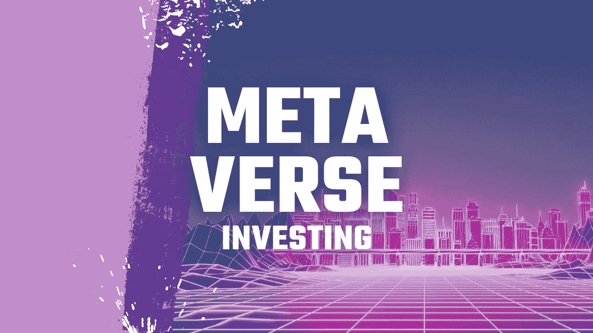

# 每个人投资虚拟未来的 4 种简单方法

> 原文：<https://medium.com/geekculture/4-easy-ways-for-everybody-to-invest-in-virtual-future-538d2a00ad43?source=collection_archive---------13----------------------->

## 元宇宙被视为互联网的下一代，是物理世界和数字世界的交汇点。

Thumbnail from [Günter Ederegger](https://medium.com/u/4f0c50d16421?source=post_page-----538d2a00ad43--------------------------------)

虽然对许多人来说，*元宇宙*这个词可能听起来很陌生，但它已经存在了三十多年。但是，随着新项目的出现，它最近越来越受欢迎