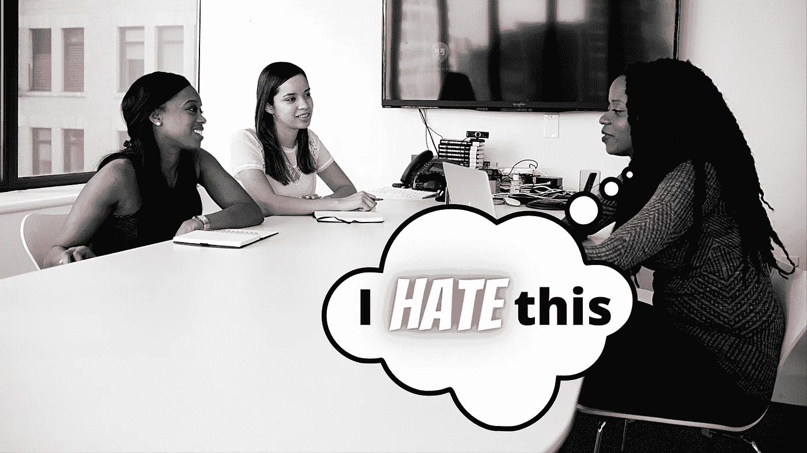

# 长达 4 小时的技术面试是错误的。我们不能再这样了

> 原文：<https://medium.com/geekculture/4-hour-long-technical-interviews-are-wrong-we-gotta-stop-doing-that-438582302da4?source=collection_archive---------10----------------------->

## 为什么我认为冗长的面试毫无意义，以及如何解决这些问题

Original Photo by [Christina @ wocintechchat.com](https://unsplash.com/@wocintechchat?utm_source=unsplash&utm_medium=referral&utm_content=creditCopyText) on [Unsplash](https://unsplash.com/s/photos/interview?utm_source=unsplash&utm_medium=referral&utm_content=creditCopyText), edits by Author

面试候选人的全部目的是了解他们是否非常适合你的公司/团队。试着从团队中剔除那些技术能力不足的人，保留那些能帮助你做出…