# Python 中每个初学者都必须知道的 4 个关键数据结构。

> 原文：<https://medium.com/geekculture/4-key-data-structures-in-python-every-beginner-must-know-9c5d5026e164?source=collection_archive---------10----------------------->

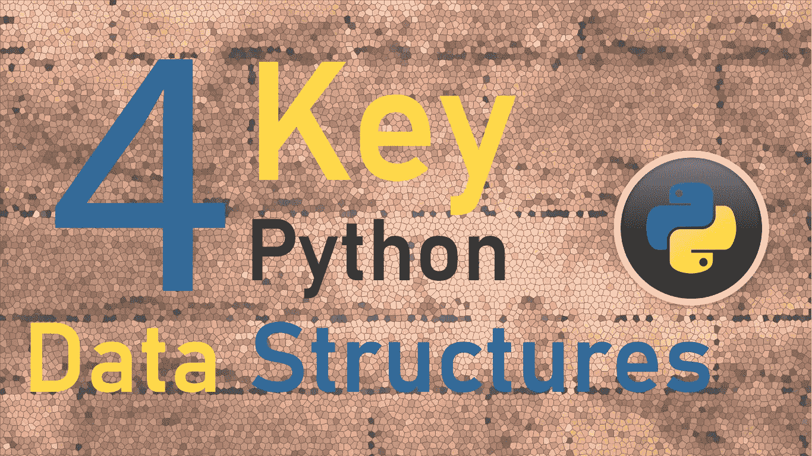[](https://writersbyte.com/programming/4-key-python-data-structures-e-very-beginner-must-know/) [## 每个初学者都必须知道的 4 个关键 Python 数据结构。- WritersByte

### 最近几年，Python 已经成为最受编程新手欢迎的语言，因为它易于使用，而且…

writersbyte.com](https://writersbyte.com/programming/4-key-python-data-structures-e-very-beginner-must-know/) 

近年来，Python 已经成为最受编程新手欢迎的语言，因为它易于使用，并且在人工智能和数据科学就业市场上越来越受欢迎。

由于越来越受欢迎，我决定列出并解释 python 中每个 python 初学者都必须理解的最重要的数据结构。

我也写过关于数据科学技术和人工智能的文章。如果感兴趣，点击下方；

[](https://writersbyte.com/datascience/ai-for-beginners-3/) [## 面向初学者的人工智能:计算机视觉和自然语言处理

### 我们已经谈了很多关于人工智能的一般意义以及它对我们世界的影响。在以前的文章中，我们…

writersbyte.com](https://writersbyte.com/datascience/ai-for-beginners-3/) [](https://writersbyte.com/datascience/implementing-multi-variable-linear-regression-algorithm-in-python/) [## 用 Python 实现“多元线性回归”算法。- WritersByte

### 机器学习算法在过去十年中获得了巨大的普及。今天，这些算法被用于…

writersbyte.com](https://writersbyte.com/datascience/implementing-multi-variable-linear-regression-algorithm-in-python/) 

本文涵盖了以下数据结构；

*   **列表**
*   **元组**
*   **字典**
*   se t

## 目录


python 中的列表是项目的集合。列表可以包含多种数据类型，要记住的最重要的事情是它们是 ***可变对象*** 。

单词“Mutable”意味着它们在创建后可以被改变，也就是说，你可以很容易地在这个集合中添加或删除元素。让我们来看一些列表是如何形成和操作的例子。

*Python 列表由方括号'* **[]'** 标识

```
#initializing a list
lst = []print("Type of this variable is:", type(lst))#adding items to the list
lst.append(1)
lst.append("String item")
lst.append(1.6)print("Your list contains:",lst)
```

上面的函数显示了我们可以初始化一个列表，然后向其中添加条目。append()函数是 list 类的内置方法，它允许我们向列表中添加元素。

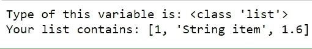

The output of list creation

现在让我们试着移除一些元素。

```
#remove some items from the list
lst.remove("String item")
lst.remove(1)print("The list now contains:", lst)
```

remove()函数属于 list 类，用于从列表中移除元素。

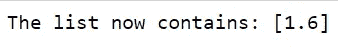

Output from removing elements.

从列表中移除元素有多种方法。另一个有用的方法是 pop()方法。使用 pop()不仅可以从列表中删除元素，还可以将它返回给用户。

```
#initializing a list with some elements already in it
new_lst = [1,2,4.5,"element"]#pop out the element at index 2
ele = new_lst.pop(2)print("Retrieved Element:", ele)
print("List after removal of element", new_lst)
```

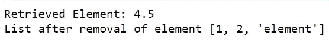

Output after performing pop()

你一定注意到了 *pop()* 和 *remove()* 之间的一个主要区别，那就是后者只是从列表中删除元素，而前者只是将元素返回给你，你可以将元素存储在一个变量中。根据您的问题，这两种方法都有其用途。

[](https://writersbyte.com/datascience/5-data-processing-techniques-for-data-science-beginners-python-and-pandas/) [## 面向数据科学初学者的 5 种数据处理技术| Python 和 Pandas - WritersByte

### 对于所有寻找数据科学工作或数据科学实习的年轻科学家来说，数据处理是一项技能…

writersbyte.com](https://writersbyte.com/datascience/5-data-processing-techniques-for-data-science-beginners-python-and-pandas/) 

## 元组


元组也是元素的集合，快速浏览一下会让你觉得元组和列表非常相似，然而，有一些要点将这两者区分开来。

在 python 中，元组由圆括号' **()** '标识，与列表不同， ***元组是不可变的*** 。这意味着它们在创建时就被分配了特定的内存位置和大小，之后就不能被操作了，也就是说，不能在 python 元组中添加或删除元素。

我们来看一些例子；

```
#creating an empty tuple
x = ()
print("x is a:", type(x))
```

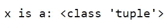

x belongs to the tuple class

让我们尝试添加一些元素；

```
#place a number at the 0th index
x[0] = 24
```


error on assignment

哎呦！！那里发生了什么？这就是我说元组是不可变的意思。那么我们如何给它添加元素呢？

从技术上来说，你不需要向它添加元素，你必须在创建它的时候定义它的元素。有许多方法可以做到这一点。

```
#creating a tuple
x = (1,2,"Third Element")
print("Current tuple:", x)#creating tuple using the tuple class constructor
y = tuple([1,5,5.5])
print("Tuple y:, y)
```

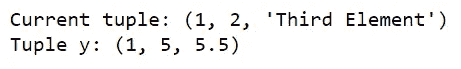

Filled tuples

注意，在上面的第二个例子中，我是如何将一个列表传递给元组构造函数的。元组构造函数可以将任何项目集合转换为元组。

不过元组是可索引的。您可以根据索引从元组中挑选出项目。

```
#accessing first element of x
print("The first element of x is:",x[0])#accessing last element of y
print("The last element of y is:",y[-1])
```

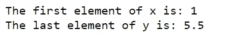

Tuple Indexing

***额外提示:可以使用负数来索引集合末尾的元素，即-1 表示最后一个元素，-2 表示倒数第二个元素，依此类推。***

## 词典


字典以键值对的形式保存元素。在 python 和类似的列表中，它们由花括号' **{}** '标识，它们也是可变对象。

在字典中，每个元素(值)都由它的键来标识。字典的一般结构如下所示。

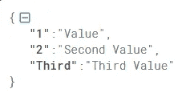

Dictionary Structure

键和值对具有一对一的映射。

```
#initialising a dictionary
dictionary = {}#Setting key-value pairs
dictionary[1] = "First Element"
dictionary["Second"] = "Second Element"
dictionary[3] = ["This", "is", "a", "list"]print("Our Dictionary: \n", dictionary)
```

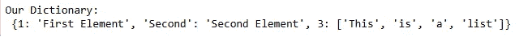

Our dictionary

上述词典示例旨在解释以下要点:

*   一个键可以指向一个值(该值也可以是一个数组)。
*   字典的键可以是多种数据类型(int、string 等。)但它必须是单个元素(而不是数组)。
*   值也可以有多种数据类型**和**也可以是元素的集合，如列表或元组。
*   在单个字典中，键值对由逗号分隔。

让我们看看如何遍历字典。

```
#print all keys and values using a loop
for key, value in dictionary.items():
    print(key, "points to (", value, ")")

print("\n")#printing all the keys from the dictionary
print(dictionary.keys())print("\n")
#printing all the values from the dictionary
print(dictionary.values())print("\n")#printing values according to a given key
print("Values pointed to by given keys")
print("3 points to:",dictionary[3])
print("'Second' points to:",dictionary["Second"])
```

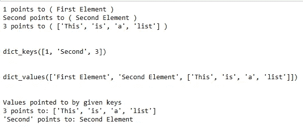

Outputs from the above code

那就是总结出来的字典结构。

## 一组


[source](http://dbadiaries.com/wp-content/uploads/2015/07/remove-duplicates-data.jpg)

集合与我们上面谈到的结构非常不同。这些是可变对象(创建后可以更改)，但它们也有一个独特的属性，即它们 ***只允许唯一的元素存储在它们*** 中。集合元素也是不可索引的(这在前面的例子中会变得更清楚)。

与字典类似，集合也由花括号( **{}** )来标识，但是它们不能通过简单地键入' {} '来初始化，因为 python 会将其识别为字典。使用**集合类构造函数初始化集合。**

```
#initilize the set
a = set()#add elements to the set
a.add(1)
a.add(3)
a.add(4)#view elements of the set
print(a)
```

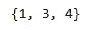

The set we just created

让我们看看是否可以在其中添加一个重复的项目；

```
#trying to add 3 again
a.add(3)print(a)
```


no duplicate item was added

不出所料，副本 3 没有添加到我们的集合中。让我们试试另一个例子。

```
#creating a list with duplicate items
lst = [1,1,1,1,2,2,3,4,5,7,2,56, "element", "element"]#converting the list to set
lst_set = set(lst)print('Our original list:', lst)
print('Converted to a set:',lst_set)
```

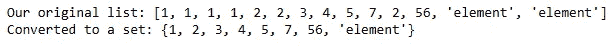

Duplicate elements removed from the list when converted to a set

## 结束了

这基本上总结了 python 中每个初学者都必须知道的主要数据结构。在您作为 python 开发人员或数据科学家的旅程中，对这些数据结构的深刻理解肯定会给您带来优势。

[](https://writersbyte.com/author/moosa-ali/) [## 穆萨·阿里

writersbyte.com](https://writersbyte.com/author/moosa-ali/)