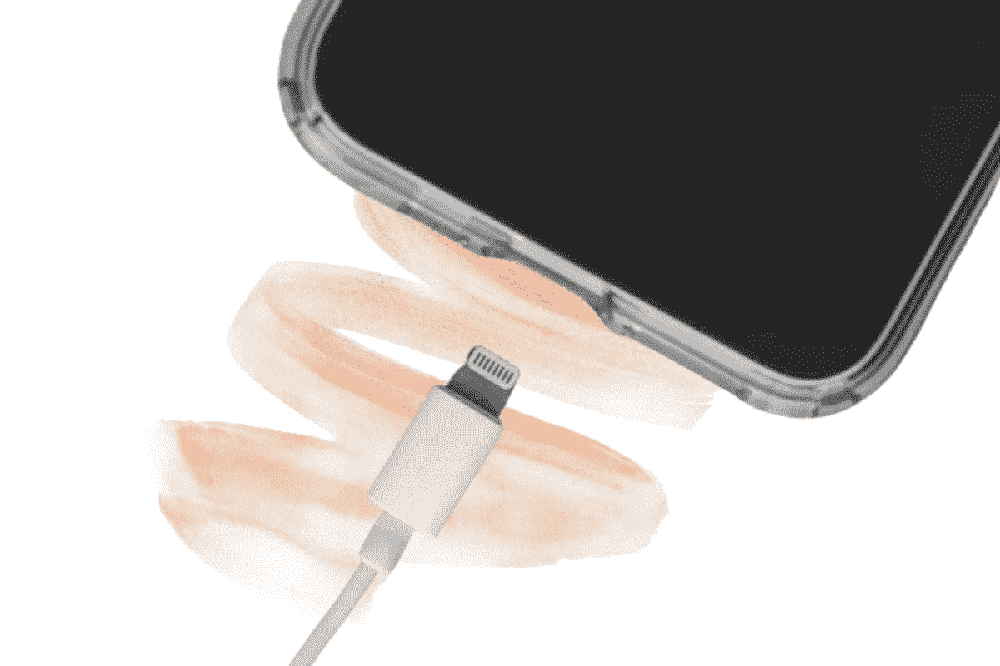

# 关于智能手机电池的 4 个误区

> 原文：<https://medium.com/geekculture/4-myths-about-smartphone-batteries-33ecb347fedc?source=collection_archive---------20----------------------->

Image from [Canva](http://canva.com)

你可能经常会听到或读到一些关于智能手机电池使用以及如何改进它们的建议。

手机电池应该会耗尽，这是肯定的。

然而，围绕电池仍有一些神话，人们至今仍盲目相信。

# 充电时使用设备会损坏…