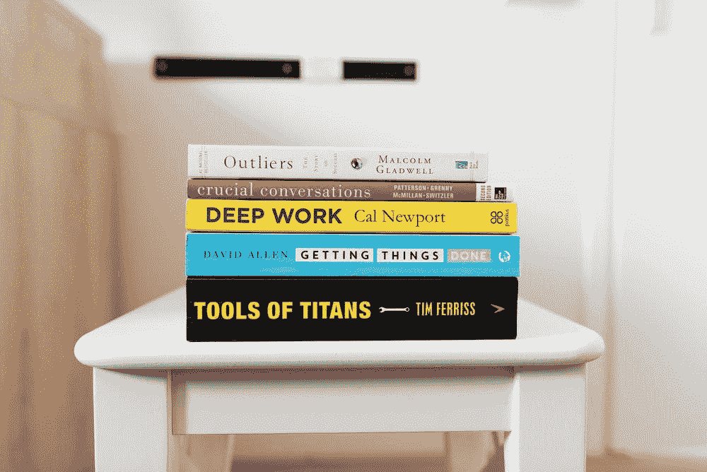

# 4 本非数据科学书籍，让你成为更好的数据科学家

> 原文：<https://medium.com/geekculture/4-non-data-science-books-that-will-make-you-a-better-data-scientist-c0a3edc01769?source=collection_archive---------0----------------------->

## 这四本书教给你在线课程所没有的东西。

Photo by [Jeroen den Otte](https://unsplash.com/@jeroendenotter)on [Unsplash](https://unsplash.com/photos/1SA__aN_I2U)

数据科学超越了数据和模型。在一天结束的时候，你需要运用你的沟通技巧来有说服力地推销你的想法，运用精彩的故事来让最难的概念变得容易为每个人理解，并运用人际交往技巧来…