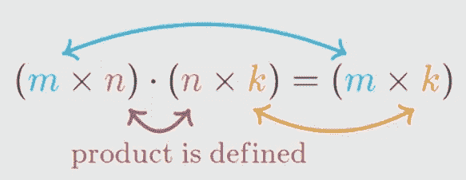
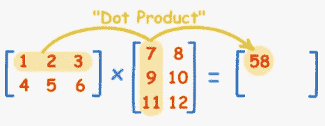
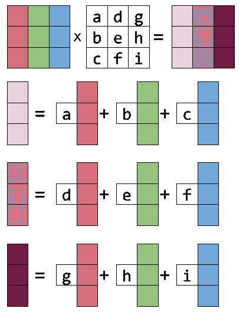
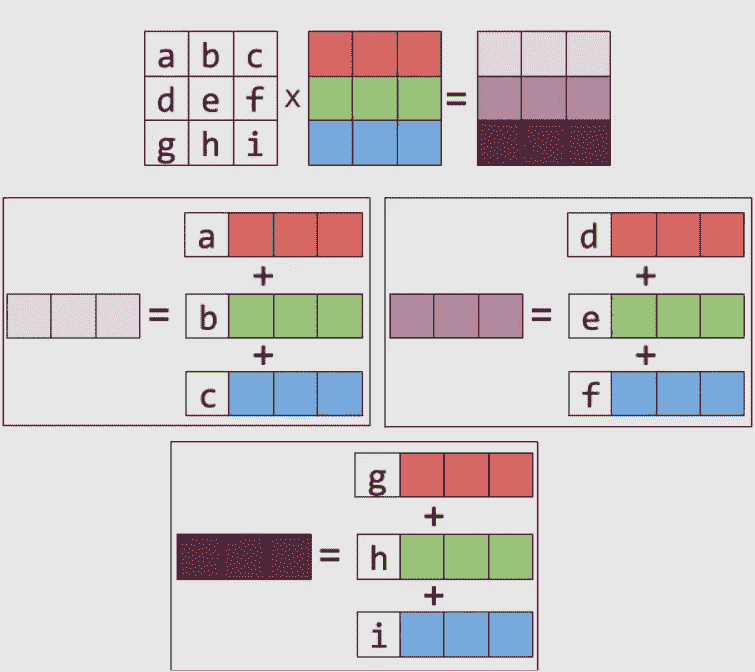

# 矩阵乘法的 4 张图

> 原文：<https://medium.com/geekculture/4-pictures-of-matrix-multiplication-dbe30cb961a9?source=collection_archive---------6----------------------->

计算机图形学，深度学习，无论你在什么设备上阅读，都执行矩阵乘法。随着数字世界中产生和存储的数据量的增加，需要矩阵乘法来有效地处理和存储信息。这篇文章描述了考虑矩阵乘法的 4 种简单而有效的方法。


Image by Shutterstock

理解思考矩阵乘法的不同方式对任何对数据科学或线性代数感兴趣、想要优化他们使用计算机的方式或想要以不同的方式思考世界的人都是有帮助的。

# 为什么选择矩阵

除了有趣之外，矩阵还非常有用。一方面，它们是存储、组织和表示数据的非常有用的工具。矩阵本质上是数字的电子表格。另一方面，矩阵被用作可以跨多个域关联信息的函数。深度学习的基础是利用矩阵乘法构造感兴趣的函数。矩阵作为函数的第二种用法有点抽象，但是通过矩阵乘法的不同表示，它会变得更加清晰。

如果矩阵表示数据或函数，那么矩阵乘法表示可以通过关联多个数据源或函数找到的信息。了解矩阵乘法如何处理您正在处理的任何数据或函数，可以帮助您思考处理和解决问题的新方法。

# 简单的数学背景

阅读本文所需的数学知识相对较少。可以总结如下。

矩阵是用来存储各种信息的数字网格。一个 *m×n* 矩阵有 *m* 行和 *n* 列。为了使两个矩阵相乘，第一个矩阵的列数必须与第二个矩阵的行数相同。例如，一个 *m×n* 矩阵可以乘以一个 *n×p* 矩阵，得到一个大小为 *m×p* 的乘积。



Image by Kahn Academy

## 线性变换

线性变换是一种特殊类型的函数，只使用加法和乘法。这些变换很好使用，因为几乎任何人都可以做加法和乘法，但它们也是非常强大的工具。矩阵和线性变换是同义的，因为每个矩阵都是线性变换，并且每个线性变换都可以写成矩阵。

既然矩阵是线性变换，那么矩阵相乘的乘积，一个新矩阵，也是线性变换。可以通过考虑每个矩阵的性质并考虑以下 4 种方式的乘法来研究乘积的性质。

# 矩阵乘法的 4 张图

本文的剩余部分将解释这 4 种方法。从现在开始，考虑乘法问题 *A×B=C，*其中 *A* 和 *B* 是相乘的矩阵， *C* 是乘积。一般总结为:

1.元素方面:通过对来自 *A* 和 *B 的值进行一系列元素乘运算来计算 *C* 中的每个元素。*

2.逐列:通过对 *A.* 中的列进行线性组合来计算 *C* 中的每一列

3.逐行:计算 *C* 的每一行是 *B.* 中各行的线性组合

4.矩阵求和:将 *A* 列与 *B.* 行的外积求和，计算 *C*

# 逐元素乘法

这是典型的矩阵乘法的第一种方法。为了计算 *C* ，我们需要计算每个元素 *C(i，j)，*，其中 *i* 是行， *j* 是元素*的列。C(i，j)* 通过将 *A* 的第 *i* 列与*b*的第 *j* 行相乘或取点积来计算

## 点积

点积是一个非常简单的操作，可以应用于相同大小的两个矩阵。通常，该操作通常在向量或矩阵列或行上完成。对于 a 向量 *v* 和 *u，*都有 *n 个*元素，则 *u×v* 的点积或乘法是通过将 *u* 中的 *i* 元素乘以 *v 中的 *i* 元素，对于 *i* 的所有值，乘以*来计算的

当手动执行这种方法时，我们通常会想到将第一个矩阵的一行和第二个矩阵的一列圈起来，以计算乘积中的一个元素。



Image by mathisfun.com

在上图中，计算了点积:1×7+2×9+3×11 = 58。

幸运的是，NumPy 有一个内置函数`np.dot`来计算行和列之间的点积。

```
def elementwise_multiplication(A, B):
    C = np.zeros((len(A),len(B[0])))
    for i in range(len(C)):
        for j in range(len(C[0])):
            C[i,j] = A[i,:].dot(B[:,j])
    return C
```

在上面的代码中，`A[i,:]`是 *A* 的第 *i* 行，`B[:,j]`是*b*的第 *j* 列，double `for`循环对由输出矩阵 *C.* 的大小设置的 *i* 和 *j、*范围内的每个值进行迭代

该函数的一些属性与下面几节中的相似。`C`被初始化为全零矩阵。它的大小被设置为具有 *A* 中的行数和 *B* 中的列数。本文中的所有代码都可以在这个 Google Colab 笔记本中找到并运行[。](https://colab.research.google.com/drive/1nPESlQE8yYmG3p-bBwlSFTWo2s94Lp6-?usp=sharing)

虽然这种方法很容易学习，但它并没有提供太多关于 *A* 的行如何与 *B* 的列相关联，或者这两者如何与 *C 的结构相关联的信息。*

# 柱形图

列式乘法依赖于对矩阵向量乘法的思考，并且与行图像框架几乎相同。我最近写了一篇关于矩阵向量乘法的文章，详细解释了两种不同的思考方式，但是我也会简单描述一下这里需要什么。

考虑将矩阵乘以右边的列向量的问题，如下图所示。从矩阵的角度来看，乘法的乘积将是矩阵的列的线性组合。下图显示了这一点，其中列乘以来自列向量的系数，然后相加得到最终乘积。



Image by Eli Bendersky on [thegreenplace](https://eli.thegreenplace.net/2015/visualizing-matrix-multiplication-as-a-linear-combination/)

从线性变换的角度来看， *m×n* 矩阵是将具有 *n* 个元素的向量映射到具有 *m* 个元素的向量的函数。在这样的矩阵中，有 *n* 个列向量，跨越列空间，每个列向量有 *m* 个项。矩阵函数的乘积是一个具有 m 个元素的向量，由于矩阵是线性变换，乘积将是 n 个列的线性组合。被相乘的向量包含矩阵的第 *n* 列的线性组合的系数。

从矩阵和线性变换的角度来看，乘积是矩阵列的线性组合。下面的代码基于这种思维方式执行矩阵的矩阵乘法。

```
def columnwise_multiplication(A,B):
    C = np.zeros((len(A),len(B[0])))
    for column in range(len(B[0])):
        C[:,column] = A.dot(B[:,column])
    return C
```

上面的代码使用术语`C[:,column]`遍历 *C* 的列，一次计算一列。每一列是通过将 *B、*、`B[:, column]`的一列乘以整个矩阵 *A、*来计算的，该矩阵采用 *A、*中的行的线性组合

# 行图片

该过程与列图相同，除了它考虑的是左乘法[而不是右乘法](/geekculture/right-and-left-matrix-multiplication-d21947f195d8?source=friends_link&sk=95f939bc31ed7c635a03e67a4035af69)。使用这个透视图，乘积 *C* 将具有矩阵 *B 中的行的线性组合。*A*A*的列将是线性组合的系数。下图是一个很好的例子。



Image by Eli Bendersky on [thegreenplace](https://eli.thegreenplace.net/2015/visualizing-matrix-multiplication-as-a-linear-combination/)

该图显示了如何产生 *C* 将具有的行是 *B 中的行的线性组合。*该图与上图几乎相同。唯一的区别是在列空间和行空间中工作。

这个代码看起来非常类似于列图片的代码。

```
def rowwise_multiplication(A,B):
    C = np.zeros((len(A),len(B[0])))
    for row in range(len(A)):
        C[row,:] = B.T.dot(A[row,:])
    return C
```

这段代码的设置和运行与上面的代码非常相似。需要注意的一点是，为了应用 *A* 、`A[row,:]`中的一行与矩阵 *B、*的左乘， *B* 的转置与 *A、*的行右乘，这些操作是等价的。

# 矩阵和图

这可能是矩阵乘法最不直观的表示，但它为如何思考奇异值分解或主成分分析等概念提供了很好的直观性，这是数据科学和线性代数中非常强大的两种技术。

在第一种方法中，逐元素乘法，将一行 *A* 乘以一列 *B* 得到 *C* 中的单个元素。在这种方法中， *A* 中的一列乘以 *B* 中的一行，得到一个大小为 *C.* 的矩阵，这种运算有时被称为外积。由于被乘向量的大小或形状改变，乘积的大小也会改变。将许多大小为 *C* 的矩阵相加将得出乘积的最终值。

手动执行这个过程可能很繁琐，但是它的代码相对简单。

```
def matrix_sum_multiplication(A,B):
    C = np.zeros((len(A),len(B[0])))
    for n in range(len(A[0])):
        C += np.dot(np.atleast_2d(A[:,n]).T, np.atleast_2d(B[n,:]))
    return C
```

在上面的代码中，`A[:,n]`和`B[n,:]`分别代表 *A* 和 *B* 的一列和一行。函数`np.atleast_2d`用于使行和列向量显示为 NumPy 中的 2D，而不是 1D，这样`np.dot`将按预期工作。在这种情况下，`np.dot`的输出是一个与 *C、*大小相同的矩阵，因此用`+=`将其加到 *C* 上。

如果你做到了这一步，请按下鼓掌按钮或给我一个关注。我刚接触媒体，正试图写出一些关于我如何看待数学、数据科学和计算机的内容。如果这是你喜欢的，请跟我来。