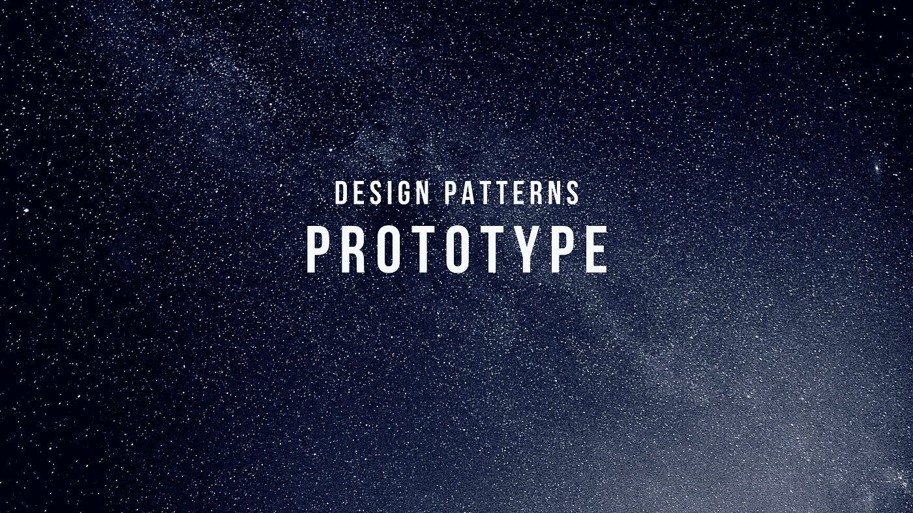
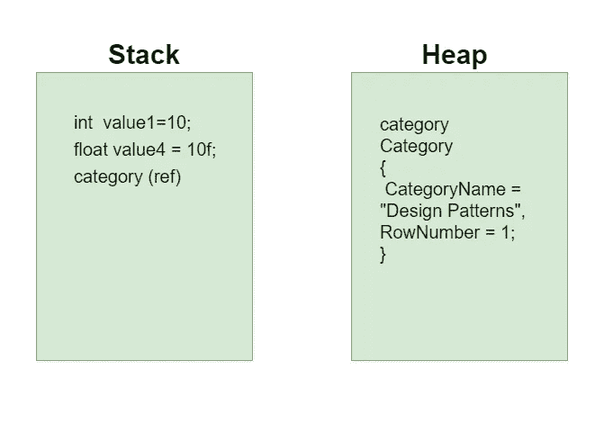
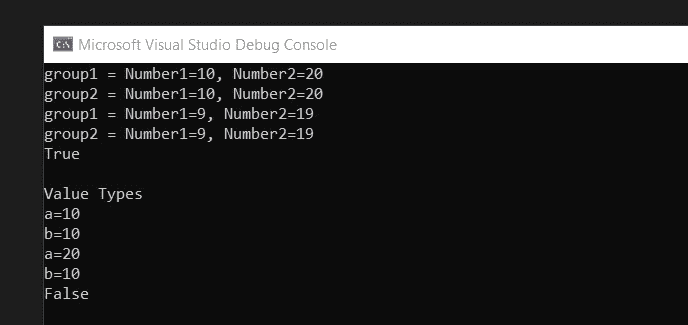
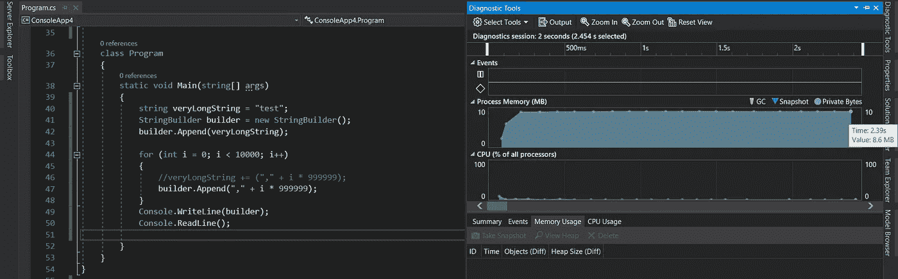
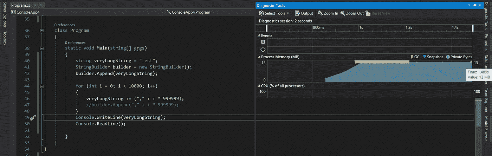
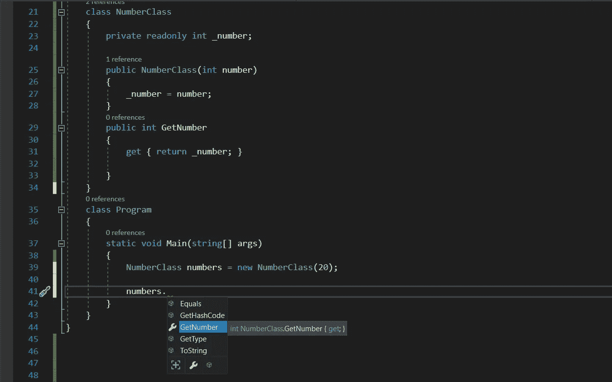
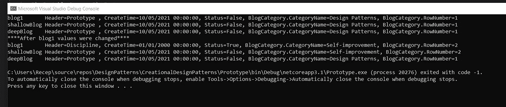

# 4-)原型设计模式

> 原文：<https://medium.com/geekculture/4-prototype-design-pattern-cfbec82052fe?source=collection_archive---------48----------------------->

我将解释第四个创造性的设计模式原型。在继续之前，我将讨论“栈-堆内存、值-引用类型、可变-不可变对象、浅-深复制”主题，以便更好地理解。

# 堆栈存储器

在开发应用程序时，内存是根据任何软件开发语言中使用的对象和变量来分配的。在运行时，在方法范围内创建的对象，连续存在。当到达方法末尾时，删除已创建的对象并释放内存。存储器变得可重复使用。

为了更有效地使用，内存分为两部分。不同的变量类型以不同的类型存储在这些部分。

# 值引用类型

在点网络中有两种变量类型值引用。值类型派生自结构类型。bool、byte、char、decimal、double、enum、float、int、long、sbyte、short、struct、uint、ulong、ushort 都是值类型的例子。当它们单独使用时，存储在堆栈存储器中。除了它们之外，枚举也存储在堆栈中。value1、value2、value3 和 value4 存储在堆栈中，代码如下。

从系统继承的类型。类、接口、委托、记录、动态、对象等对象是引用类型，存储在堆内存中。

Int 是一个值类型，但在这段代码中，它被用作类属性，并被转换为引用类型。为此，它存储在堆内存中。

当引用类型相互赋值时，堆栈内存中的指针变得不同，但堆内存中的值变得相同。如果改变其中一个值，就会影响另一个值。

我创建了一个名为 Numbers 的类。在获得名为 group1 的实例后，我设置了值。我从名为 group2 的 Number 类中创建了一个新实例。我用“=”操作符将 group2 分配给 group1。在这个阶段，堆栈内存中有两个不同的字段指向堆内存中的同一个值。当我更改组 1 的值时，这会影响组 2。对象。Equals(group1，group2)方法返回 true。另一方面，我创建了两个 int 值类型，并用“=”运算符互相赋值。然后我改变了第一个 int 值，但没有改变其他值。因为彼此存储在堆栈内存的不同字段中。Equals(a，b)返回 false。我运行控制台应用程序。

# 可变-不可变对象

可变的意思是可变的，不可变的意思是不可变的。当我们在一个不可变对象的字符串中做任何改变时，就变成了内存中新的分配。稍后 GC 会清除旧字段。如果使用了一个循环并在此循环中更改了字符串值，则创建的新字符串与循环中的条目数一样多。而是使用 StringBuilder。StringBuilder 允许改变字符串而不是新的内存分配。

让我们创建一个控制台应用程序，然后检查使用字符串更改和 StringBuilder 时的内存。

首先，我使用了 StringBuilder。调试应用程序时，诊断工具中显示内存使用量为 8.6 Mb。

我注释了 StringBuilder 并运行了字符串更改。这一次看到了 12 Mb 的内存使用。此外，GC 在 1.2 秒内工作了数千次。第一次编译器到达控制台。Writeline 线在 200 毫秒内，但第二次是 1000 毫秒。性能差异显而易见。

类也可以被创建为不可变的对象

Value 仅在通过构造函数获取实例时设置 NumberClass。之后，可以用 GetNumber 方法获取值。

# 浅-深拷贝

当我们得到一个类的副本时，我们有两个选择，浅副本和深副本。仅浅复制类的值类型属性。如果有子对象，它们不会被复制，只会在堆栈中创建一个新地址，指向堆中对象的字段。深度复制对象包含创建的新实例的所有成员。我将在原型设计模式标题下给出一个例子。

# 原型设计模式

这种设计模式关注对象复制。

我创建了 BlogPost 和 Category 类。BlogPost 具有类型为值和引用的属性。有浅层和深层复制方法。我打印了用 override ToString()方法筛选类属性值。

在控制台应用程序的 Main 方法中，我获得了 BlogPost 的一个实例，然后填充了属性值。我用 ShallowCopy 和 DeepCopy 方法得到了两个副本。在这个阶段，我有 BlogPost 类的 3 个实例。在用 ToString 方法打印了值之后，我第一次修改了值。当再次打印属性值时，我们可以看到 ShallowCopy 和 DeepCopy 之间的区别。

当运行应用程序输出将是这样的。

我改变了 blog1 的所有属性。在 ShallowCopy 原型标头 CreateTime 中，状态属性没有更改。但是作为子对象的 BlogCategory 随原始实例发生了变化。DeepCopy 原型没有改变任何属性。

当需要复制类时，我们可以使用原型设计模式。此外，根据我们要复制的类结构，我们可以选择浅复制或深复制。

您可以查看我的 github 知识库中关于设计模式的内容。

[https://github.com/orhanrecep90/DesignPatterns](https://github.com/orhanrecep90/DesignPatterns)