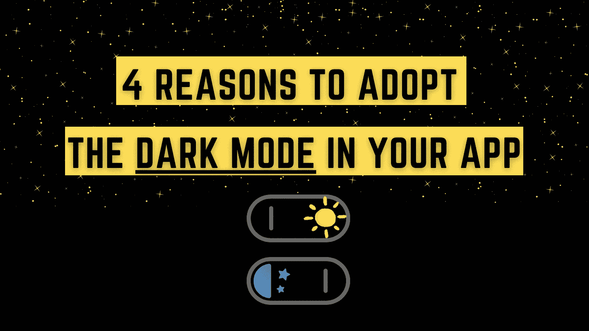

# 在你的应用中采用黑暗模式的 4 个理由

> 原文：<https://medium.com/geekculture/4-reasons-to-adopt-the-dark-mode-in-your-app-b235632c550c?source=collection_archive---------10----------------------->

## 为什么每个开发者都应该考虑黑暗模式？

By FAM

让我们从一些事实开始:

*   **根据最近的一项研究，81.9%的人在手机上使用黑暗模式。**
*   **82.7%的调查参与者表示他们使用操作系统的黑暗模式。**
*   **64.6%的受访者期望网站能够** …