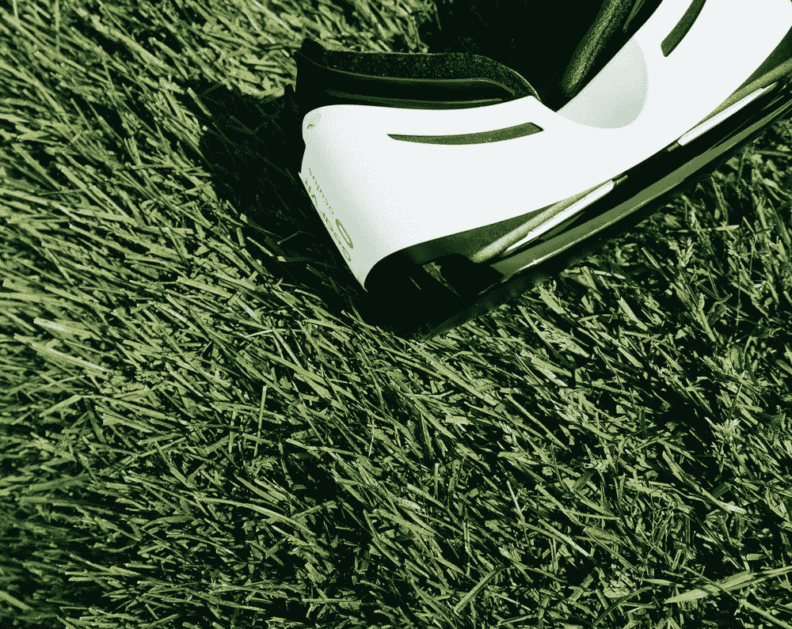

# 虚拟现实运动的 4 种启动解决方案

> 原文：<https://medium.com/geekculture/4-start-up-solutions-to-vr-locomotion-6864146b1dec?source=collection_archive---------4----------------------->

即使经过十年的投资和技术进步，虚拟现实仍然是一项变化无常的技术。耳机并不总是正确跟踪，控制器也不精确，为其开发的软件有时几乎不起作用。无论如何，这是新锐公司展示独特创意和打入行业的首要场所。尽管我们几乎不知道如何移动摄像机…