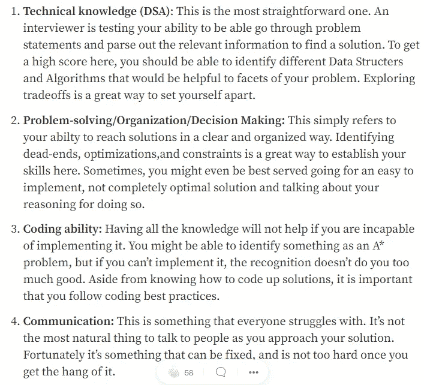
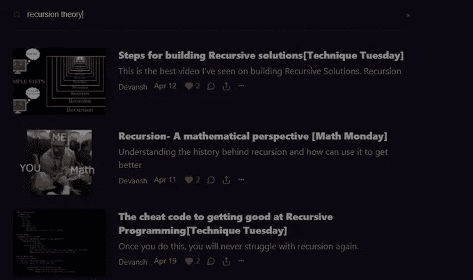
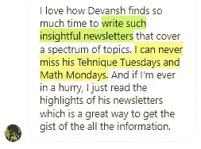
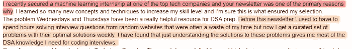

# 在 FAANG 访谈中实施递归解决方案的 4 个步骤

> 原文：<https://medium.com/geekculture/4-steps-to-implement-recursive-solutions-in-your-faang-interviews-8e7c683de037?source=collection_archive---------7----------------------->

## 这个模板可以处理任何 Leetcode 问题

作为一个与成千上万的学生、求职者和软件工程师互动过的人，我知道递归是每个人都在纠结的话题之一。不幸的是，这是大型科技公司喜欢在面试中测试的话题。二分搜索法、图、树、回溯和许多其他主题都依赖于递归。


Recursion can really mess with our minds. Photo by [Paweł Bukowski](https://unsplash.com/@bukowski?utm_source=medium&utm_medium=referral) on [Unsplash](https://unsplash.com?utm_source=medium&utm_medium=referral)

在这篇文章中，我将分享我与学生和订阅者分享的递归解决方案模板。这个模板将递归分解成多个更小的步骤，并允许您一次处理一个步骤。


This template has helped tons of people gain the results they want.

首先，让我们解释一下为什么人们会纠结于递归问题，以及为什么使用一个有组织的模板是一个好主意。

# 为什么递归很难

许多人纠结于递归代码的最大原因是确保事情正常运行的所有活动部分。在压力大、时间紧迫的环境中，比如面试或考试，这往往会让人不知所措。该模板为您提供了一个清晰的分步指南，让您可以避免这个问题。通过一次专注于一个步骤，你将能够以清晰流畅的方式解决问题。这对你的面试官来说是一个巨大的绿色信号。



For your Leetcode interviews, you want to master these 4 areas. [Source- 4 things to master for your coding interviews](/geekculture/4-things-to-master-for-your-coding-interviews-218d66e413e7)

使用模板是一个很好的方法，可以确保你能够突出你在所有这些领域的技能。此外，模板给你一个清晰明确的前进道路。它会让你立即投入工作。记住，没有什么比在面试中沉默不语更糟糕的了。处理问题时，使用模板是建立肌肉记忆的好方法。这类似于运动员如何一遍又一遍地练习组合，以便他们可以在压力下执行它们。

既然我们在为什么模板有用的问题上已经达成一致，不再多说，下面是递归的模板。

# 递归编码模板

模板如下所示-

1.  **检查终止情况-** 在每个递归函数中，首先要检查的是终止/基本情况。这些情况往往很容易实现，所以您可以相对容易地将它们处理掉。一旦你经历了这些，你只需要担心递归的情况。首先处理好基本情况也允许你实现 [**信念的递归跳跃，我们在周二**](https://codinginterviewsmadesimple.substack.com/p/recursive-leap-of-faith-technique) 的技巧中已经讨论过了。
2.  **进行处理**——这通常与我们期望产生的结果有关。对于我们的反转函数，这意味着交换左右节点。如果您的解决方案涉及回溯，您希望将当前状态标记为已访问。
3.  **继续递归的例子**——注意我们花了多长时间才到达这里。我们已经去掉了许多其他移动部分，所以我们可以专注于递归本身。现在，您可以对需要处理的所有变量调用递归函数。在图遍历中，这意味着在所有邻居上调用它。等等等等。
4.  **重置副作用-** 有时你会对你的代码/状态做一些你想撤销的更改。这可能涉及到重置全局变量的值。在你的 Leetcode 风格面试/竞争性编程中，这将成为回溯的一个因素。

看看下面的递归函数，并识别函数的不同部分。注意实现这个模板将如何让你解决这个非常棘手的编码问题。如果你想看到完整的问题，可以查看帖子 [**【解决方案】问题 18:打包单词上船【谷歌】**](https://codinginterviewsmadesimple.substack.com/p/solutionproblem-18-pack-words-on) 。这是一个与大家分享的示例解决方案，所以即使是我的免费用户也可以访问它。

```
def max_words(board, n, m, words, visited, r, c, curr_word):
    if r < 0 or r >= n or c < 0 or c >= m or visited[r][c]:
        return [] curr_word += board[r][c]
    # if no words in |words| start with |curr_word|, then return early.
    if not any(word.startswith(curr_word) for word in words):
        return [] visited[r][c] = True max_word_set = []
    if curr_word in words:
        # A valid words has been found: terminate current word search and start a new one
        for r, row in enumerate(board):
            for c, val in enumerate(row):
                curr_word_set = max_words(board, n, m, words, visited, r, c, '')
                if len(curr_word_set) > len(max_word_set):
                    max_word_set = curr_word_set
        max_word_set.append(curr_word)
    else:
        for dr, dc in DIRECTIONS:
            curr_word_set = max_words(board, n, m, words, visited, r + dr, c + dc, curr_word)
            if len(curr_word_set) > len(max_word_set):
                max_word_set = curr_word_set visited[r][c] = False
    return max_word_set
```

如果您发现此内容有价值，请考虑成为此简讯的高级会员。高级会员可以获得许多这样的解决方案，以及其他关于科技行业的独家内容，采访秘密，并在科技领域建立一个令人惊叹的职业生涯。 [***使用以下链接***](https://codinginterviewsmadesimple.substack.com/subscribe?coupon=fe3f374b) 可免费获得两周。请记住，这份简讯有完全的满意度保证。如果在头 60 天内，你对时事通讯不满意，你要做的就是联系我。我会无条件全额退款给你。所以对你来说没有风险。


**最后一点**——当你将递归隔离到辅助函数时，模板工作得最好。这使得你的整个代码更加整洁。我将在周二做一个关于辅助函数的单独技术，因为它们是一个如此强大的工具。



Make sure you go through the archives on the Substack website to read through the older posts. They have a lot of knowledge in them. [Search for topics here](https://codinginterviewsmadesimple.substack.com/archive)

更多这样的文章，请查看我的时事通讯[技术变得简单](https://codinginterviewsmadesimple.substack.com/)。Tech Made Simple 是寻求在技术领域建立惊人职业生涯的人的最佳资源。它将帮助您概念化、构建和优化您的解决方案。**它涵盖了从系统设计、计算机科学概念和 Leetcode 问题解决的技术方面到网络和职业发展的详细指南的所有内容**。*在一个地方找到你所有的需求，节省你的时间、精力和金钱。* [**使用此处的链接可享受 20%的优惠，优惠期长达一整年**](https://codinginterviewsmadesimple.substack.com/subscribe?coupon=1e0532f2) **。**



我创造了[技术，利用通过指导多人进入顶级科技公司而发现的新技术使](https://codinginterviewsmadesimple.substack.com/)变得简单。时事通讯旨在帮助你成功，避免你在 Leetcode 上浪费时间。**我有一个 100%满意的政策，所以你可以尝试一下，不会有任何风险。[您可以阅读常见问题解答，并在此了解更多信息](https://codinginterviewsmadesimple.substack.com/p/faqs-and-about-this-newsletter?r=4tnbw&s=w&utm_campaign=post&utm_medium=web)**



如果你也有任何有趣的工作/项目/想法给我，请随时联系我。总是很乐意听你说完。

# 向我伸出手

使用下面的链接查看我的其他内容，了解更多关于辅导的信息，或者只是打个招呼。另外，查看免费的罗宾汉推荐链接。我们都得到一个免费的股票(你不用放任何钱)，对你没有任何风险。**所以不使用它只是失去免费的钱。**

为了帮助我了解你[填写这份调查(匿名)](https://forms.gle/7MfQmKhEhyBTMDUD7)

查看我在 Medium 上的其他文章。https://rb.gy/zn1aiu

我的 YouTube:[https://rb.gy/88iwdd](https://rb.gy/88iwdd)

在 LinkedIn 上联系我。我们来连线:[https://rb.gy/m5ok2y](https://rb.gy/f7ltuj)

我的 insta gram:[https://rb.gy/gmvuy9](https://rb.gy/gmvuy9)

我的推特:[https://twitter.com/Machine01776819](https://twitter.com/Machine01776819)

如果你想在科技领域发展事业:[https://codinginterviewsmadesimple.substack.com/](https://codinginterviewsmadesimple.substack.com/)

在罗宾汉上获得免费股票:【https://join.robinhood.com/fnud75 