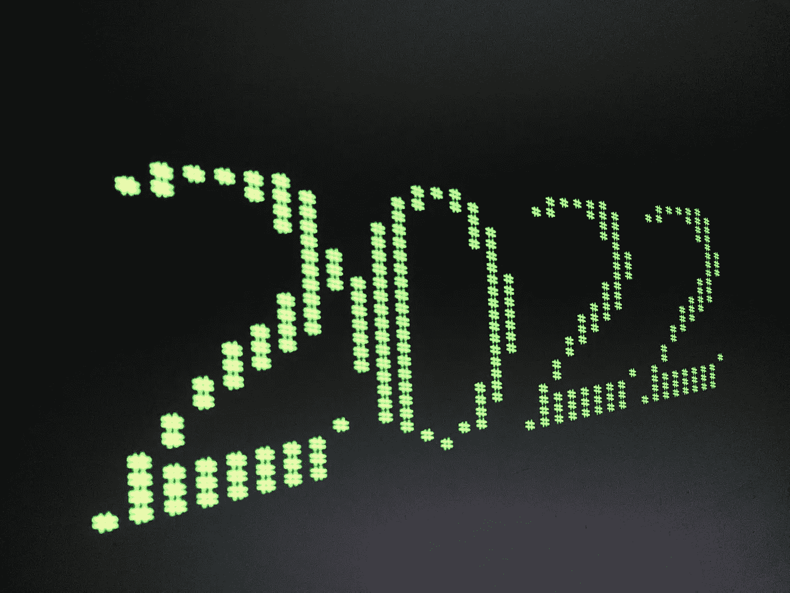

# 我们认为将在 2022 年腾飞的 4 大技术趋势

> 原文：<https://medium.com/geekculture/4-tech-trends-we-think-will-take-off-in-2022-acfd61580d3?source=collection_archive---------14----------------------->

# Web3

Web2 带来了很多挫折。从剑桥分析，通过滥用我们的广告技术巨头的数据，到大规模泄露，用户已经厌倦了当前的互联网方式。

网络的下一个版本，Web3，是改变的承诺。这是去中心化的承诺，网络民主几乎可以被描述为现代世界的圣杯。

直到今天，下一代互联网更多的是一个利基市场。，扩展主要是由于环境问题和以太坊(ETH)的区块链强加的低得惊人的同时交易限制而停止的。目前，我们已经有了在主链之上运行的第 2 层解决方案，以同时处理更多的事务。ETH 可能会在 2022 年赶上。有了 Eth2，以太坊验证条目的方式将不再是工作证明(解决复杂的计算)，而是利害关系证明(验证节点将根据它们拥有多少硬币来选择)。索拉纳和卡尔达诺已经通过这种方式验证了他们的交易。

前面提到的索拉纳和卡尔达诺不会留下。前者将获得一个改进，而后者将获得第一个稳定版本。

随着交易越来越便宜，确认越来越快，环境问题不再适用，主要的担忧将会消失，为进入主流铺平道路。

# 低/无代码

AWS re:Invent 2021 的亮点之一是宣布了几个由 AWS 构建的低/无代码解决方案。然而，亚马逊并不是这一领域的唯一玩家，有人可能会说，他们甚至是游戏的[迟到者。](https://www.gartner.com/en/documents/3991199/magic-quadrant-for-enterprise-low-code-application-platf)

这些平台的流行主要是由于软件开发的持续“民主化”,在这种情况下，将想法转化为功能产品的能力不再掌握在少数人手中，而是掌握在大多数人手中。

低代码/无代码领域的后起之秀包括:

1.[AWS Amplify Studio](https://techcrunch.com/2021/12/02/aws-launches-amplify-studio-a-new-low-code-app-development-tool/)——一款低代码应用开发工具，可以从 Figma 文件创建并同步 React 组件

2.[获得 7.35 亿美元](https://blog.airtable.com/announcing-airtables-series-f-funding/)融资的 Airtable——2021 年 12 月 13 日，Airtable 宣布推出 F 系列产品，旨在加速互联应用和自动化工作流的采用。

3. [Webflow 在其 B 轮融资中筹集了 1.4 亿美元](https://webflow.com/blog/webflow-series-b-funding)—Webflow 扩展了其功能，包括工作流、会员资格、扩展的电子商务功能等。有趣的事实:这个网站是建立在 Webflow！

4. [AWS SageMaker Canvas](https://aws.amazon.com/blogs/aws/announcing-amazon-sagemaker-canvas-a-visual-no-code-machine-learning-capability-for-business-analysts/?utm_source=thenewstack&utm_medium=website&utm_campaign=platform) —面向商业分析师的可视化机器学习无代码平台

当一些人仍在预测世界末日，说开发人员会因为这些工具而过时时，其他人已经接受了低代码/无代码平台的流行，并意识到这些只是工具，而[永远不会取代开发人员](https://hackernoon.com/why-low-code-will-never-replace-developers-zo1d3um8)。

低代码和无代码平台仅仅是为了缩小开发人员和非开发人员之间的差距，将开发人员从比集中 div 更令人兴奋的任务中解放出来。最终，这些平台是由开发人员构建的，并在幕后运行代码，在大多数情况下，需要开发人员为超出任何特定平台能力的附加功能编写自定义代码。

我们今年所看到的，以及我们期望继续的，是这些工具之间的创造性集成。

例如，从设计到成品，不再需要设计师在 Figma 中创建文档，然后由开发人员进行构建。现在，React 组件可以在 AWS 中直接从 Figma 中自动创建。然后，我们可以将应用程序插入到后端，这给了我们一个功能齐全的应用程序。

我们期待着看到明年市场将发生什么样的整合，以及当前玩家将向他们的功能集引入哪些扩展，从而使他们在竞争中脱颖而出。

关于何时以及何时不使用低代码、无代码解决方案的进一步阅读，我们推荐阅读这篇哈佛商业评论文章:[何时低代码/无代码开发可行——何时不可行(hbr.org)](https://hbr.org/2021/06/when-low-code-no-code-development-works-and-when-it-doesnt)

# 元诗句

无论你认为这些品牌是标志性的，值得迷因的，畏缩的，还是炒作的，都没有关系。目前，他们是引领虚拟世界的组织。这些公司所追求的元宇宙的定义很简单:一个与物理世界并存的平行世界。

在一个技术上不存在的世界里度过时光的想法并不新鲜。玩家已经在诸如第二人生、GTA 游戏等游戏上花费了大量的时间。然而，直到最近，我们的目标还是娱乐自己:玩得开心，在回到现实生活之前重新设定。

现在情况不同了。Meta 想创造一个你可以工作、社交、甚至去跳舞俱乐部的世界。微软将元宇宙视为专业协作的工具(到目前为止)。我们将看到的世界或许可以被视为平台经济发展的下一步。

不管他们的目的是什么，虚拟世界肯定会在明年起飞。有两件事是比赛加速的关键。第一个是流行病。旅行突然变得困难，人们彼此分离；这是世界在过去 200 年大幅萎缩后首次增长。第二件事是将脸书更名为 Meta。尽管它不是唯一一家想为我们建立一个新世界的公司，但这一举动在全世界掀起了波澜。如果人们不知道元宇宙的概念，他们现在知道了。

# 物联网(IoT)和运营技术(oT)安全竞赛

当我们谈论物联网和 5G 网络对我们生活的巨大影响时，我们至少在一个领域有很多工作要做:安全。智能设备的出现让我们的生活变得更简单，尽管也更危险。

无论是否在企业网络中，这些设备都有多种用途，因此它们影响着我们生活的多个领域。如果错综复杂的电子网络遭到破坏，后果可能是可怕的。仅提及[(幸运的)美国佛罗里达州供水设施的黑客攻击失败](https://www.nytimes.com/2021/02/08/us/oldsmar-florida-water-supply-hack.html)，这可能导致供水中毒(！).

[对 615 名 IT 和运营技术(OT)安全从业者进行的关于物联网和监控工业设备的调查发现了很多问题。](https://www.zdnet.com/article/iot-under-attack-security-is-still-good-not-enough-on-these-edge-devices/)首先，88%的受访者表示，他们中有 88%的人将其物联网设备连接到其他服务，而 56%的人表示他们的物联网设备是为了“远程访问”而连接的[受访者检测漏洞的确定性也很低。其中近一半(42%)声称没有能力检测物联网和 oT 设备的安全问题。](https://www.microsoft.com/security/blog/2021/12/08/new-research-shows-iot-and-ot-innovation-is-critical-to-business-but-comes-with-significant-risks/)

这是一个严重的威胁，因为整个业务网络、组织或其关键流程都可能因这种攻击而受损。另一种情况是，攻击者可以使用您的设备将它们变成僵尸网络的一部分。一个例子是墨子，它已经逍遥法外两年多了，没有停止的迹象。然后，它们可以用于执行 DDoS 攻击或挖掘加密货币。

[随着物联网设备市场的预计增长](https://www.fortunebusinessinsights.com/industry-reports/internet-of-things-iot-market-100307)，其生产商需要找到一种更好地保护其设备的方法。组织还需要更好地控制软件更新和监控，以免在与恶意第三方的竞争中失利。赌注很高，比赛已经开始。

【https://www.itmagination.com】最初发表于**。**