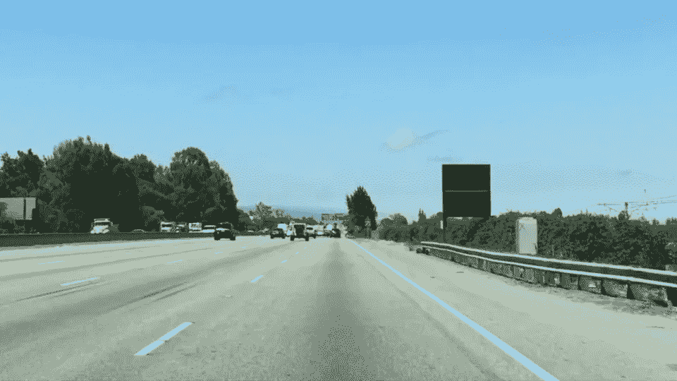
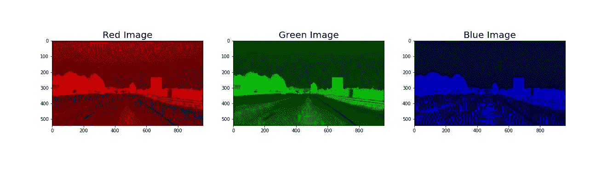
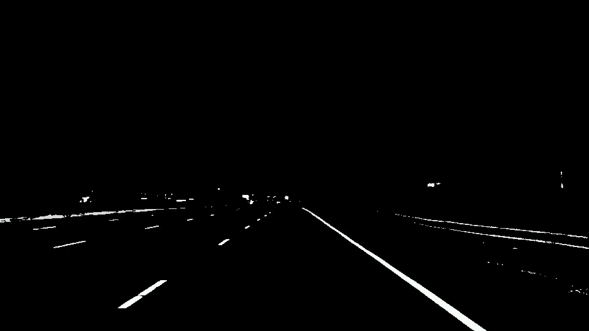
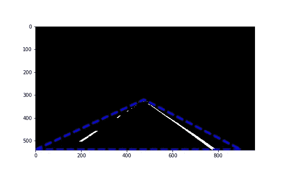
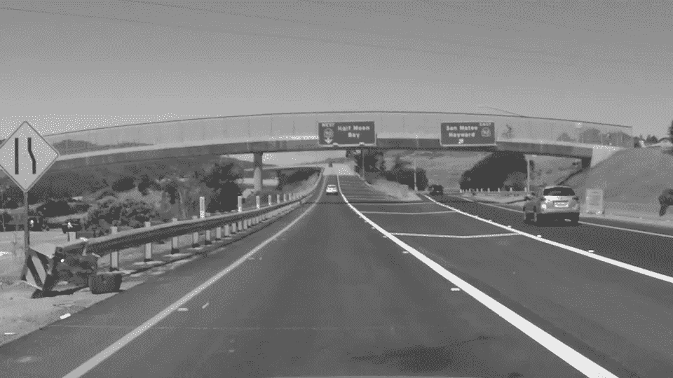
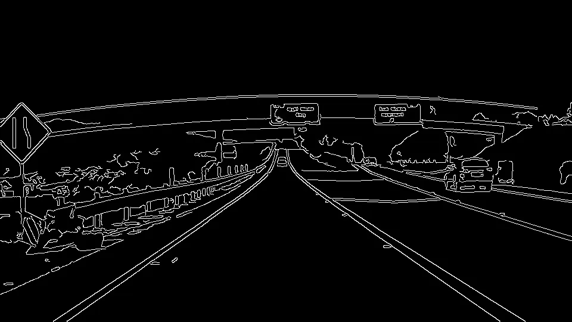
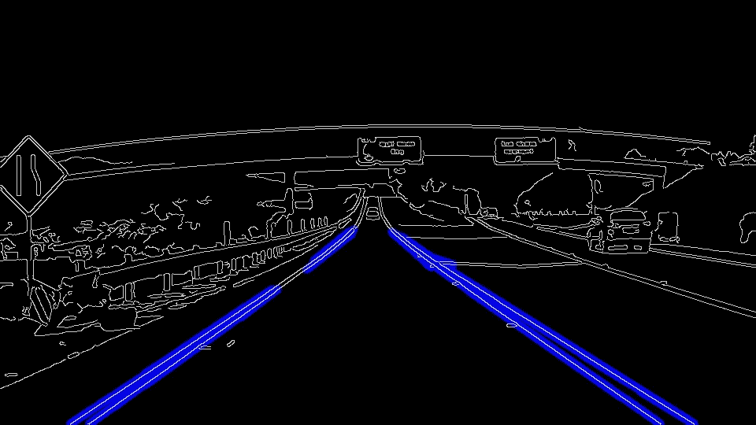
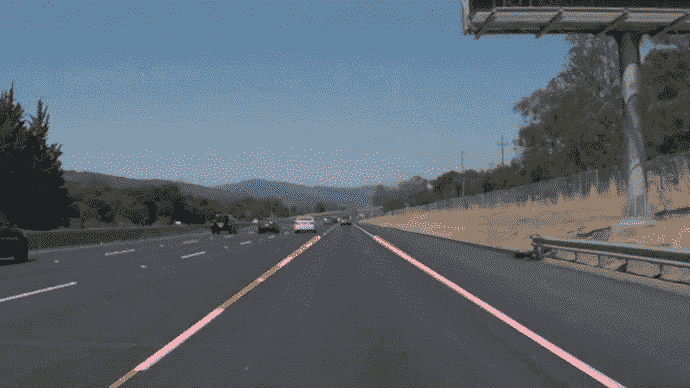

# 自动驾驶汽车可以用来寻找车道的 4 种技术

> 原文：<https://medium.com/geekculture/4-techniques-self-driving-cars-can-use-to-find-lanes-fcb6dd06b633?source=collection_archive---------0----------------------->

## 让电脑看见！

Photo by [Erik Mclean](https://unsplash.com/@introspectivedsgn?utm_source=medium&utm_medium=referral) on [Unsplash](https://unsplash.com?utm_source=medium&utm_medium=referral)

每一台电脑都有广泛的应用。在自动驾驶汽车的背景下，看到下图，汽车必须知道车道在哪里，才能安全导航。

Test Image From Udacity’s Self Driving Car Nano-Degree course

我们将学习一些寻找车道线的技巧。

## 技术

1.  颜色阈值
2.  区域掩蔽
3.  Canny 边缘检测
4.  霍夫变换

## 颜色阈值

彩色图像由三幅图像堆叠而成，每幅图像对应红色、绿色和蓝色通道。上面的图像可以分成三个独立的图像，如下所示

Image split into 3 channels

> 图像是像素的矩阵，其值的范围从 0(暗)到 255(白)。

由于车道是道路上的白色标记，因此可以通过过滤掉值小于特定阈值的像素来识别这些车道。通过选择正确的阈值，可以产生以下输出。

Output after applying color thresholds

*然而，这并不能完全解决我们的问题，因为* ***图像中你可以看到其他白点，那不是车道*** *。*

## 区域掩蔽

假设拍摄道路照片的摄像机安装在汽车前方的固定位置，车道线将总是出现在图像的大致区域周围。将感兴趣的区域应用于图像(蓝色虚线区域)，我们现在能够消除非车道线，如下所示。

Output after applying color threshold and region masking

*然而，在不同的光照条件(白天、夜晚、阴影等)和车道颜色(黄色等)下，我们到目前为止研究的两种技术可能无法检测到车道* ***。因此需要更复杂的算法。***

## Canny 边缘检测

这种技术有助于找到图像中对象的边缘。

> 由于我们只对寻找边缘感兴趣，我们首先将彩色图像转换成灰度图像，如下所示。

GrayScale Image

> 图像是像素的数学函数 f(x，y ),因此您可以对其执行数学函数。

每个像素的亮度对应于该点的渐变强度。我们通过追踪沿着最强梯度的像素来找到边缘像素。通过识别边缘，我们可以更容易地根据物体的形状来检测它们。

Canny Edge Detected Image

*应用 canny 边缘检测算法的输出显示一个充满圆点* *的* ***图像，这些圆点代表车道线* ***以及其他物体的边缘。*****

## 霍夫变换

S 由于我们只对**寻找车道线感兴趣**，我们可以建立一条线的模型，然后将该线模型与各种各样的点进行拟合，以检测车道线。为了更容易处理大量的点，我们使用霍夫空间。

> 图像空间中的一个点代表霍夫空间中的一条线，反之亦然。通过使用极坐标，图像空间中的点被变换(霍夫变换)成霍夫空间中的正弦曲线。

在 canny 边缘检测图像上应用 Hough 变换并执行参数调整后，我们现在能够检测车道，如下所示。

Image With Lane Lines Identified

# 结果:自动驾驶汽车在行动

*上述技术的应用使得汽车能够准确识别车道，如下图所示。*

As it moves, Car can identify lanes

*尽管我的算法能够在上面的视频中准确地检测出车道，但在其他一些情况下，它可能无法正确地检测出车道。这种情况可能包括不同条件的组合，如照明(白天、夜晚、阴影)、曲线等。*

*这些缺点将在下一篇文章中解决(见下面的链接)*

最后的视频是我的“寻找车道线项目”的输出，是 Udacity 自动驾驶汽车纳米学位项目的输出。

 [## 3 种应对急转弯和不同光线条件的技巧

### 自动驾驶汽车在不同条件下的感知能力！

medium.com](/@siddartha.govada_9750/3-techniques-to-tackle-steep-turns-and-varying-light-conditions-342bfb0e9845) 

*原载于*[*https://github.com*](https://github.com/buddha216g/Computer-Vision/blob/master/001-Finding-Lane-Lines.md)*。*