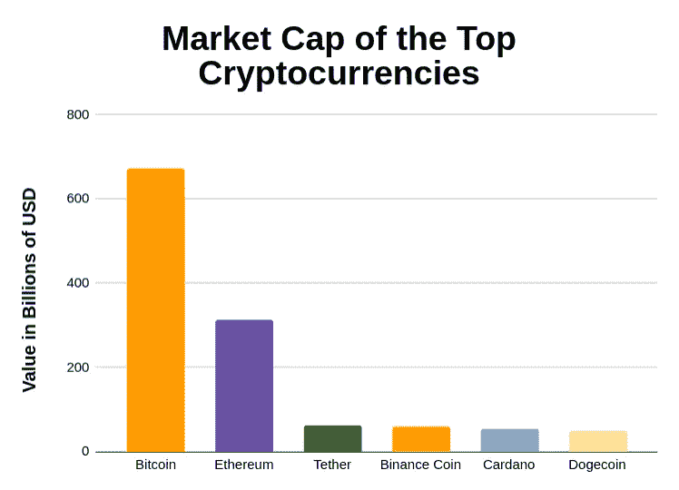
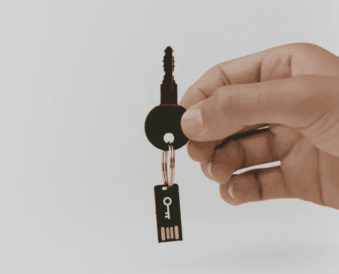
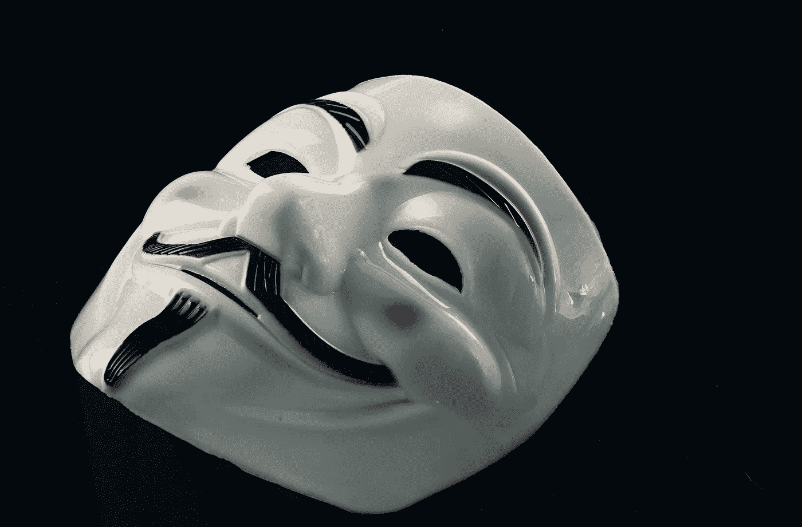

# 关于加密，人们会犯的 4 个错误

> 原文：<https://medium.com/geekculture/4-things-people-get-wrong-about-crypto-15a8fd6c8792?source=collection_archive---------35----------------------->

## 揭穿神话

网上有很多关于加密货币的信息，但不幸的是，也有很多错误信息。我希望能消除你可能从错误的邻居或朋友那里听到的一些误解。

# 1.价格决定一切

我发现大多数人都对加密货币的价格着迷。虽然价格是一个项目是否被低估或高估的良好指标，但它不是唯一的指标。比价格更重要的是加密货币的市值，通常称为市值。计算一枚硬币的市值非常简单，用流通的代币总量乘以代币价格。例如，在撰写本文时，大约有 1870 万个比特币，一个比特币的价格是 37100 美元；这意味着比特币的市值约为 1870 万乘以 37100，等于 6919 亿美元。

那么为什么一枚硬币的市值比价格更重要呢？让我们来看看最近出名的迷因币之一，柴犬。这枚硬币最近很受欢迎，被框定为新的“dogecoin”。虽然 dogecoin 也是一个迷因币，背后没有太多的基本面，但柴犬要糟糕得多。写这篇文章时，大约有 437 万亿个柴犬代币，每个代币价值 0.0000883 美元。现在，密码领域的初学者和新手可能会看一下价格，并将其与 dogecoin 等产品进行比较，doge coin 目前的交易价格为 0.39 美元，并认为柴犬应该处于类似的价格。按照上面的逻辑，人们会认为柴犬的价格应该乘以 5000！意味着你投资的 500，000%回报。如果这听起来好得不像是真的，那是因为它就是真的。我可以用我一生的积蓄打赌，柴犬永远不会达到接近 0.4 美元的价格，除非他们从根本上改变这个项目。让我们来看看为什么我对此如此有信心。

柴犬的代币比 dogecoin 多 35 倍，dogecoin 的总流通供应量只有 1290 亿(比柴犬的 437 万亿少 35 倍！).现在，我们不再比较这两种代币的价格。让我们来看看他们的市值。

Dogecoin 的市值= 129，000，000，000 * 0.39 = 503.1 亿美元。大约 500 亿美元。

柴犬市值= 437，000，000，000，000 * 0.0000883 = 39.735 亿。大约 40 亿美元。

现在，如果我们看看这些硬币的市值，我们认为柴犬是一个应该与 Dogecoin 大致相同的项目，那么这个项目的价值大约被低估了 12.5 倍，这是因为 40 亿乘以 12.5 等于 500 亿美元。虽然这仍然是一个非常好的投资回报，但与最初只考虑两枚硬币价格的最初 500，000%的数字相比，这算不了什么。我并不是说柴犬应该得到和 Dogecoin 大致相同的估值，而是告诉你如何用更精确的方法计算一个项目的价值，而不仅仅是看一个代币的价格。

# 2.最好将你的密码存放在交易所

很多人认为把密码存放在他们用来买卖的交易所是最安全的。这可能是因为大多数人把现金存在银行或其他金融机构，因为把现金埋在你的后院是不可行的。然而，由于加密是全数字的，你不需要担心有一个后院来存储你的资产。你为什么想自己存储加密？为什么不让公司帮你处理呢？

当您在交易所存储加密货币时，您也在交易所存储了私钥。私钥用于访问用户的加密货币。这意味着，如果一家交易所遭到黑客攻击，黑客也将获得你的私钥，从而获得你的加密货币。

有许多交易所被黑客攻击的案例，这意味着储存在这些交易所的密码被盗。2019 年，最大的加密交易所之一币安成为黑客的受害者，这些黑客利用钓鱼攻击和恶意软件窃取了 7000 个比特币(今天价值 2.59 亿美元)。这不是一个单一的事件，在过去已经有许多黑客攻击，并且在可预见的未来可能还会继续。[这里的](https://selfkey.org/list-of-cryptocurrency-exchange-hacks/)是一个网站，向你展示了一些加密货币交易所最近遭到的黑客攻击。所以，既然我们知道加密货币交易所可能会被黑客攻击，为什么不自己存储密码呢？

为了让你自己存储你的加密货币，你将需要保持你的私人密钥，私人，足够令人惊讶！你可能听过这样一句话“不是你的密钥，不是你的密码”，这可以通过几种不同的方式来实现。不使用交易所而存储低温电流的两种最流行的方法是使用硬件钱包或纸质钱包。

> 不是你的钥匙，不是你的密码

**五金钱包**

硬件钱包与 USB 驱动器非常相似，但专门为加密货币的存储和加密而设计。值得注意的是，硬件钱包实际上并不存储您的加密货币，而是保存您的私钥。在区块链上访问加密货币需要私钥，因此对于很多人来说，硬件钱包是一个不错的便携选择。硬件钱包通常也是我们所说的“冷存储”，意思是它们没有连接到互联网，因此大大降低了你的加密货币被黑客攻击的风险。

**纸钱包**

纸质钱包类似于硬件钱包，但不同之处在于它们不是 USB 驱动器，而是纸片。纸质钱包通常有一个二维码和一个字母数字串，用于访问您的加密货币。和硬件钱包一样，纸质钱包也是一种“冷藏”形式，这意味着它们和硬件钱包一样安全。事实上，一些人认为纸质钱包更安全，因为它们不需要更新硬件和/或软件。

我个人更喜欢使用硬件钱包，因为我觉得一张纸比 u 盘更容易乱放，但无论你决定使用硬件还是纸质钱包，你都需要考虑一个安全的地方来存放它。此外，还值得注意的是，如果您积极交易加密货币，通常不方便将它们存储在您的硬件或纸质钱包中。因此，建议您在交易所存储一些您积极交易的加密货币，并在钱包中存储其他您不积极交易的加密货币。

# 3.所有加密都是匿名的

许多人和媒体都认为所有加密货币都是匿名的，因此被用于非法商品交易。事实是，大多数加密货币都不是匿名的。比特币地址是唯一的字母数字串，这实际上并没有使交易匿名，而是使它们成为假名；这意味着地址相当于地址所有者身份的占位符。此外，由于所有的比特币交易都是在区块链上记录的，所以没有办法隐藏你的身份，因为它可能会追踪到你。

这方面的一个例子是，美国联邦调查局逮捕了丝绸之路的创始人罗斯·乌布里希特。丝路是最早在暗网中发现的暗市之一。当联邦调查局逮捕罗斯·乌布里希特时，他们确保在逮捕他时他的笔记本电脑是开着的，并登录了黑市的管理员角色，这使得他们可以将他的在线状态与他本人联系起来。黑市管理员充当中间人来处理交易，这意味着每笔比特币交易和每个比特币钱包地址在技术上都可以追踪到买家和卖家，并最终使用区块链分析揭示他们的身份。

# 4.密码太复杂，无法使用

人们声称加密货币太复杂，普通人无法使用，但这意味着什么？你不需要为了使用它而深刻理解它是如何工作的。你了解我们在 1969 年将人类送上月球时使用的技术和代码吗？你了解 Instagram、脸书或 Snapchat 使用的技术吗？不，因为你不需要为了使用他们的服务。技术已经变得更加复杂，以适应我们社会的需求。为了使用加密货币，您不需要深入了解代码的工作原理。我鼓励每个人都了解一些密码是如何工作的，因为我认为这是未来的趋势。然而，随着时间的推移，随着更复杂的细节从最终用户那里抽象出来，技术变得更容易使用。对加密货币和一些相关主题的基本知识肯定会对你有益。我写了一本初学者指南，旨在为你提供一些关于加密的基本信息，你可以在这里找到文章。

我希望你喜欢这篇文章，一如既往，如果有什么你想让我更深入的让我知道。

*本文仅供参考，仅代表我个人观点，不应视为财务或法律建议。在做任何重大财务决定之前，先咨询财务专家。*