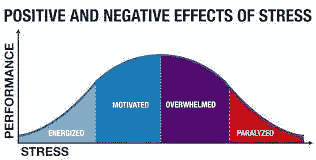
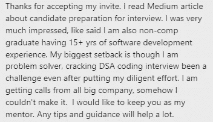
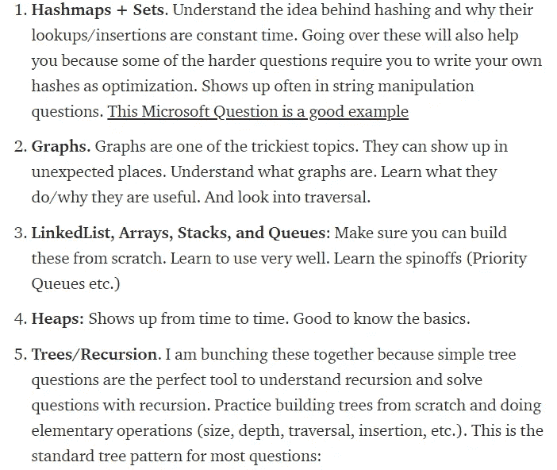
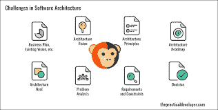
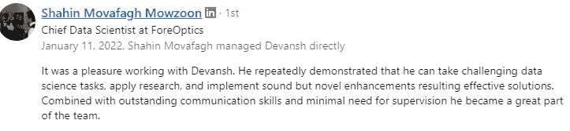
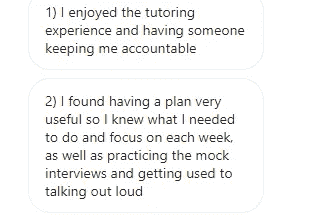

# 编码面试需要掌握的 4 件事

> 原文：<https://medium.com/geekculture/4-things-to-master-for-your-coding-interviews-218d66e413e7?source=collection_archive---------2----------------------->

## 通过关注这些方面，你会在面试中胜出

为了帮助我了解您[请填写此调查(匿名)](https://forms.gle/7MfQmKhEhyBTMDUD7)

自从我开始分享我是如何帮助学生通过编码面试的，就有很多人在面试中向我反映他们的问题([包括 FAANG 公司的面试](/geekculture/how-i-helped-a-non-computer-science-student-nail-a-faang-software-dev-job-86a4e41f95b7?source=post_stats_page----------------------------------------))。很多人纠结于面试准备的原因之一是缺乏知识。我不是指技术知识。我指的是关于面试本身的知识。在他们的脑海中，人们把面试想象成一个怪物。这导致他们紧张，反过来，把面试搞砸了。模拟面试很神奇，因为它们让你暴露在这种压力下，让你的身体适应它们。但是在这篇文章中，我们将首先关注减少你的压力。

Too many people approach the interview with a high level of stress.

俗话说“知识就是力量”。在本文中，我将在您的编码面试中，从不同的方面对您进行评估。通过了解这些方面，你将清楚如何准备和面试。这将减轻你的压力，同时让你达到最佳表现。我会给你一个清晰的画面，而不是让你在没有计划的情况下盲目行动。一如既往，如果你有任何想法/问题，请在评论中留下。

# 你采访的四骑士

在你的编码面试中有 4 个标准可以用来评估你。这四个方面都很重要，并且在你工作的不同方面都有体现。我们将列出这些，然后稍后提供更多的细节。

1.  **技术知识(DSA)** :这是最直白的一个。面试官在测试你是否有能力浏览问题陈述，分析相关信息并找到解决方案。为了在这里得到高分，你应该能够识别不同的数据结构和算法，这将有助于你的问题的各个方面。探索权衡是让你脱颖而出的好方法。
2.  解决问题/组织/决策:这只是指你以清晰而有条理的方式达成解决方案的能力。识别死角、优化和约束是在这里建立你的技能的好方法。有时，你甚至可能最好去寻找一个容易实现的，不完全最优的解决方案，并谈论你这样做的理由。
3.  **编码能力:**拥有所有的知识，如果你没有能力去实现，也是无济于事的。你也许能够将某件事情识别为 A*问题，但是如果你不能实现它，这种识别对你没有太大的好处。除了知道如何编写解决方案，遵循编码最佳实践也很重要。
4.  **沟通:**这是每个人都在纠结的事情。当你接近你的解决方案时，与人交谈并不是最自然的事情。幸运的是，这是可以修复的，一旦你掌握了窍门，就不会太难了。

使用这个标题是有益的，原因很简单，它给你指明了方向。你可以从模拟面试中获得更详细的反馈，这有助于你更快地成长。最终，这将有助于你在面试中脱颖而出，获得这份工作。现在，我们来了解一下这些分级功能。对于其中的每一个，我们将从它们在软件开发中的用处开始，逆向工作。一旦确定了这一点，我们就可以想出如何最好地传达我们在该领域的能力。

Remember that everyone struggles with this process. It does get better though.

# 特点一:DSA 知识

请记住，在现实世界中，事情往往是模糊的。我们得到的是信息不完整的问题陈述，有许多可能的途径。DSA 知识将帮助您确定最佳的前进方向。尤其是当涉及到大规模工作的解决方案时，了解最佳解决方案可以为您的组织节省大量资源。下面是一个列表，列出了你应该首先关注的数据结构(以及你需要多少细节)。这是摘自我的文章，“[你对阿朗采访的计划](/geekculture/your-plan-for-acing-faang-interviews-20a35fa6be1c)”

Make sure you check out that article for a structured plan that will make you ace your interviews

确保你[查看了](/geekculture/your-plan-for-acing-faang-interviews-20a35fa6be1c)，因为这是对你的编码面试的完整准备计划。它通过给人们一个清晰可行的面试准备计划来帮助他们。

# 特点二:**解决问题/组织/决策**

除了你的知识，你还需要展示一种清晰的、有条理的解决问题的方法。如果你的解决方案看起来漫不经心或者死记硬背，你的表现会被降低。想一想这将应用到什么样的环境中。如果你的方法是随意的，寻找改进或调试将会更加困难。它也不会带来可扩展的解决方案。这是假设你能想出一个解决方案。

With so many aspects, it’s essential to focus on the right things.

另一方面，如果你有一个清晰的流程/组织，你可以和其他人合作找到解决方案。记住，很多软件开发是在团队中完成的。通过良好决策，您将能够优先考虑高影响力任务，而不是做高强度低影响力任务。

Managers often praise my creatvity/solutions. This is due to how I’ve been able to learn from mine and others experiences

那么我们怎样才能发展你的决策和组织能力呢？不幸的是，我只知道一种方法:leetcode 练习。很大一部分。你将不得不练习大量的问题。除此之外，你可以通过观看视频/阅读该领域的进展来提高你的技能。这将让你了解不同的人目前面临的挑战，以及他们是如何解决的。你的视角会根据你的兴趣而改变。例如，我的大部分内容关注机器学习、数学和可扩展性，因为这是我最感兴趣的。你的精确值可能不同(如果你对类似的领域感兴趣，请联系我)。

当涉及到你的 leetcode 实践时，事情就更加标准化了。“[我的学生用来最大化 Leetcode 问题并赢得 FAANG 面试的 4 步法](/geekculture/the-4-step-method-my-students-use-to-maximize-leetcode-problems-and-ace-their-faang-interviews-2d5e0a6b1538)”是一篇我分享如何更好地练习每个 Leetcode 问题的细节的文章。看看它来增强你的学习。

# 功能 3:编码

这是我最弱的地方。由于我大部分时间都花在机器学习和 AI 上，所以并不是经常有时间专门为了编码面试而练习编码。我的许多辅导学生和我处境相似。幸运的是，如果你擅长其他方面，并且遵循好的实践，你不需要在这一方面表现突出。

也就是说，你仍然需要擅长这个。我用一种时间有效的方式保持我的编码技巧的方法之一是通过做一些简单/中等的 Leetcode 问题。这些不需要太多的时间就能打通，让我不断接触编码面试技巧。我如何使用这些简单/中等问题的完整详细分类在文章中，“[为什么你需要简单的问题来赢得 FAANG 面试](/geekculture/why-you-need-easy-questions-to-ace-your-faang-interviews-ba0b6fc144ef)”。

幸运的是，随着你看/读得越来越多，做决定的准备越来越充分，你的编码技能也会提高。一开始会很慢，但是随着你变得更好，你的成长会是指数级的。

# 特点四:沟通

这是编码面试准备时最容易被忽视的一个方面。令我困惑的是，有多少人从来没有培训过面试的这一方面。为什么沟通很重要？

记住，当你工作时，你必须与利益相关者互动。团队经理、经理、客户等。你必须以清晰有效的方式传达潜在的障碍、解决方案和权衡。当你不能告诉同事你的困境时，你怎么能指望他们帮助你呢？对于任何从事技术工作的人来说，这都是一项不容置疑的技能。

Of all the ways I’ve helped my students, Mock Interviews have been the most beneficial to most of them.

那么我们该如何提高这项技能呢？模拟面试。你必须习惯说出你的想法，让人们了解你的解决方案。阐明为什么你认为一种结构比另一种更好。为什么你选择实现一种算法。良好的沟通能让你突出自己的优势。“如何设计你的模拟面试答案来确定你的 FAANG 面试”是一份很好的清单，供你在准备时参考。如果你想更好地交流，请随时联系我们。很乐意帮忙。

# 关闭

这些特征对你的面试都至关重要。了解它们将有助于你对自己的优势和劣势有一个更清晰的认识，从而更好地调整你的准备。通过区分它们，我们可以衡量这些方面。越变越好。

让你的面试有一个清晰的结构，以及你是如何被评分的，也会让你有一个更清晰的视野。有了这种清晰的认识，你就不会有压力，也能在面试中胜出。

如果你喜欢这篇文章，看看我的其他内容。我定期在 Medium、YouTube、Twitter 和 Substack 上发帖(所有链接都在下面)。我专注于人工智能、机器学习、技术和软件开发。如果你正在准备编码面试，看看:[编码面试变得简单](https://codinginterviewsmadesimple.substack.com/)，我的每周简讯。您可以以每天不到 0.5 美元的价格获得高级版本。高级版本将解锁每周编码问题的高质量解决方案，特别讨论帖子和一个伟大的社区。它帮助了很多人做准备。

如果你也有任何有趣的工作/项目/想法给我，请随时联系我。总是很乐意听你说完。

以下是我的 Venmo 和 Paypal 对我工作的金钱支持。任何数额都值得赞赏，并有很大帮助。捐赠解锁独家内容，如论文分析、特殊代码、咨询和特定辅导:

https://account.venmo.com/u/FNU-Devansh

贝宝:[paypal.me/ISeeThings](https://www.paypal.com/paypalme/ISeeThings)

# 向我伸出手

你可以在任何平台上联系我，或者查看我的其他内容。如果你想讨论家教，发短信给我。查看免费的罗宾汉推荐链接。我们都得到一个免费的股票(你不用放任何钱)，对你没有任何风险。**所以不使用它只是失去免费的钱。**

查看我在 Medium 上的其他文章。:[https://rb.gy/zn1aiu](https://rb.gy/oaojch)

我的 YouTube:【https://rb.gy/88iwdd 

在 LinkedIn 上联系我。我们来连线:【https://rb.gy/m5ok2y】T4

我的 insta gram:[https://rb.gy/gmvuy9](https://rb.gy/gmvuy9)

我的推特:[https://twitter.com/Machine01776819](https://twitter.com/Machine01776819)

如果你正在准备编码/技术面试:[https://codinginterviewsmadesimple.substack.com/](https://codinginterviewsmadesimple.substack.com/)

获得罗宾汉的免费股票:[https://join.robinhood.com/fnud75](https://www.youtube.com/redirect?redir_token=QUFFLUhqa0xDdC1jTW9nSU91WXlCSFhEVkJ0emJvN1FaUXxBQ3Jtc0ttWkRObUdfem1DZzIyZElfcXVZNGlVNE1xSUc4aVhSVkxBVGtHMWpmei1lWWVKNzlDUXVJR24ydHBtWG1PSXNaMlBMWDQycnlIVXNMYjJZWjdXcHNZQWNnaFBnQUhCV2dNVERQajFLTTVNMV9NVnA3UQ%3D%3D&q=https%3A%2F%2Fjoin.robinhood.com%2Ffnud75&v=WAYRtSj0ces&event=video_description)