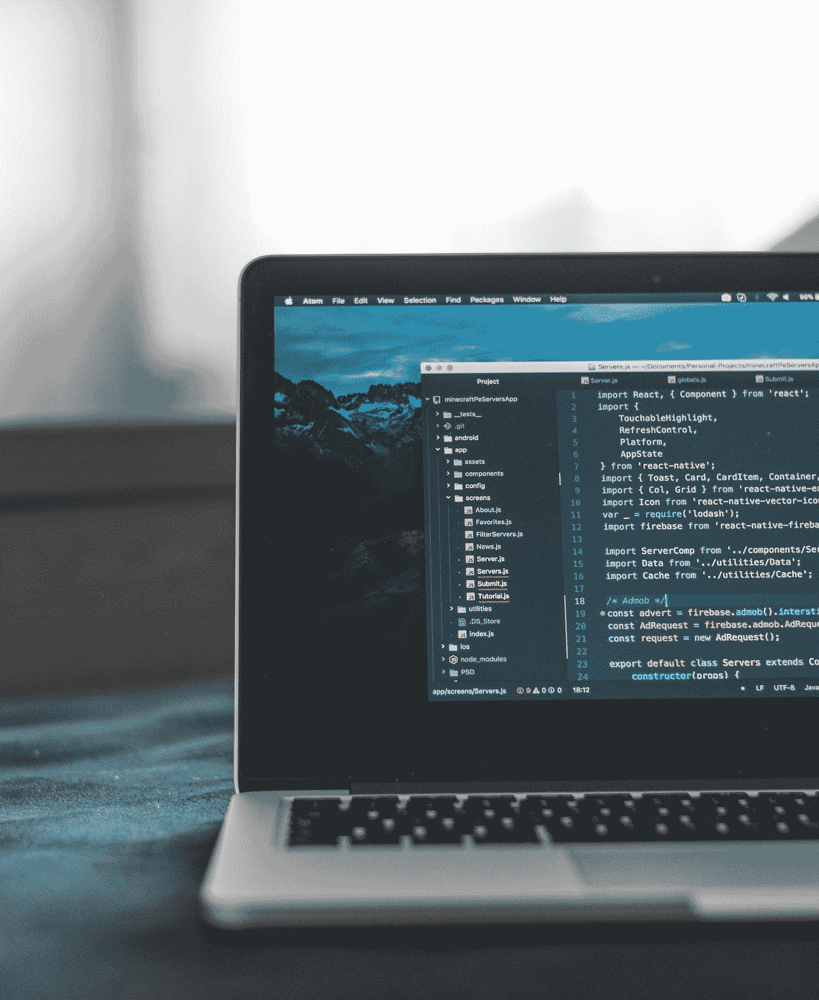

# 清理代码的 4 个技巧

> 原文：<https://medium.com/geekculture/4-tips-to-clean-your-code-c63d422ccd58?source=collection_archive---------11----------------------->

干净的代码对于编写、阅读和维护代码非常重要。虽然上面概述的步骤不是具体的规则，但是它们可以作为创建干净代码的指南。不管你的具体情况如何，保持你的代码有条理和整洁总是更好的。从事代码工作的人会感谢你的努力，他们可能会从你身上学到一些东西。那么，你应该怎样清理你的代码呢？下面列出了清理代码的 4 个技巧。

Photo by [AltumCode](https://unsplash.com/@altumcode?utm_source=medium&utm_medium=referral) on [Unsplash](https://unsplash.com?utm_source=medium&utm_medium=referral)