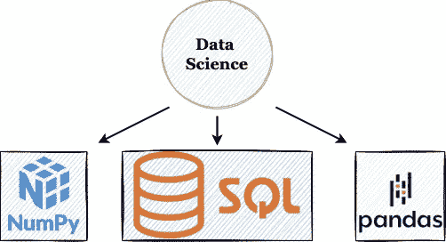
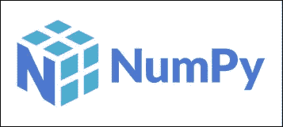
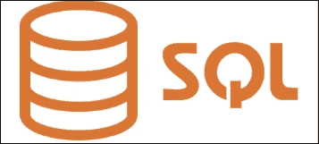
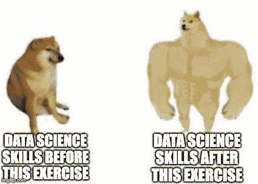

# 450 多个练习题，让你成为熊猫、NumPy 和 SQL Pro

> 原文：<https://medium.com/geekculture/450-practice-questions-that-will-make-you-a-pandas-numpy-and-sql-pro-1cd6f72ee330?source=collection_archive---------1----------------------->

## 自我策划的实践问题集，旨在提高您的数据科学技能。

Photo by [Cytonn Photography](https://unsplash.com/@cytonn_photography?utm_source=medium&utm_medium=referral) on [Unsplash](https://unsplash.com?utm_source=medium&utm_medium=referral)

Pandas、NumPy 和 SQL 无疑是每个数据科学项目的核心。这些工具对于数据驱动项目的整个开发生命周期来说是不可或缺的，这使得它们成为开始/维持数据科学职业生涯的必备技能。

A few tools utilized in a Data Science project (Image by author)

鉴于这些工具因其无与伦比的潜力而在工业和学术界拥有广泛的适用性，熟悉它们的功能和语法已经成为有抱负的数据科学家的最大必要。

因此，为了扩展您的专业知识，提高您对数据科学中最流行的三种工具的认识，并挑战您现有的知识，我将展示一个自我策划的数据科学笔记本，其中收集了超过 **450** 个练习问题。

引入这一练习的动机是增强您的逻辑能力，并帮助您利用数据生态系统中最受欢迎的三种工具内化数据操作。

**你可以在这里** **获得修炼笔记本** [**。**笔记本本身的介绍中提供了使用笔记本的步骤。](https://subscribepage.io/450q)

# 排名第一的熊猫

熊猫图书馆已经成为数据科学家进行各种表格数据分析、管理和处理的首选工具。

Pandas (Source: Pandas [Website](https://pandas.pydata.org/docs/index.html)) (Edited by Author)

Pandas API 提供的广泛功能一直吸引着数据科学家去做一些令人惊奇的事情。你可以在我下面的博客中读到熊猫最常用的方法:

 [## 数据科学家 80%的时间使用熊猫 20%的功能

### 将帕累托法则运用于熊猫图书馆

towardsdatascience.com](https://towardsdatascience.com/20-of-pandas-functions-that-data-scientists-use-80-of-the-time-a4ff1b694707) 

为了提高你处理表格数据的技巧和经验，在这个练习中，我特别为熊猫准备了 200 多个问题。这些包括广泛的主题，例如:

*   熊猫的输入和输出操作
*   数据帧和序列上的一般函数
*   数据操作
*   过滤操作
*   分组方法
*   连接
*   滚动窗口方法
*   数据分析，**还有更多**。

此外，本练习还包括使用 Pandas 深入探索真实世界的表格数据集，这将帮助您探索各种 Pandas 方法在真实世界数据集上的适用性。

## 示例问题:

下面是熊猫练习中的几个示例问题:

*   基于另一个列表对数据帧排序

*   交换数据帧的两行

# 第二名

NumPy(或 Numeric Python)广泛用于在 Python 中高效处理数值计算。

NumPy (Source: NumPy [Website](https://numpy.org/)) (Edited by Author)

NumPy 无疑是 Python 中最重要的库之一。此外，整个数据驱动的生态系统在某种程度上依赖于 NumPy 及其核心功能。

如果您刚刚开始使用 NumPy，阅读我下面的博客可能会有所帮助，它描述了 NumPy 中最广泛使用的方法:

 [## 数据科学家 80%的时间使用 20%的 NumPy 函数

### 谁说你应该知道一切？

towardsdatascience.com](https://towardsdatascience.com/20-of-numpy-functions-that-data-scientists-use-80-of-the-time-d8bd9c7d144b) 

为了这个数据科学练习，我专门为 NumPy 创建了近 150 个问题。主题包括:

*   Numpy 数组创建方法
*   NumPy 数组操作
*   NumPy 数组上的数学运算
*   矩阵和向量运算
*   分类方法
*   搜索方法
*   统计方法等等。

## 示例问题:

下面提到了 NumPy 练习中的几个示例问题:

*   检查数组的所有元素是否都是有限的

*   忽略 nan 元素求总和

# #3 SQL

虽然 Pandas 和 NumPy 是数据生态系统中与数据管理和处理相关的流行的特定于 Python 的框架，但 SQL 是其自身的完整编程语言，旨在与数据库进行交互。

SQL (Image by author)

Pandas 和 SQL 有一个突出的共同点，那就是两者都是处理表格数据的优秀工具。

因为 Pandas 和 SQL 本质上都是用来处理和操作表格数据的，所以可以使用两者来执行类似的操作。请阅读我下面的博客，探索其中的一些转变:

 [## 将 SQL 查询转换为 Pandas 操作

### Pandas 中的 SQL 查询及其对应方法

towardsdatascience.com](https://towardsdatascience.com/translating-sql-queries-to-pandas-operations-2d27c354b8a2) 

我的数据科学练习中的 SQL 部分提供了 100 多个问题来提高您的 SQL 技能。我在这一部分涉及的主题包括:

*   数据操作
*   数据分析
*   表格更新
*   GroupBy 操作
*   SQL 连接
*   过滤方法等等。

与 Pandas 练习类似，SQL 练习也围绕使用 SQL 中的方法深入研究真实世界的表格数据集。

# 最后的想法

最近，当我写自己的博客和阅读其他作者写的纯粹围绕数据科学技巧和诀窍的博客时，我意识到这些博客从根本上假设读者熟悉所提出的方法背后的基本概念。

然而，随着时间的推移，我意识到很大一部分读者可能会被忽略，因为他们发现理解这些帖子中提出的技巧很有挑战性。这可能是因为不熟悉，也可能是因为被他们从未见过的东西淹没了。

我希望这个练习将成为那些寻求在使用这些流行的数据科学工具方面获得信心的人，以及那些寻求改善和挑战他们现有专业知识的人的一个很好的起点。

**访问** [**这里**](https://subscribepage.io/450q) **。**

感谢阅读。

Doge meme created by the author on [imgflip.com](https://imgflip.com/).