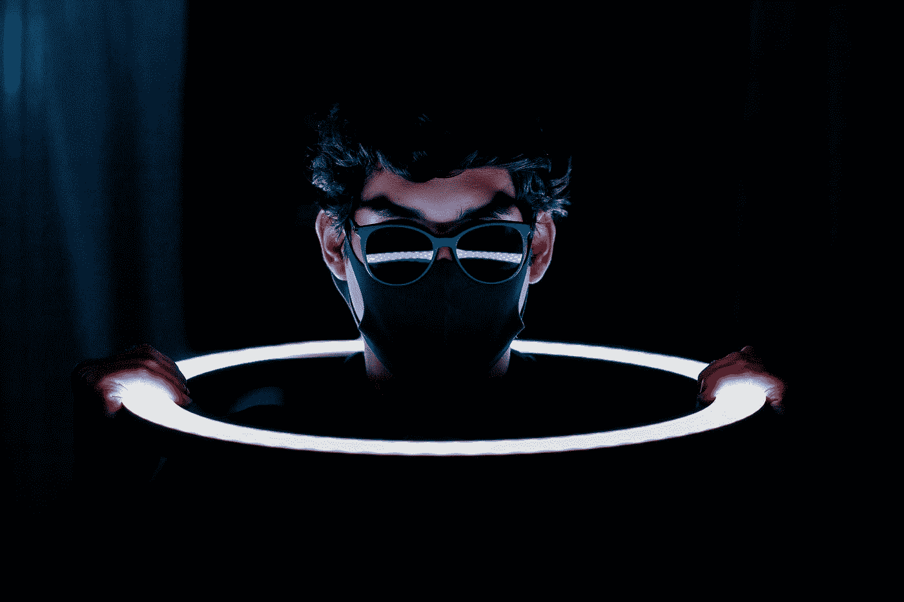

# 暗网上的 48h

> 原文：<https://medium.com/geekculture/48h-on-darknet-756a74b39e8b?source=collection_archive---------14----------------------->

## 我花了 48 小时在暗网上，这是我发现的。这是什么？它是如何工作的？里面是什么？安全吗？

Photo by [Fábio Lucas](https://unsplash.com/@fabiolucas_foto?utm_source=medium&utm_medium=referral) on [Unsplash](https://unsplash.com?utm_source=medium&utm_medium=referral)

虽然这听起来像是一个耸人听闻的标题，但它很好地描述了这篇文章的内容。在这一周里，我一直在为我在 DeepWeb 上的 Twitch 广播准备内容。

> [*🔔*](https://emojipedia.org/bell/) *20:00 —* [*今天我要上 Twitch*](https://www.twitch.tv/davidmoremad) …