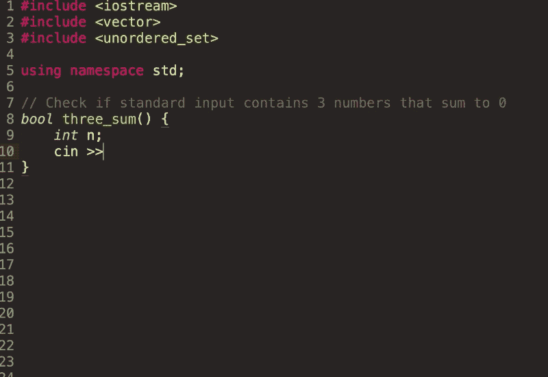
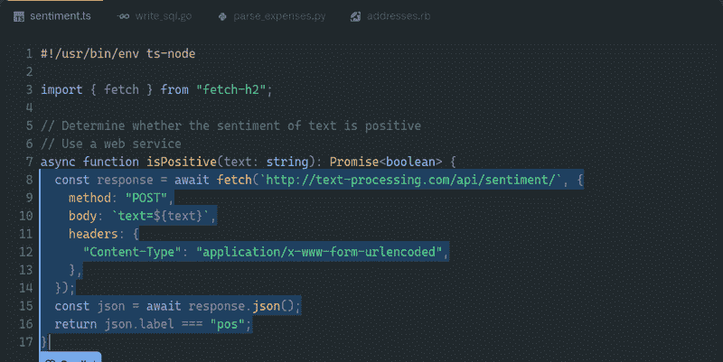
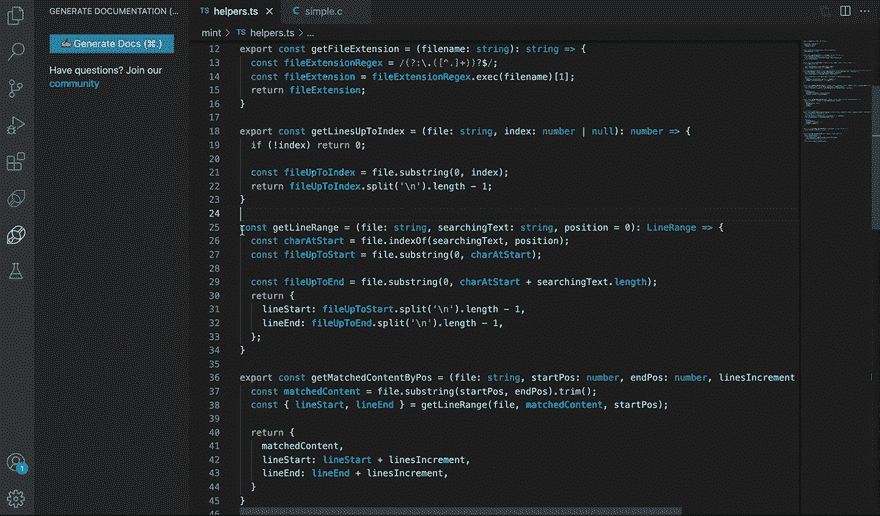
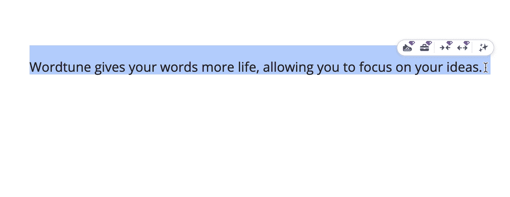

# 2023 年每个软件开发人员都应该使用的 5 个人工智能工具

> 原文：<https://medium.com/geekculture/5-ai-tools-every-software-developer-should-be-using-in-2022-afc4fb149c60?source=collection_archive---------0----------------------->

使用这些 AI 工具成为 10 倍的开发者。

Photo by [Josh Hild](https://unsplash.com/@joshhild?utm_source=unsplash&utm_medium=referral&utm_content=creditCopyText) on [Unsplash](https://unsplash.com/s/photos/futuristic?utm_source=unsplash&utm_medium=referral&utm_content=creditCopyText)

AI 正在慢慢潜入我们的生活。对于软件开发者来说，利用人工智能快速设计和开发软件是很重要的。众多的人工智能工具可以协助软件开发人员的日常工作。

以下是我的 5 大推荐。

# 1.泰伯宁

**类别:** AI 代码补全工具。

【tabnine.com】网站:

**VSCode 插件:**[bit.ly/3QTvC8c](https://bit.ly/3QTvC8c)

Tabnine 通过自动完成代码使开发人员更有效率。

智能代码完成节省了大量时间。

在您键入时，Tabnine 会根据上下文和语法预测并建议您的下一行代码。它提供:

*   整行代码完成
*   全功能代码完成
*   代码的自然语言

Tabnine 通过建议符合您的编码模式的代码完成来提高代码质量和一致性。

Tabnine 运行在您的本地计算机上，从不共享您的数据和代码；因此隐私不是问题。

Tabnine in action

# **2。GitHub 副驾驶**

**类别:**自动化代码生成

**网址:**[github.com/features/copilot](https://github.com/features/copilot)

**VSCode 插件:**[bit.ly/3R1mWg2](https://bit.ly/3R1mWg2)

从头开始编码需要时间和精力。使用 Copilot，您可以通过组装预定义的模块来实时构建整个功能。

Copilot 接受了数十亿行公共代码的训练，可以将包括注释和方法名称在内的自然语言提示转化为跨数十种语言的编码建议。

Copilot 的一些优势包括:

*   不需要搜索栈溢出或谷歌。
*   它节省了输入新代码的时间。
*   一旦你练习写出好的提示，Copilot 就会创造奇迹。

GitHub Copilot in action

# **3。明特利**

**类别:** AI 文档作者

**网址:**[mintlify.com](http://mintlify.com)

**VSCode 插件:**[bit.ly/3QD9NtW](https://bit.ly/3QD9NtW)

写评论或生成文档很糟糕。让明特利来处理吧。只要突出代码，看看神奇之处。

Mintlify 在理解你的代码方面给人留下了极其深刻的印象。它可以非常方便地用于:

*   理解复杂的功能并生成文档。
*   快速生成评论，以了解其他人的职能在做什么。

Mintlify in action

# 4.Quillbot 或 Wordtune

**类别:**转述工具

【quillbot.com】网站:app.wordtune.com 或[T4](https://app.wordtune.com/)

使用 QuillBot 释义工具，您可以重写任何句子、段落或文章。

很多时候，当你不喜欢你写句子的方式，不想重写或编辑它时，使用 Quillbot 或 Wordtune 来重新构建你的句子。

有了这个工具，你的语言技能将会提高。与其担心语法或错别字，你可以专注于实际内容。

Wordtune in action

# 5.Otter.ai

**类别:**自动抓取会议笔记

**网址:** [otter.ai](https://otter.ai/)

使用人工智能，水獭。人工智能使用户能够实时转录可共享、可搜索、可访问且安全的会议笔记。

不需要做笔记，记在笔记本上。让水獭帮忙；它会自动做会议记录。

# 结论

如果你是开发者，请做好准备！在你的下一个项目中，人工智能有很多方法可以帮助你。使用上述工具成为 10 倍开发者！一旦你习惯了这些工具，就没有回头路了。

➡在 Linkedin 上关注我，了解系统设计和编码面试的技巧。

阅读更多信息:

 [## 系统设计面试生存指南(2023):准备策略和实用技巧

### 2023 年系统设计面试剧本。

levelup.gitconnected.com](https://levelup.gitconnected.com/system-design-interview-survival-guide-2023-preparation-strategies-and-practical-tips-ba9314e6b9e3)  [## 用这 20 个必须知道的算法模式在 2023 年成为一名编码面试专家！

### 大师级编码面试:探索编码面试模式如何帮助你聪明地准备。

levelup.gitconnected.com](https://levelup.gitconnected.com/become-a-coding-interview-pro-in-2023-with-these-20-must-know-algorithmic-patterns-715643e493f5)  [## 12 大系统设计面试问题及答案(2023)

### 通过练习这些问题，你可以增加许多成功的机会！

medium.com](/geekculture/top-12-system-design-interview-questions-with-answers-2022-dc2b6599f39a) 

*   👏请为这个故事鼓掌，然后跟我来👉
*   📰查看更多关于[编码和系统设计访谈的内容](https://arslan-ahmad.medium.com/)
*   🔔关注我:[LinkedIn](https://www.linkedin.com/in/arslanahmad/)|[Twitter](https://twitter.com/arslan_ah)|[时事通讯](https://designgurus.org/interview-noodle-page)