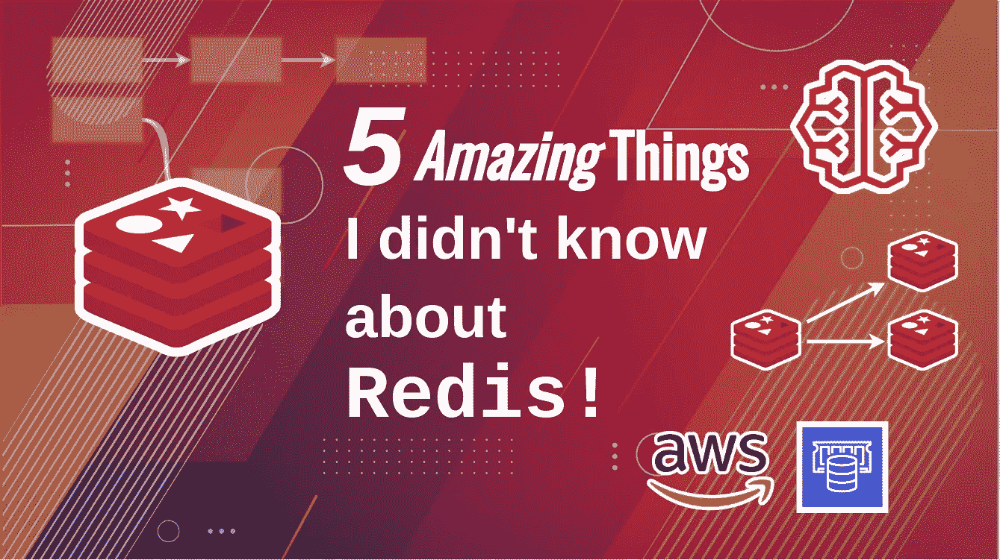
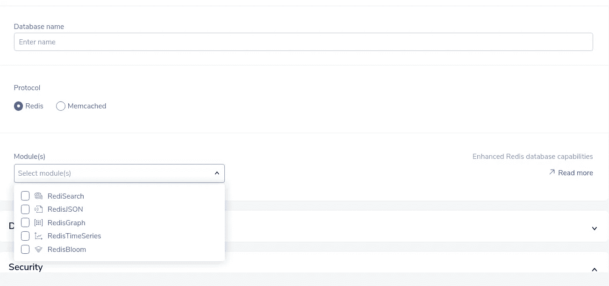

# 关于 Redis，6 个月前我不知道的 5 件惊人的事情

> 原文：<https://medium.com/geekculture/5-amazing-things-i-didnt-know-about-redis-6-months-ago-914a6686090?source=collection_archive---------1----------------------->

# 简短的序言

在过去的一个月左右的时间里，我一直在探索 Redis(我也写了一堆博文，如果你想去[看看](/@sanilkhurana7/list/redis-88a4c95150fa))。虽然它的编程方面非常有趣(我确实做过几个实际项目)，但我的大部分研究和帖子更侧重于高级架构。我想了解 Redis 与其他数据库相比如何，以及为什么会有人想使用 Redis，这也是这篇文章的内容。

虽然编写代码并投入实现很有趣，但除非我知道自己为什么这么做，否则我不会对自己正在做的事情感到真实。要真正了解*如何使用 Redis，我觉得应该先了解*为什么*要使用 Redis。这就是这篇文章的内容，Redis 真正有趣的特性可以影响你的架构决策。我已经对其中的大部分做了深入的描述，如果你想单独探讨某个话题，我已经在这篇文章中链接了这些文章。*

# *托管 Redis 服务*

*到目前为止，我一直在讨论在虚拟私有服务器中运行 Redis 或者作为 docker 映像运行 Redis，原因是在我看来，每当我写 Redis 时，我都在考虑使用`docker run -it redis`将其作为 docker 容器运行，或者创建 EC2 实例并在其中运行 Redis。*

*这是一个不错的解决方案，对于很多用例(比如为博客做实验)，它会工作得很好，但是如果我告诉你我们可以做得更好呢？如果我们可以获得更好的性能和特性，同时还必须做更少的工作(尽管成本更高)，那会怎么样？*

*我们可以这样做的方法是使用托管 Redis 服务。这些是许多云主机提供商提供的服务，他们会自动设置 Redis，设置其功能，如备份和安全，并给我们一个端点，我们可以使用不同级别的配置连接到 Redis。你可以认为这是 AWS 自动化了你的一些工作，这样你就不必设置一个 EC2 实例并在其中运行 Redis，相反，AWS 将设置实例，运行 Redis，添加更多的功能，并把它放在银盘子里给你。*

*如果您在生产环境中运行 Redis，这个选项特别有用，因为托管 Redis 服务将为您提供自动备份和更新、简单的配置、访问控制机制、安全性以及更多选项。例如，在 RedisLabs 上建立数据库时，它为您提供了一个选择任何预配置 Redis 模块的简单选项*

**

*显然，您也可以自己完成这些工作，但是您必须花费大量的时间和资源来创建这种级别的功能集，更不用说测试和调试 bug 了。*

*这些服务通常还提供 SLA，以便您对数据和 API 的可靠性和可用性有一定程度的信心，如果您的客户有法规遵从性要求，这些服务也会很有用。*

*因此，简而言之，您做的工作更少，您使用的解决方案经过了尝试和测试，比普通开发人员在相同时间内创建的任何解决方案都少得多，并且您对您获得的服务级别更有信心，尽管您确实需要支付更多的钱(毕竟没有免费的东西)。*

# *Redis 流和发布/订阅*

*如果你曾经认为 Redis 只是一个简单的内存数据库，只适合缓存，那么和我一样，你错了。*

*Redis 不仅可以临时存储数据，还可以做很多事情。事实上，它也是最受欢迎的消息经纪服务之一。它可以作为一个成熟的发布订阅和排队系统，与 RabbitMQ 或 Kafka 相差不远。*

*那么，这是怎么做到的呢？嗯，其实很简单。你可以在 Redis 中创建频道，用户可以连接到他们想听的频道。这里有很多配置，我现在不会深究，但我确实写了一篇非常深入的帖子，解释 PubSub 系统以及它们为什么如此棒[这里](/geekculture/streams-vs-pub-sub-systems-in-redis-70626821cc2f)。*

*仔细想想，使用 Redis 作为消息代理实际上很有意义。Redis 在快速访问数据方面非常出色(这正是您在消息代理中所需要的)，Redis 的一个显著缺点是数据存储成本更高，因为它是在内存中存储的(有多种方法可以持久存储数据，稍后我会详细介绍)。Redis 作为一个消息代理是有意义的，因为无论如何你都不会在一个消息代理中存储大量的数据，并且它在内存中的事实可以是一个巨大的优势，因为这意味着生产者和消费者的快速读写。不仅如此，我们可以用 TTL 值使 Redis 中的数据过期，这对于删除消息代理中的旧消息也非常有益。事实上，它作为消息代理的受欢迎程度是它成为 AWS 上[最受欢迎的数据库的部分原因(这些数据已经有一年多的历史了，但它证明 Redis 是 AWS 上一个非常受欢迎的选择)](https://www.theregister.com/2020/11/23/redis_the_most_popular_db_on_aws)*

*Redis 还支持另一种有趣的方式，即流，通过这种方式，服务可以以一种解耦的方式进行通信。流与 Redis 中的通道非常相似，在许多场景中，两者都可以作为另一个的替代品。我真正喜欢 streams 的是它如何将何时消费哪些消息的责任转移给消费者。但显然，有很多权衡需要考虑。这是一个更复杂的话题，值得在我的博客上发表，我已经在这里写了一篇博文，在这篇博文中，我使用 Redis 通道对 Redis 流和 PubSub 流进行了比较。如果你想知道更多，可以去看看。*

# *坚持*

*直到几个月前，我还认为 Redis 是一个内存缓存，一个可以存储数据以便在内存中快速检索的数据库，但是一旦我的服务器停机，我就会丢失数据。*

*然而，这不是真的。*

*Redis 还通过一些不同的方法提供了强大的持久性功能，这些方法包括快照、仅追加文件以及同时使用快照和仅追加文件。让我们更深入地讨论这些问题吧！(别担心，它们相当简单)*

*让我们从抓拍开始。这个想法很简单，每隔 *n* 分钟，Redis 就会给你的数据库拍快照，并把它写到磁盘上。它们非常适合备份，我们可以建立一个架构，每隔 *n* 分钟存储一次快照，并在 *m* 分钟后自动删除它们，为我们提供版本化的快照。我们还可以将这些版本化的快照推送到像 S3 这样的平面文件存储中。*

*但是它们也有一些缺点。通常，您希望每隔 5 分钟或更长时间自动保存 Redis 数据，因此如果您正在寻找时间点恢复(PITR ),您可能希望恢复到任意时间点，那么这不适合您。能够将数据恢复到任何特定的一秒可能有点困难，因为根据数据库的大小，非常频繁地拍摄快照也会对性能产生影响。*

*在仅附加文件或 AOF 持久性中，Redis 将它执行的每个事务写入仅附加日志文件。当服务器下次启动时，Redis 可以逐个加载并运行这些事务日志，以恢复数据库的状态。AOF 可以让您拥有更精细和可配置的备份，允许您配置它每隔 *n* 秒甚至在每次事务处理后写入磁盘。但是由于它如此频繁地写入磁盘，因此可能会对性能产生轻微影响。*

*最后，你可以两者都用！您可以启用 AOF 和 RDB 快照。这为您提供了两种方法的优点。因此，您的数据库将每隔 *n* 分钟拍摄一次快照，并写入一个只附加的日志文件，以允许您将数据库回滚到任何一秒。*

# *Redis 模块*

*有许多即插即用模块可用于增强 Redis 实例的功能。这些通常是开源库，任何人都可以创建，并安装在 Redis 之上。*

*我发现的最有趣的一个是 RedisAI，它允许你在 Redis 中托管机器学习模型。这有很多优点和缺点，我在[这篇文章](/dev-genius/redisai-for-serving-ml-models-in-production-ed450143ec19)中更深入地讨论了这一点，在这篇文章中，我们还实现了一个简单的项目来托管 ML 模型并从中进行推断。*

*其他有趣的模块包括 RediSearch，它提供了非常好的全文搜索功能，提供了与 ElasticSearch 类似的用例，RedisJSON 允许我们在 Redis 中编写 JSON 文档，提供了与 MongoDB 和其他文档数据库类似的用例(您也可以使用普通的 Redis 并将 JSON 文档存储为字符串，但是您将失去对 JSON 文档执行某些操作的能力，例如检索嵌套属性)，RedisTimeSeries，顾名思义，它提供了一个时间序列数据库，并为 Prometheus 提供了类似的用例，以及[更多](https://redis.io/modules)！*

*简而言之，如果你真的喜欢 Redis，并且觉得它的快速内存性能在其他地方也很有用，你可以看看 Redis 模块，它们安装在 Redis 之上。实现相当简单，您可以传递模块的。所以在运行 Redis 服务器时，可以使用`--loadmodule`指令或`MODULE LOAD`命令。例如，这是我们用 RedisAI 实现项目时使用的 docker-compose 文件(注意`--loadmodule`指令)*

# *Redis 集群*

*Redis 也支持集群！*

*简而言之，您可以通过创建读取副本来提高读取性能，或者通过共享 Redis 数据库来提高写入性能，从而轻松地水平扩展 Redis 实例。Redis 为读取副本和分片提供了强大的支持。*

*添加读取副本仅仅意味着您创建了从主节点复制数据的 Redis 实例。当您想要读取数据时，您可以将您的读取分发到您的从节点，并写入到主节点。这些多个 Redis 实例可以在单独的硬件上运行，因此当您在单独的硬件上运行多个读取副本时，每个副本都有自己的 CPU、内存和网络带宽，您可以大大提高读取性能。*

*同样，为了提高写性能，可以将单个数据库划分为多个数据库，每个 Redis 实例存储一部分数据。*

*这看起来很复杂，但不用担心！我已经就这两个主题写了深入的文章，探索了它们如何以及何时成为这两者的有用和实用的例子。看看[我在缩放 Redis 上的帖子是](/geekculture/replication-in-databases-with-redis-architecture-for-horizontally-scaling-databases-b19fc6c5d149?source=list-2bda56b80bb9--------2-------88a4c95150fa------------------------)和[如果这听起来令人兴奋的话，我在缩放 Redis 上的帖子是](/geekculture/horizontally-scaling-writes-with-redis-clusters-a77cdcdf6de2)。*