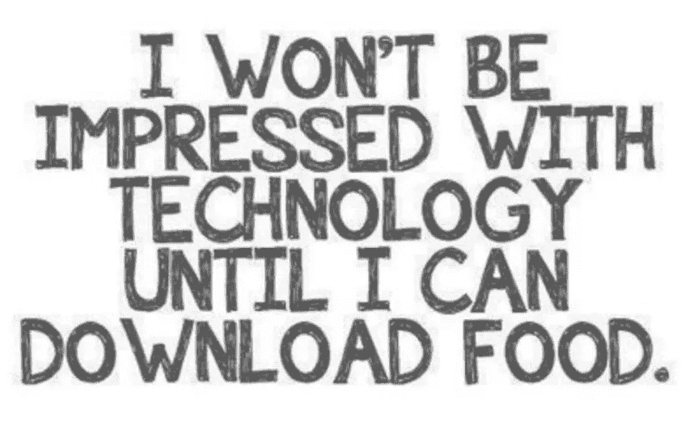
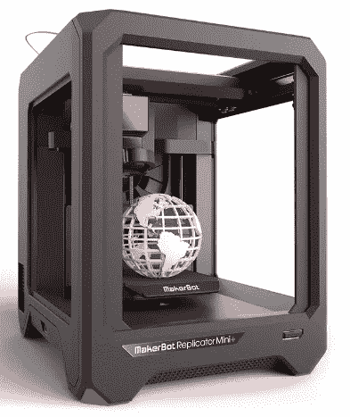
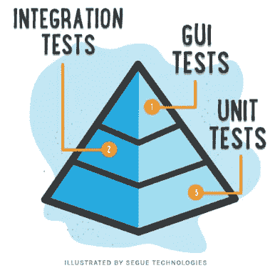

# 5 款可以造福人类的应用

> 原文：<https://medium.com/geekculture/5-apps-that-could-benefit-humanity-efd26f091e6a?source=collection_archive---------67----------------------->

## 讽刺

[https://imgflip.com/memegenerator](https://imgflip.com/memegenerator)

## #1.英制电表

一个应用程序，将在激活时，检测是否有人在说废话。它也可以是文本浏览器的扩展。

Stock image, edited by author

如何使用:当有人在说废话时，你可以打断他们，并在你的手机或手表上显示通知——对不起，但那只是废话！或者，您可以在您的 comp 上截屏通知，并通过电子邮件链回复所有人，包括截屏。文章可以有 **bs-score** ，类似于[烂番茄](https://www.rottentomatoes.com/)，分数高就是不好。

## #2.意图检测器

Embassy Pictures, modified by author

与#1 类似，这是一款可以检测对话、文本中隐藏意图的应用。除了显示通知之外，如果有人心怀不轨，还应该有一点类似电影的音乐来警告你。这可能是约会场合的救命稻草。**双分**，与之前类似。

## #3.3D 复制器(立方体)

Image from [MakerBot](https://www.makerbot.com/3d-printers/replicator-mini/)

不完全是一个应用程序，而是一个从空气、水、土壤中获取资源并合成我们想要的任何东西的设备。类似于现实世界中的复制粘贴机。那就太棒了！

## #4.在线投票系统

Screenshot taken from technologytimes.ng

我们当然有技术做到这一点。如果脸书能管理 20 多亿用户，也许美国政府能管理 1.5 亿用户？！不再有不公正的划分选区，重新计算，和所有的忧郁。你验证你自己，你投票，它会自动计算。是的，不要选举团了，好吗？！

## #5.仅适用于开发人员:自动单元测试生成器

程序员知道我在这里说的是什么。当您编码时，它会自动为您生成所有相应的单元测试。作为一名开发人员，我会把我工资的 10%给开发这个应用程序的人。

**输入**:面条码

**输出**:100%覆盖率的干净代码！

其他想法？留言评论！谢谢😂