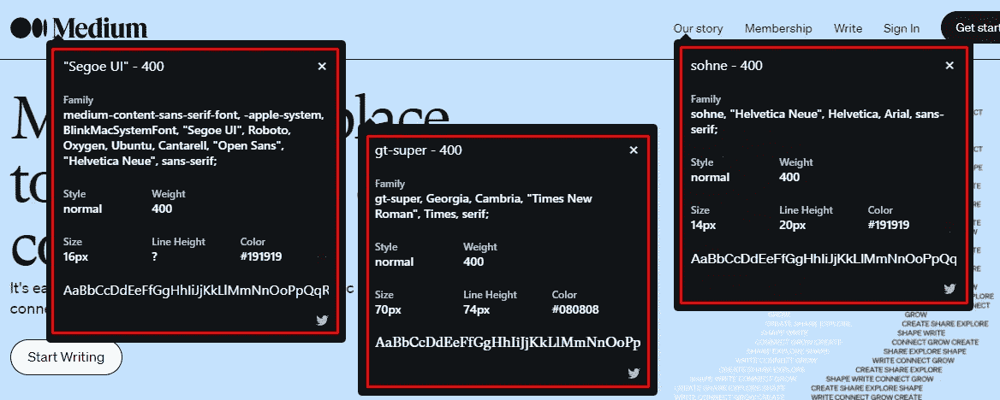
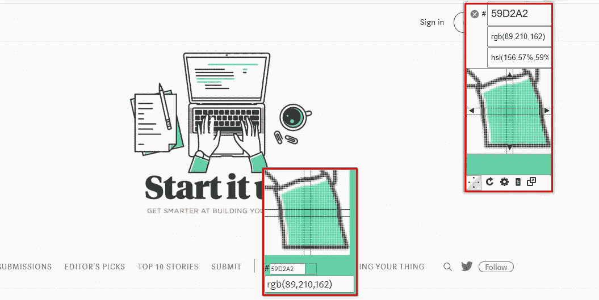
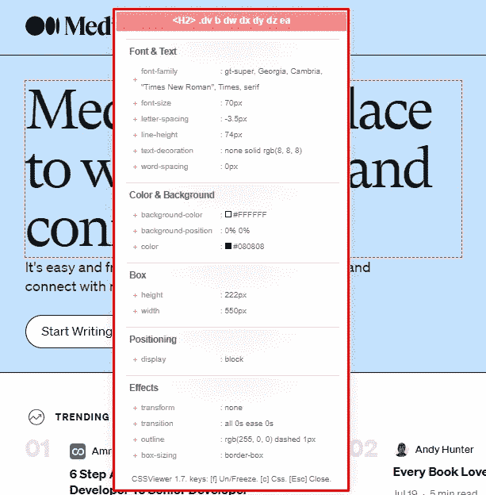
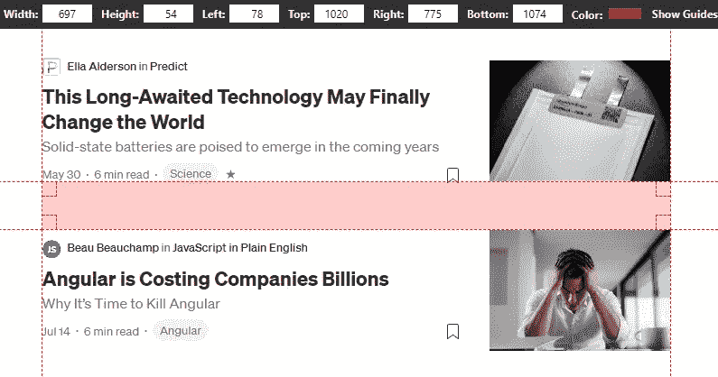
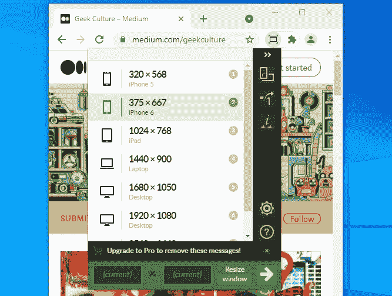

# 每个网页设计师必须拥有的 5 个基本 Chrome 扩展

> 原文：<https://medium.com/geekculture/5-basic-chrome-extensions-every-designer-must-have-ae7a6ffbc3d7?source=collection_archive---------31----------------------->

Photo by [Theme Photos](https://unsplash.com/@themephotos?utm_source=medium&utm_medium=referral) on [Unsplash](https://unsplash.com?utm_source=medium&utm_medium=referral)

作为一名中级网页设计师，有几件事我希望能早点知道。我的意思是，我努力寻找正确的字体，完美的颜色代码，或者我的竞争对手正在使用的复杂的 CSS 位。

当我做完这些，我会花一个多小时。这足以扼杀我们的动力。有几天我觉得自己不想再写代码了。糟透了。

然而，这也是有趣的部分。在花了几个小时努力开发之后，那种强烈的成就感是任何开发人员都无法比拟的。

但这都是有趣的游戏，直到你开始厌倦这种例行公事。这时你需要找到捷径，在最微小的事情上减少时间。这时你需要一个真正有用的工具。

通过 3 个月的学习网站开发，我偶然发现了许多资源、技巧和工具，它们都是为了让学习变得更容易。他们中有几个人在工作，而其余的人只许下诺言。因此，回顾过去的日子，我决定列出一个小清单，列出一些能帮助你加速这个过程的工具。他们帮助了我，所以也许对你也有用。

为了便于阅读，我在一个**‘短列表’**中列出了所有的东西，后面是一个扩展的**‘长列表’**。你可以在短列表中确定你需要什么，然后跳到长列表中更详细的版本。

***本文未列出任何委托或附属项目***

# 短名单

*   [什么字体](#9d8f)
*   [颜色选择](#cb56)
*   [CSS 查看器](#1a6f)
*   [页面标尺冗余](#25a2)
*   [窗口大小调整器](#c3fc)

# 长名单

## [什么字体](https://chrome.google.com/webstore/detail/whatfont/jabopobgcpjmedljpbcaablpmlmfcogm)

从名字就很明显。该扩展名标识网站上使用的字体。因此，如果你曾经遇到过与你一直以来所想的相匹配的字体，你所要做的就是选择扩展名，点击文本，它会告诉你关于该字体的一切。这还包括它的颜色、大小、重量和行高的信息。

screenshot by [author](/@amanhabib)

## [颜色选择](https://chrome.google.com/webstore/detail/colorpick-eyedropper/ohcpnigalekghcmgcdcenkpelffpdolg)

WhatFont 和 ColorPick 将是最基本和最有用的扩展。ColorPick 可以识别网站上使用的任何颜色。点击扩展会出现一个新的十字准线，当你把它悬停在上面时，它会立即识别颜色。扩展将显示颜色代码，包括它的 RGB 和 HSL 模型。

screenshot by [author](/@amanhabib)

## [CSS 查看器](https://chrome.google.com/webstore/detail/cssviewer/ggfgijbpiheegefliciemofobhmofgce)

作为一个初学者，我很难找到竞争对手的确切 CSS 代码。计算这个复杂的部分对设计师来说很有帮助。这个扩展可以很容易地找到并显示一个网站正在使用的每一个 CSS 代码。只需点击扩展，它会立即给你鼠标悬停的元素的 CSS。

我有一个类似的免费学习 web 开发的故事。如果你是一个想成为开发者或初学者，你可以查看一些最好的免费资源和学习技巧。

 [## 如何免费学习 Web 开发——技巧和资源

### 最好的免费教程和有效的学习技巧，为创作者寻找学习网页开发。

medium.com](/swlh/how-to-learn-web-development-for-free-tips-and-resources-f177cb04d376) 

## [页面标尺 Redux](https://chrome.google.com/webstore/detail/page-ruler-redux/giejhjebcalaheckengmchjekofhhmal?hl=en#:~:text=Page%20Ruler%20Redux&text=Page%20Ruler%20Redux%20is%20a,measurements%20of%20any%20web%20elements.)

这基本上是一个屏幕标尺，对测量网站的尺寸非常有帮助。您可以选择扩展名，然后在网站上的任意位置单击并拖动鼠标进行测量。

screenshot by [author](/@amanhabib)

截图中显示的**宽度**和**高度**是高亮区域的尺寸。**左、上、右、**和**下**是高亮区域的边距。这对我很有帮助，尤其是当我设计克隆网站来学习的时候。

## [窗口大小调整器](https://chrome.google.com/webstore/detail/window-resizer/kkelicaakdanhinjdeammmilcgefonfh/)

为响应式设计寻找不同的浏览器尺寸真的占用了我很多时间。这个扩展可以根据不同的可视设备轻松地将浏览器调整到不同的尺寸。无论是智能手机、平板电脑还是电脑。

您也可以给它一个自定义的宽度和高度，扩展将相应地调整窗口的大小。很漂亮，对吧？

screenshot by [author](/@amanhabib)

非常感谢您阅读这篇文章。我真的很高兴能和你分享这些。

这些扩展对我帮助很大，所以我相信它们对设计师来说是有效的。如果你对这篇文章或扩展有任何问题或疑问，请在回复中让我知道，我会确保帮助你。

祝大家有美好的一天:)