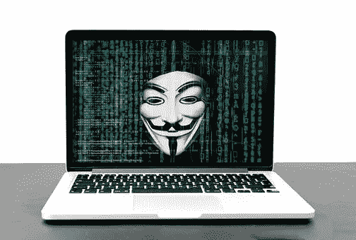

# 保护您的 AWS 帐户免受未授权访问的 5 个基本步骤

> 原文：<https://medium.com/geekculture/5-basic-steps-to-shield-your-aws-account-from-unauthorized-access-1a378bd6c6b3?source=collection_archive---------23----------------------->

# 我是如何被黑的

很多年前，我们就知道我们的 AWS 账单上涨了。我们开始挖掘，发现一个月中有两天 EC2 成本飙升。我们的分析得出结论，不知何故，我的机器被黑了，黑客得到了我的*访问密钥。*

我是 *AWS 访问键*的超级用户。我曾经很喜欢命令行界面…