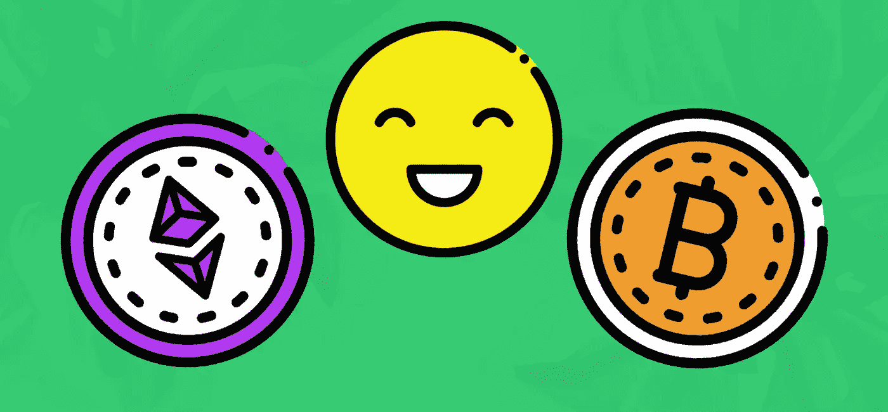

# 你可能不知道的加密货币的 5 个好处

> 原文：<https://medium.com/geekculture/5-benefits-of-cryptocurrency-you-may-not-know-498332484dc9?source=collection_archive---------24----------------------->

## 第三集

## 是什么让加密货币变得有趣？

在[第 1 集](https://frukerick.medium.com/cryptocurrency-explained-in-less-than-one-minute-179b6223c1ae)中，我们从新手和专家两个角度定义了加密货币。

因此，你可能会问，“鉴于我们已经有了发送和接收货币的支付网关和平台，加密货币有什么好处，到底是什么让它们变得有趣？”🤔

Source: [Blockgeeks](https://blockgeeks.com/5-benefits-cryptocurrency/)

以下是你可能不知道的加密货币对社会的五大好处:

**1。** [**去中心化无权限**](https://academy.binance.com/en/start-here) **:** 由于每个所有者都充当着银行的角色，没有人能阻止你存取或移动你的资产。与此同时，集中式系统控制着交易发生的时间、原因和方式。必要时，他们可以冻结你的资产或拒绝交易。

**2。更便宜、更快:**区块链交易无论地理位置如何都可以立即发生，而且成本只是国际电汇的一小部分。交易率低且快是因为没有中间人，就像国际电汇一样。

3.除了交易率低，拥有加密货币相对更便宜；[持有者无需支付与法定货币相关的传统银行费用](https://www.investopedia.com/ask/answers/100314/what-are-advantages-paying-bitcoin.asp)。没有账户管理费、最低存款余额要求、透支费和存款返还费。

**4。抗审查:**区块链采用加密技术进行保护，其运行方式使得黑客或攻击者几乎不可能关闭它们。因此，使得加密货币对于进行商业和金融交易非常安全。

**5。低准入门槛:**任何拥有智能手机或电脑的人都可以访问、发送和接收加密货币。从理论上讲，[每个人都可以使用加密货币](https://www.simplilearn.com/tutorials/blockchain-tutorial/what-is-cryptocurrency)，而无需进入传统的银行系统、信用卡和其他集中支付系统。

> ***您知道吗，您的年度中级会员资格可以节省 10 美元*** ***？点击*** [***此处***](https://frukerick.medium.com/membership) ***即可享受*** [***优惠******的同时。***](https://frukerick.medium.com/membership)

👉 [**跟我来**](https://frukerick.medium.com/) ，Fru Kerick。
👉 [**订阅**](https://frukerick.medium.com/subscribe) 让你永不错过一个故事。
👉您的中级会员资格可节省 10 美元。**阅读** [无限故事](https://frukerick.medium.com/membership)。以后再谢我吧…

[Fru Kerick](https://frukerick.medium.com/?source=post_page-----498332484dc9--------------------------------)

## 周日运动

[View list](https://frukerick.medium.com/list/the-sunday-movement-4ca3751173a0?source=post_page-----498332484dc9--------------------------------)25 stories