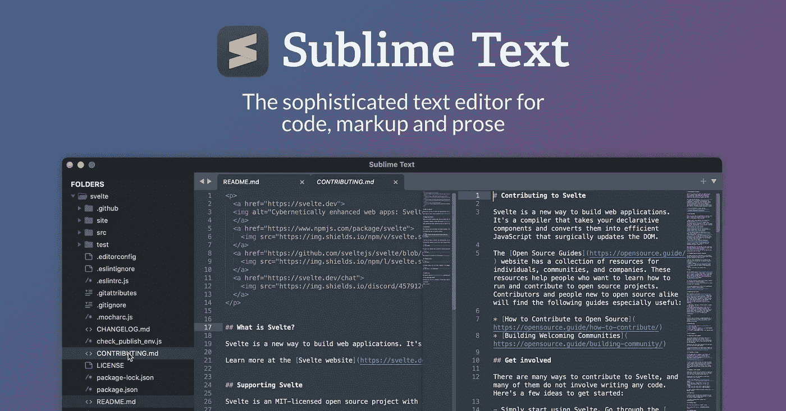

# 前端开发的 5 个最佳构建工具

> 原文：<https://medium.com/geekculture/5-best-build-tools-for-frontend-development-9ecd20fed840?source=collection_archive---------4----------------------->

有许多不同的前端构建工具可用，要知道哪一个是最好的可能会让人不知所措。虽然构建工具旨在使生活变得更简单，但许多开发人员最终却增加了一层复杂性。只使用你需要的工具，并学会理解如何使用它们。否则，你可能会浪费时间和金钱去掌握每一种可用的工具。

## 崇高的文本

