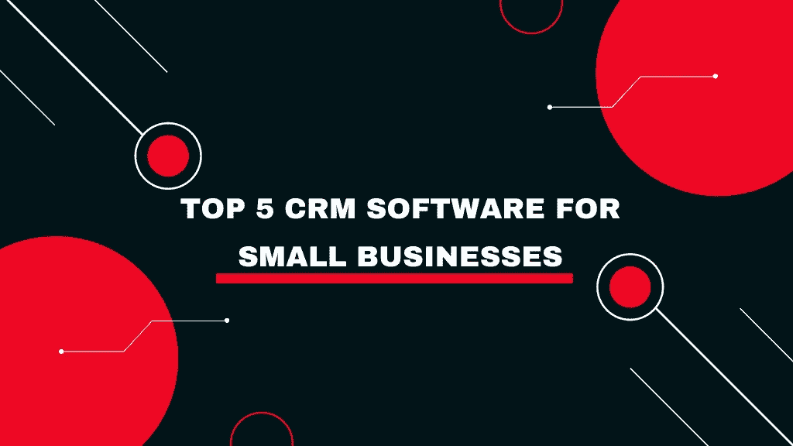

# 5 款最适合您企业的 CRM 软件

> 原文：<https://medium.com/geekculture/5-best-crm-software-for-your-businesses-35b74087ad3f?source=collection_archive---------20----------------------->

每个人都需要与客户建立牢固的关系来发展业务。但是获得更多的客户，建立你的底线和扩大经营需要在理想的概念上投资。拥有一个一体化的 CRM 系统可以让你从各个角度了解客户，以最聪明的方式集中资源。CRM 将帮助您管理您的客户和潜在客户，同时使您能够专注于您的业务增长。

但是，究竟什么是 CRM，你如何选择一个适合你的业务。让我们开始吧。

# 什么是 CRM 软件？

客户关系管理(CRM)软件是一种工具，公司使用它来管理互动，提供独特的无缝体验，并通过提供客户互动的完整画面、组织或优先安排机会、跟踪记录和促进团队协作来与客户建立更好的关系。CRM 战略有助于公司简化流程、增加销售额、建立客户关系和提高盈利能力。

阅读: [**应用安全的秘密管理工具**](https://www.decipherzone.com/blog-detail/best-secrets-management-tools-for-application-security)

CRM 软件旨在通过在一个中心区域收集客户信息并提供 360 度的数据视图来消除客户信息孤岛。您的团队可以获得客户的电子邮件、姓名、通信偏好和电话号码等信息，以及通信和购买历史记录，这将有助于他们通过正确的渠道出于正确的原因联系客户。

阅读: [**银行业的未来**](https://www.decipherzone.com/blog-detail/the-future-of-banking-technology)

那么，你应该为你的企业考虑哪些顶级的 CRM 软件呢？

# 促进小型企业发展的最佳 5 款 CRM 软件

对你的小企业来说，最好的 CRM 软件是帮助你确定在哪里集中简化和组织你的业务流程的软件。因此，这里有 5 大 CRM 软件，将提高你的小企业的效率。

# 1.轮毂点

Hubspot CRM 是小型企业的最佳 CRM 之一。它为初始阶段提供了一个经济高效的 CRM 解决方案。它有助于管理销售线索。免费的 Hubspot CRM 由集客营销工具组成，这些工具将博客帖子导向搜索引擎，同时提供充分的电子邮件营销。它还有助于管理工作流，从而更好地管理项目。此外，您可以轻松分配和跟踪销售线索，跟踪销售流程并记录客户通过渠道进行的互动。

阅读:****】网页设计如何帮助你提升生意？****

**它被设计成与微软 Office 和 G Suite 一起工作。拥有 Zapier 集成将使跨应用程序共享信息和简化任务变得更加高效。而且它对无限用户永远免费，除非你准备好升级为高级版本，你不用担心你在发展业务的同时联系的人数。**

# **2.销售力量**

**Salesforce 已经成为 CRM 行业的巨头，也是小型企业的优秀软件。使用 Salesforce，您可以通过个性化的客户之旅获得线索，并通过智能营销平台的消息、电子邮件、社交媒体和数字广告推动更多销售。**

**阅读: [**SaaS 成功远程团队的工具**](https://www.decipherzone.com/blog-detail/7-must-have-saas-tools-for-successful-remote-team)**

**Salesforce 提供定制报告和仪表板、自动电子邮件和会议跟踪、引导入职、企业级安全性、电子邮件和社交媒体支持等功能。对于小型企业，salesforce 的成本从每月/用户 25 美元开始。**

# **3.Zoho**

**Zoho 是一个基于云的软件套件，旨在为您提供平稳运营小型企业所需的一切。它提供了一套强大的营销和销售功能，以及在线生产力工具和 SaaS 应用程序。**

**阅读: [**打造公司文化的在线工具**](https://www.decipherzone.com/blog-detail/13-online-tools-for-building-your-company-culture)**

**Zoho CRM 软件帮助营销品牌、管理销售、组织联系、提供客户支持等等。它包括用于开发智能仪表盘和预测业务趋势的人工智能语音助手、多渠道联系人管理、让团队保持一致的移动应用程序、用于数据安全的内置安全性、详细的分析报告和销售线索管理。**

**对于最多 3 个用户，它有一个免费增值计划，而对于超过 3 个用户，它的付费计划从每个月 12 美元开始。**

# **4.销售闪光**

**[Salesflare CRM](https://salesflare.com/) 是一款非常棒的 B2B 销售软件。它易于使用，并且利用了自动化的优势，因此销售代表在管理上花费的时间最少。开始使用 Salesflare 非常容易，因为它会自动在平台上导入您的数据。每次通过电话、聊天或电子邮件与联系人的互动都会被自动记录下来。**

**智能工具建议将机会作为重中之重。跟进和提醒有助于减少被遗忘客户的数量。它是专门为销售 B2B 产品和服务的中小型企业设计的。将 Salesflare 与 Outlook、Google 或 iCloud 集成和同步非常简单。在维护电子邮件工作流的同时，它可以方便地从 Salesflare 记录电子邮件和发送跟进。**

**阅读: [**小型网上商业创意**](https://www.decipherzone.com/blog-detail/small-online-business-ideas)**

**它有三个定价等级:增长级每月 29 美元，专业级每月 49 美元，企业级每月 99 美元。Salesflare 还提供 30 天的免费试用期，因此您也可以进行演示。**

# **5.小容器**

**[坚果壳](https://www.nutshell.com/)是一个强大的 CRM 软件，以其简单直观的界面而闻名，非常适合 B2B 销售团队。销售和营销工具使您能够访问和开发客户对话历史，使用销售线索表的集成将访问者转化为客户。**

**果壳可以防止重要的对话和人们从裂缝中崩溃。您还可以记录会议笔记、编辑联系人、扫描名片和接收提醒，以直接从 Android 或 iOS 应用程序建立新的线索。它的一些功能包括排行榜、活动提醒、可定制的销售渠道、团队提醒和@提及、点击通话和电话录音。**

**阅读: [**一款大麻配送 App 的成本和功能**](https://www.decipherzone.com/blog-detail/cannabis-app-development)**

**坚果壳的首发价格是每个用户每月 19 美元，专业版是每个用户每月 35 美元。除了与 Outlook、Exchange、G Suite 和 Microsoft 365 的同步。最重要的是，果壳还提供了与 Quickbook 或 Slack 等商业工具以及 Constant Contact 或 MailChimp 等电子邮件营销服务的一键式集成。**

**选择 CRM 软件的选项是无穷无尽的，但在上述选择的帮助下，你可以很容易地开始访问一个最适合你的。在做出任何决定之前，需要记住的几件事是成本和课程、简单的设置实施和强大的技术支持、可用性、用户最低要求以及新的 GDPR 安全功能。此外，如果你想建立一个根据你的需要和要求特别设计的 CRM 软件，那么你也可以[雇佣已经在](https://www.decipherzone.com/hire-developer)[开发 CRM 软件](https://www.decipherzone.com/erp-solutions)的有经验的开发者。**