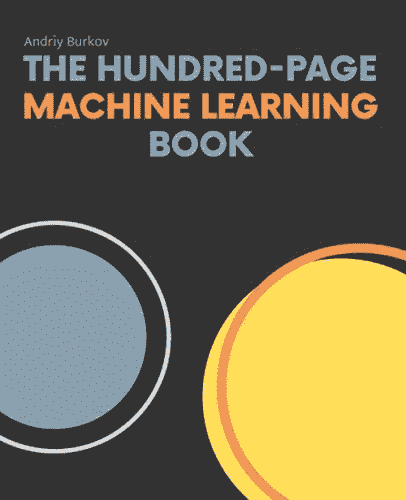
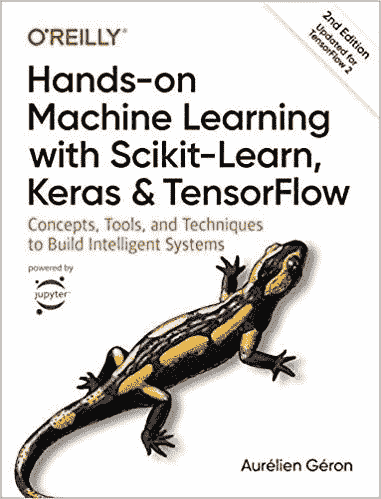
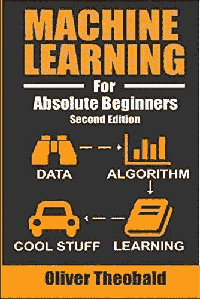
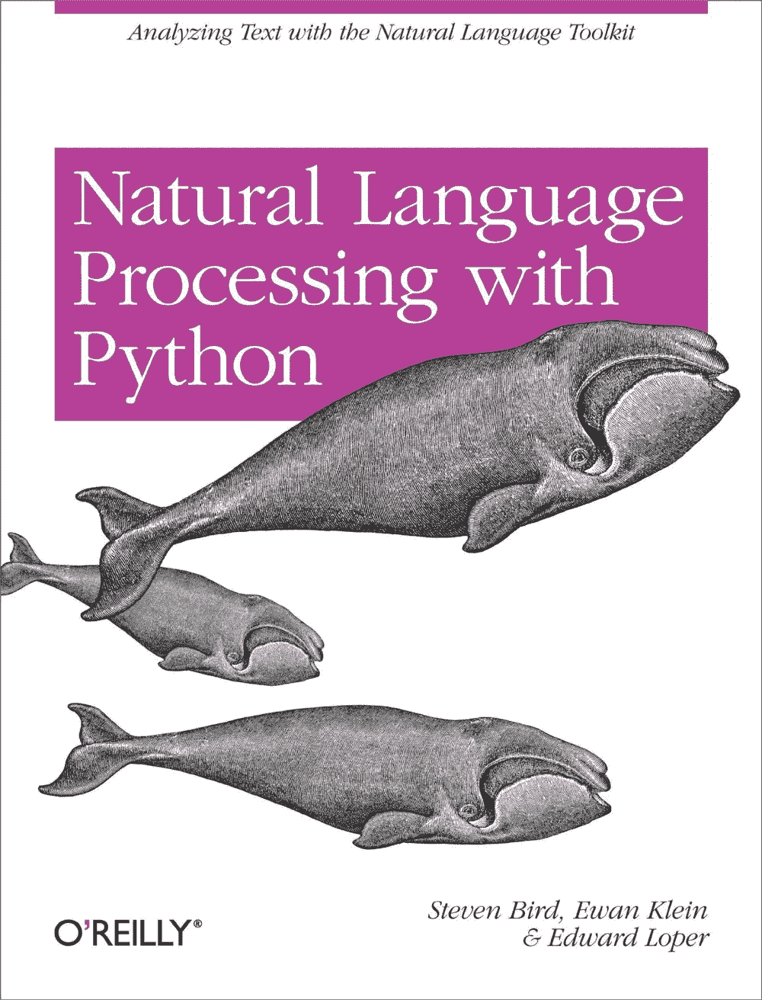
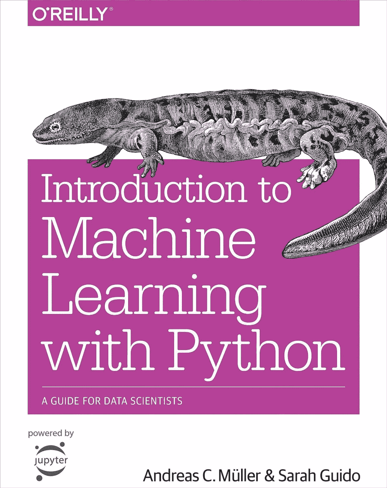
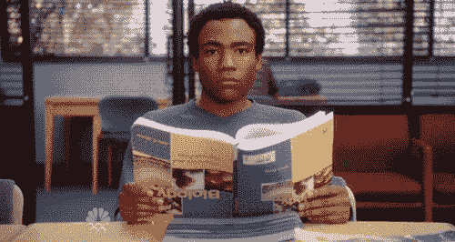

# 最适合 ML 初学者的 5 本机器学习书籍

> 原文：<https://medium.com/geekculture/5-best-machine-learning-books-for-ml-beginners-4e2fd3f0bd03?source=collection_archive---------12----------------------->

## 开始构建你的机器学习职业生涯的推荐书籍

Photo by [cottonbro](https://www.pexels.com/@cottonbro?utm_content=attributionCopyText&utm_medium=referral&utm_source=pexels) from [Pexels](https://www.pexels.com/photo/people-studying-inside-a-library-6344238/?utm_content=attributionCopyText&utm_medium=referral&utm_source=pexels)

读书很重要，因为它们给你带来无穷的知识。

如果你计划成为一名数据科学家或机器学习工程师，阅读机器学习书籍将有助于你获得该领域所需的知识和技能。

简单地说，机器学习是人工智能的一个子集，它能够自动从数据中学习，而无需显式编程或领域专业知识的帮助。

垃圾邮件和恶意软件过滤、产品推荐、图像识别、自动语言翻译——这些都是现实生活中机器学习应用的例子。

《2020 年工作报告的未来》预测，到 2025 年，[人工智能](https://hackernoon.com/ai-vs-ml-whats-the-difference-3pt37h9?ref=hackernoon.com)(机器学习是其中的一个子集)将在 26 个国家创造 1200 万个新工作岗位。

市面上有很多学习机器学习的书籍。在这篇文章中，我整理了 5 本最好的机器学习书籍，它们将帮助你开始在这个领域建立自己的职业生涯。这些书没有特定的排名或顺序。

所以让我们开始吧！

# 1.一百页的机器学习书

**作者:**安德烈·布尔科夫

作者在大约 100 页的篇幅里从各个角度总结了机器学习中的复杂话题。你会发现这本书提供了足够多的细节，可以让你轻松理解机器学习的概念。

这本书在机器学习项目开始时的头脑风暴中也很有用，你将学习如何回答一个给定的技术或商业问题是否是“机器可学习的”，如果是，你应该使用什么技术来尝试解决这个问题。

这本机器学习书籍已经得到了谷歌研究总监彼得·诺维格(Peter Norvig)的认可。我建议每一个 ML 初学者都应该得到这本书。

这本书涵盖了以下主题。

*   什么是机器学习
*   符号和定义
*   基本算法
*   学习算法的剖析
*   基本准则
*   神经网络和深度学习
*   问题和解决方案
*   高级实践
*   无监督学习
*   其他形式的学习

# 2.[使用 Scikit-Learn、Keras 和 TensorFlow 进行机器实践学习:构建智能系统的概念、工具和技术](https://amzn.to/3ecI4z8?ref=hackernoon.com)

**作者:**奥雷连恩·盖伦

这本机器学习的书为你提供了实现能够从数据中学习的程序所需的概念、工具和直觉。这本书的每一章都有大量的练习来帮助你应用你所学到的东西，这是一个开始获得机器学习经验的好方法。

你可以在 https://github.com/ageron/handson-ml2.的 Jupyter 笔记本上找到代码示例

本书中的大多数例子、练习和简单的机器学习项目都是通过使用流行的 python 框架实现的，如 [Scikit-learn](https://hackernoon.com/scikit-learn-024-top-5-new-features-nm1w34ev?ref=hackernoon.com) 、TensorFlow 和 Keras。

在这本书里，你会学到大量的技术，从最简单最常用的机器学习算法(比如线性回归)到一些定期赢得 ML 比赛的深度学习技术。

这本书分为两部分。第一部分侧重于机器学习的基础，第二部分侧重于神经网络和深度学习。要阅读这本书，您必须有一些 Python 编程经验，并且熟悉 Python 的主要科学库，如 NumPy、pandas 和 Matplotlib。

**本书涵盖以下主题:**

*   机器学习的前景
*   端到端机器学习项目
*   分类
*   培训模型
*   支持向量机
*   决策树
*   集成学习和随机森林
*   降维
*   无监督学习技术
*   神经网络和深度学习的更多主题

# 3.绝对初学者的机器学习(第二版):简单的英语介绍

**作者:**奥利弗·西奥博尔德

如果你想了解机器学习的世界，这是一本不错的书。作者专注于教授机器学习的高级基础以及设计机器学习模型的数学和统计基础。

要阅读这本书，你不需要事先有机器学习的经验。

本书涵盖了以下主题:

*   什么是机器学习
*   机器学习类别
*   回归分析
*   使聚集
*   偏差和方差
*   人工神经网络
*   决策树
*   集成建模
*   用 Python 构建模型
*   模型优化

# 4.[用 Python 进行自然语言处理](https://amzn.to/3kfzSBY?ref=hackernoon.com)

作者:史蒂文·伯德、伊万·克莱恩和爱德华·洛珀

如果你对自然语言处理(NLP)感兴趣，想成为一名 NLP 从业者，我推荐你读这本书。这本书提供了自然语言处理领域的高度可访问的实用介绍，它包含数百个示例和练习，以帮助您获得更多的经验。

这本书基于 Python 编程语言和一个叫做自然语言工具包(NLTK)的开源库。如果你没有学过 Python 编程语言，不要担心，这本书有几个子主题可以教你 Python 编程语言。

在本书中，您将学习如何使用 python、文本中的语言结构以及其他面向 NLP 的方面来访问注释良好的数据集，以分析和处理非结构化数据。

本书涵盖以下主题:

*   语言处理和 Python
*   访问文本语料库和词汇资源
*   处理原始文本
*   编写结构化程序
*   对单词进行分类和标记
*   学习文本分类
*   从文本中提取信息
*   分析句子结构
*   构建基于特征的语法
*   分析句子的意思
*   管理语言学数据

# 5.[Python 机器学习简介:数据科学家指南](https://amzn.to/3eci3Ql?ref=hackernoon.com)

**作者:**安德里亚斯·穆勒和萨拉·圭多

这是一本非常实用的书，适合那些熟练使用 Python 编程，并且希望以实用的方式学习机器学习的读者。在这本书里，你将学习各种实用的方法来构建你自己的健壮的机器学习解决方案

主要重点是教您如何使用开源 Python 库(如 Scikit-learn、Pandas、Numpy 和 Matplotlib)构建机器学习应用程序，这种方法简单易懂，非常实用。

您还将了解某个业务问题何时需要或可以通过机器学习和机器学习项目的整个工作流程(数据准备、预处理、培训、评估和生产实施)来改进。

你可以在 https://github.com/amueller/introduction_to_ml_with_python[找到可供下载的代码示例和笔记本。](https://github.com/amueller/introduction_to_ml_with_python?ref=hackernoon.com)

本书涵盖以下主题:

*   机器学习导论
*   监督学习
*   无监督学习和预处理
*   表示数据和工程特征
*   模型评估和改进
*   算法链和流水线
*   使用文本数据

# 对 ML 初学者的 5 本最佳机器学习书籍的最终想法

书籍仍然是获取新知识的最佳途径之一。上面提到的这本机器学习书籍集将帮助你学习很多关于机器学习的知识。

但重要的是要记住，通过从事不同的小型机器学习项目和参加机器学习竞赛，如在 [**Kaggle**](https://www.kaggle.com/competitions?ref=hackernoon.com) 和 [**zindi**](https://zindi.africa/competitions?ref=hackernoon.com) 中，将你的知识付诸实践。通过这样做，你将继续学习更多，并获得更多在机器学习方面工作的经验。

如果你学到了新的东西或者喜欢阅读这篇文章，请分享给其他人看。在那之前，下期帖子再见！

也可以在 Twitter [@Davis_McDavid](https://twitter.com/Davis_McDavid?ref=hackernoon.com) 上找我。

*最后一件事:在以下链接中阅读更多类似的文章*

 [## AI vs ML:有什么区别？

### 了解人工智能和机器学习之间的区别

medium.com](/geekculture/ai-vs-ml-whats-the-difference-2e2e73e98d9c)  [## 如何用 VS 代码使用 Google Colab

### 像在本地机器上一样利用成熟的代码编辑器。

medium.com](/geekculture/how-to-use-google-colab-with-vs-code-8d4876def8ed)  [## Python 子字符串:您需要知道的一切

### 在 python 中，字符串是一系列字符，可能包含特殊字符或字母数字字符，用于…

medium.com](/nerd-for-tech/python-substrings-everything-you-need-to-know-4cca526c07eb) 

*本文首发* [*此处*](https://hackernoon.com/5-best-machine-learning-books-for-ml-beginners-o23g376l) *。*