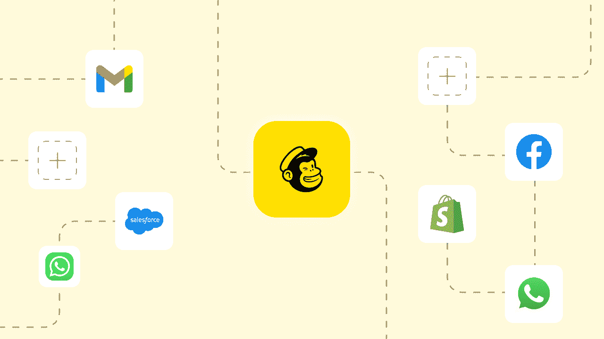
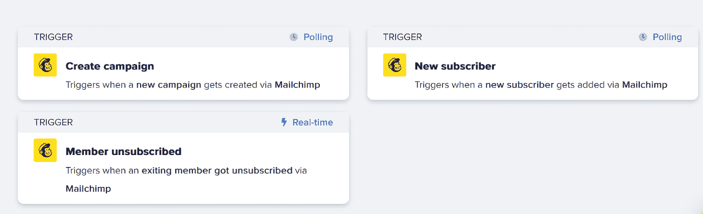
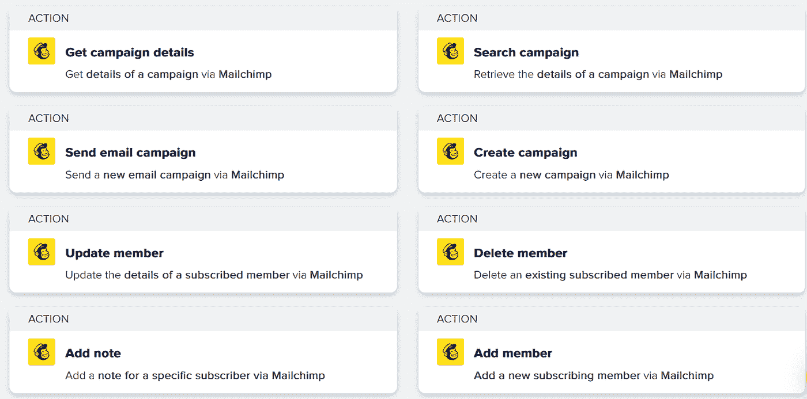

# 利用嵌入式 iPaaS 解决方案的 5 个最佳 Mailchimp 旅程

> 原文：<https://medium.com/geekculture/5-best-mailchimp-journeys-that-make-use-of-an-embedded-ipaas-solution-29806fa381ab?source=collection_archive---------15----------------------->

使用 Quickwork 与 MailChimp 集成，以联系您的客户，并帮助他们接触和吸引他们的受众。以及增加他们的商业机会，帮助他们更快地实现目标。将您的 SaaS 连接到 MailChimp，帮助您的客户扩大营销范围和潜力。

Mailchimp 集成如何帮助您提升客户能力？

**处理掉你积压的工作。利用集成的集成。**

Quickwork 允许您的客户以图形方式连接到任何 API。所有这些都不需要任何代码。

**轻松同步和更改数据**

您的客户使用各种应用程序。允许他们用无代码的解决方案同步数据，并在进行过程中进行修改。

**从 1000 多个可用应用程序中连接您最喜爱的应用程序。**

开发和维护 API 的时代已经过去了。在几天内实现连接，并让您的客户能够访问现成的连接器库。

# Mailchimp 工作流触发器和操作

让我们来看看使用 Quickwork 的五大 Mailchimp 旅程。

**脸书——梅尔钦普:**

在你的 Mailchimp 列表中添加新的脸书广告线索。

**Typeform — Mailchimp:**

Mailchimp 的订阅者可以从新的打字形式的回答中产生。

**Hubspot — Mailchimp:**

新的 Mailchimp 订户将用于创建或更新 HubSpot 联系人。

**谷歌表单——Mailchimp:**

新 Google Sheets 行的订阅者应该添加到 Mailchimp。

**active campaign—Mailchimp:**

新 Mailchimp 列表中的订户将被添加到 ActiveCampaign 联系人中。

虽然 iPaaS 允许组织处理内部集成问题，但嵌入式 iPaaS 是为希望在其产品中集成和自动化工作流的 SaaS 供应商设计的。

此外，一些嵌入式 iPaaS 提供了现成的和令人惊叹的 UI 小部件，可以快速使您的产品看起来更好、更复杂！