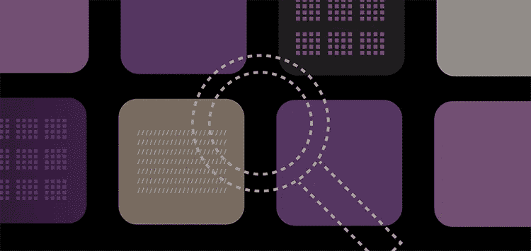

# 追踪应用内事件数据的 5 个最佳实践

> 原文：<https://medium.com/geekculture/5-best-practices-for-tracking-in-app-event-data-d3d3cce45c10?source=collection_archive---------19----------------------->

这是移动应用的时代。我们在移动设备上获取一切，从关键的商业信息到娱乐视频和游戏。信息就在我们的指尖，我们总是努力赶上外面的世界。根据 App Annie 的调查，一个普通的智能手机用户安装了 80 个应用。

在这个竞争激烈的移动应用市场中，每个应用开发公司都在想方设法获得最多的用户，并尽可能长久地留住这些用户。持续吸引用户是一件棘手的事情。了解你的客户想要什么，并利用这些信息来构建更好的应用版本是成功的关键。应用内活动数据是你与客户思想的直接链接，有效地利用它可以证明是你与竞争对手之间的区别因素。

# 什么是应用内事件和事件数据

应用内事件是用户在应用内活动的记录，从用户安装应用的那一刻开始。事件数据的几个例子可以是注册、登录、完成的教程等。您还可以收集带有多个参数的丰富的应用内事件，或者通过多个事件的流。例如，您可以确定用户是否进行了任何购买，或者哪个参与活动将用户带到了您的应用程序。此外，您可以使用大量事件数据来衡量抽象信息，例如哪个活动带来了更多创收用户。

# 你为什么需要追踪应用内事件

构建一个独特的应用很难；然而，要接触到合适的受众并让他们参与到你的应用中来是很难的。我们喜欢个性化的东西，并试图找到最适合我们需求的产品。应用内活动让我们能够找到用户最喜欢的功能，从而从应用内购买中获得收入。

根据[的统计](https://www.statista.com/statistics/202485/average-in-app-session-durations-operating-systems-worldwide/)，用户每次在应用上花费大约 5-6 分钟。为了确保用户回到应用程序，在这短暂的时间内给用户最好的体验是很重要的。为用户完善这种体验需要用户的痛点或保持用户参与的因素。只有当我们开始测量各种应用内指标时，这才有可能。

# 你应该追踪什么，不应该追踪什么

理想情况下，您希望尽可能多地了解用户及其行为，这意味着不应该对收集和分析的数据量有任何限制。然而，分析服务是有价格标签的，你通常需要在跟踪什么和跟踪多少方面限制它们。也就是说，在跟踪应用内活动数据时，遵循一些最佳实践可以帮助您优化流程，并确保您获得最佳投资回报。

以下是设置事件流的最佳实践。

# 用您的事件数据完成您想要回答的问题。

事先确定你想从事件数据中获得什么样的洞察力是非常重要的。例如，诸如“用户初次购买需要多长时间？”或者“用户在购买前平均玩多少级？”值得询问您的数据。这是最重要的一点。这些问题的答案定义了跟踪和监控应用内数据的总体目标。应用程序内的数据也可以给你一些微妙的推论，例如，游戏中的哪个特定关卡太难通过，以及大多数用户在哪里掉队。

# 指定将回答上述问题的事件属性。

将它与事件流一起指定。比如回答上面的问题，可以生成*登录*、*教程完成*、*关卡完成*(进行~ 4-5 次)、以及*购买*等流。

# 确保分析平台满足您整个团队的需求。

单个平台可能无法通过你的活动数据直接回答你的所有问题。您的营销团队可能需要不同的报告，而您的客户支持团队可能需要完整的数据来回答用户投诉。确定整个组织中各种相关团队的需求，并选择合适的平台为他们服务，可以减少大量的时间、精力和金钱。

# 测试您的事件数据。

这是你决策过程中最关键的一步，因为一旦你发布了你的应用，就没有简单的方法回去修复你的分析工具代码的问题。事件分析工具与您的功能开发一样重要。

# 找到合适的工具来分析数据。

强大的报告可帮助您分析数据并做出明智的决策。很难找到满足我们所有需求的单一工具。因此，您最终会使用多个平台来分析数据、创造 ROI，并在此基础上建立受众。从应用程序开发人员的角度来看，一旦您决定使用一个新的分析平台，您最终会实施他们的 SDK，并开始在应用程序的不同操作点检测事件数据。这种方法有其自身的困难:

*   你编写了大量的代码来满足不同平台的数据格式的需求，最终增加了应用程序的规模。
*   通过 App Store 和 Play Store 分发应用程序(为 iOS 和 Android 构建的不同应用程序)为我们带来了两个不同版本的应用程序，它们正被不同的用户群使用。
*   此外，不同的 SDK 进行它们自己的处理，这导致杀死移动设备的有限资源并耗尽电池。

现在，如果您想控制您的事件数据流到正确的平台，而不陷入这些问题，您需要一个中央系统，它将智能和高效地路由这些事件数据。

在 RudderStack，我们正在用几种方法解决这些问题。我们为 [Android](https://rudderstack.com/integration/android-sdk-source-integration/) 、 [iOS](https://rudderstack.com/integration/ios-sdk/) 、 [Unity](https://rudderstack.com/integration/unity-sdk-source/) 开发了 SDK，并定义了统一的事件结构，以满足不同分析平台的需求。除此之外，我们的服务器端还有智能转换器，负责将您的活动交付到您选择的目标平台。另一方面，如果你想探索一个平台的原生 SDK 的特性，我们也支持。

# 设置活动数据的一些技巧和窍门

以下是设计事件数据时需要记住的几个关键事项。这些考虑因素可能因平台或产品而异。

# 事件属性

## 生成事件的时间或事件的时间戳

这可以推断出应用程序的使用模式。例如，在一个电子商务平台上，大多数用户在下班回家或睡觉时查看新到达的物品。

## 将用户与身份或匿名 Id 相关联

这将有助于你重新定位用户，或者用更个性化的东西吸引他们，因为他们的所有活动都是在同一个标识下捕获的。

# 用户属性

第一次使用应用程序的时间:这将帮助你建立一组忠实用户，并建立退出用户的投资回报率。

通过平台购买的数量:这将告诉用户更多的购买模式。

来自用户的总收入:你也可以识别高收入用户和那些没有增加你的应用收入的用户。

# 如何命名事件

建议将事件命名为 Object + Action，以避免混淆。例如，添加的产品或完成的订单比产品或订单更明确。

# 保管好你的支付数据

在应用内购买的情况下，最好有一种通过购买令牌验证支付的替代方法。不这样做可能会降低准确性。

# 最后

简而言之，提前思考如何使用分析来改进你的应用程序是非常重要的。花大部分时间开发你的应用，而只花几个小时利用分析来改进它，这不是一个好主意。决定您想从事件流中了解什么，并确保您选择的平台能够满足您的需求。

我们在 [RudderStack](https://rudderstack.com/) 为您提供一个统一的平台，满足您所有的活动数据收集和路由需求，并特别关注数据隐私。借助我们完全开源的数据平台，您还可以自由定制和转换您的事件数据，以满足目的地分析平台的要求。由于许多目的地是按事件收费的，这可以帮你省下一大笔钱！

# 免费注册并开始发送数据

测试我们的事件流、ELT 和反向 ETL 管道。使用我们的 HTTP 源在不到 5 分钟的时间内发送数据，或者在您的网站或应用程序中安装我们 12 个 SDK 中的一个。[上手](https://app.rudderlabs.com/signup?type=freetrial)。

本博客最初发表于:
[https://rudder stack . com/blog/5-best-practices-for-tracking-in-app-events-data-analysis](https://rudderstack.com/blog/5-best-practices-for-tracking-in-app-events-data-analysis)