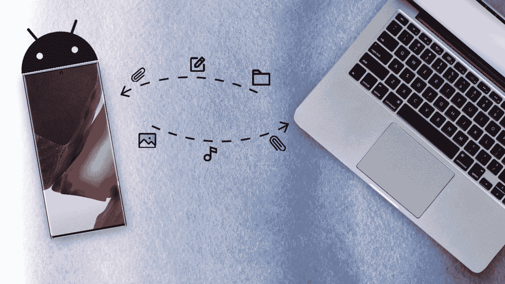
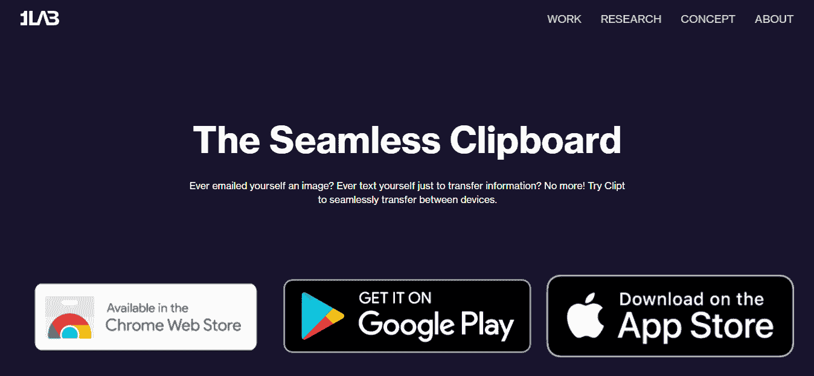
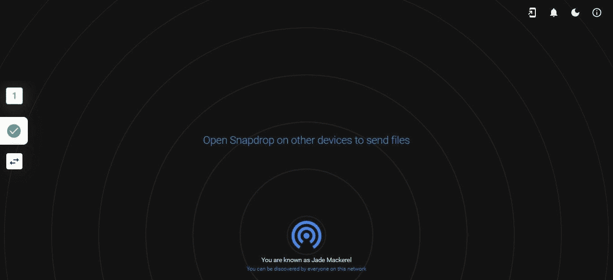
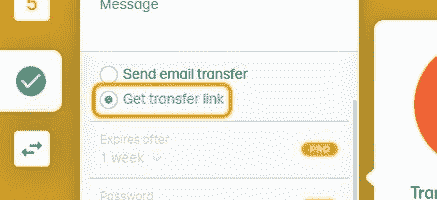
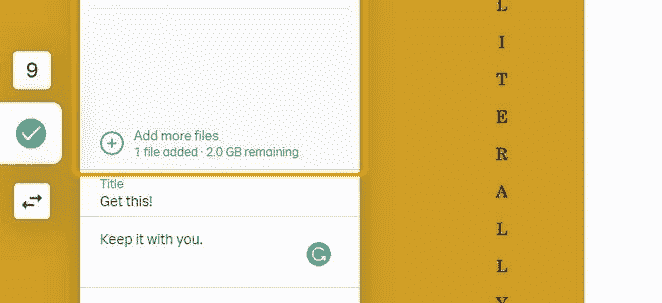
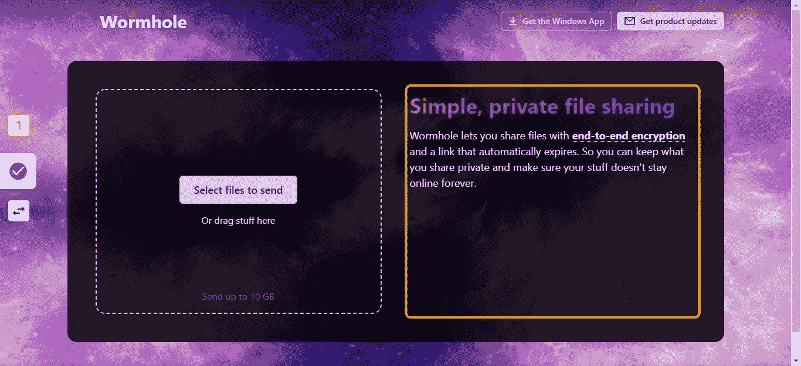
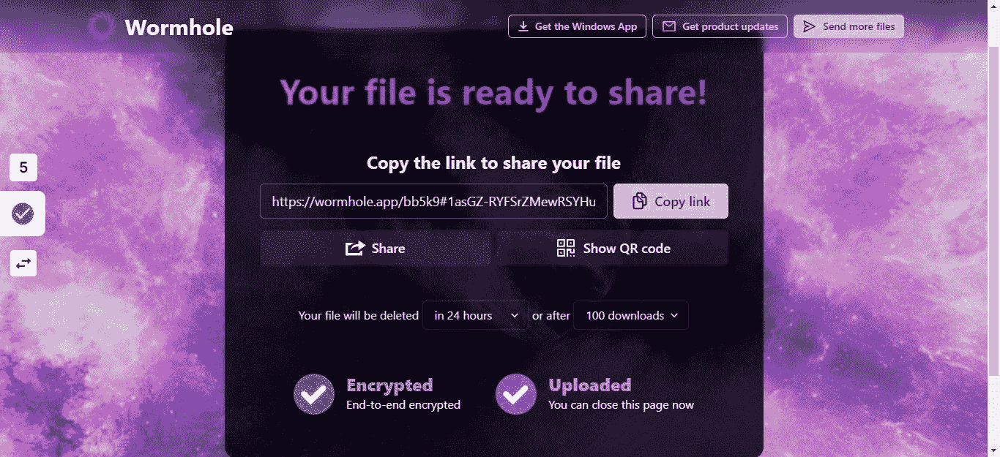
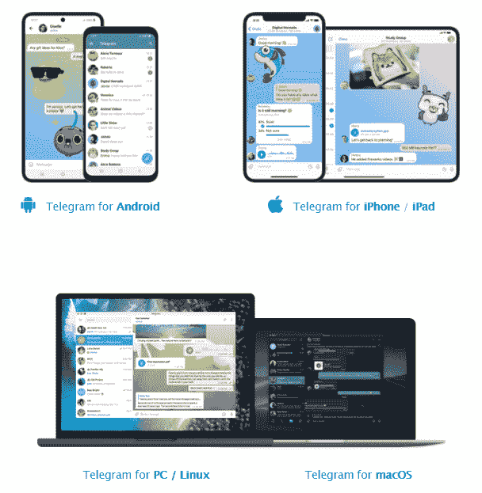

# 在智能手机和笔记本电脑之间无线传输数据的 5 种最佳方式。

> 原文：<https://medium.com/geekculture/5-best-ways-to-transfer-data-from-an-android-smartphone-to-laptop-bda94d080304?source=collection_archive---------16----------------------->

以下是如何通过使用这 5 种方法将数据从 Android 智能手机传输到笔记本电脑来提高您的工作效率。无论是链接，图像，文件，视频，你的名字！

Credits: Author | Android™ Logo

只要你是苹果生态系统的一部分，来回传输数据就是一种享受，Airdrop 让它变得如此轻松。但并不是所有人都使用苹果设备。

谷歌也在努力将不同的原始设备制造商的 Android 设备整合在一起，使传输更容易，就像附近的共享一样，但它仍然是新鲜的，比下面提到的那些相对较慢。

我见过许多人设置另一个消息帐户，可能只是为了接收那个文件，或者发送他们不想丢失的那个链接，给自己发送那个 pdf，然后从另一个设备登录，然后在那里下载，唉！这么多工作。将文件发送到其他设备变得很麻烦，现在这种麻烦结束了！

有了这四种方法，无论你使用什么平台，你都会变得很有效率。我见过的最常见的组合是 Android 用户和 MacBook，反之亦然，这篇文章也支持这些用户。

我们开始吧，好吗？

## 修剪

我用这个，我喜欢它。Clipt 是由一加的开发团队开发的。这个应用程序让它非常接近苹果用户已经获得的体验。

*   📱将照片和视频从智能手机(Android/iPhone)传输到笔记本电脑(Mac/PC)
*   🔑从手机向电脑发送密码
*   📥在一个设备上复制并粘贴到另一个设备上(我的最爱)
*   📂管理手机和笔记本电脑之间的文件
*   🌐在设备之间传输文本

你应该这样做:

Credit: 1Lab

1.  安装扩展后，它会将你重定向到注册页面。
2.  请确保您使用与智能手机相同的 Google 帐户进行注册。
3.  现在去[Play Store](https://play.google.com/store/apps/details?id=studio.onelab.clipboard)/[App Store](https://apps.apple.com/us/app/clipt-the-seamless-clipboard/id1580529382)下载 Clipt。
4.  使用同一个 Google 帐户登录。
5.  你可以走了！

现在，您可以尝试从笔记本电脑的网页浏览器中复制文本等内容，Clipt 会自动将其与您的其他设备同步。但是，如果您不想要这种自动化，即使您不需要，您在笔记本电脑上复制的所有内容都会被同步，该怎么办呢？

只需进入扩展设置并禁用自动复制，现在你将不得不复制文本并点击扩展。您会在“将最新剪贴板内容复制到其他设备”旁边看到一个发送按钮

现在你可能是一个不经常传输文件的人，不想安装应用程序，你需要一个临时的解决方案，你在阅读这篇文章时很匆忙。这让我想到了我的下一个选择。

## 快照

它使同一 WiFi 网络上的设备能够轻松高效地发送和接收数据。

*   右键单击设备名称。
    它将生成一个随机名称来识别设备。

A screengrab from Snapdrop Homepage

*   然后点击设备名称，选择你想分享的文件，就这样。

但是如果那个设备因为某种原因不在同一个 WiFi 网络中呢？嗯，那个问题下一个就解决了。

## WeTransfer

WeTransfer 解决了你需要在同一个 WiFi 网络中的问题，这并不总是可能的，对吗？这创建了一个临时链接，将在 1 周后过期，但这应该不是问题。上传和下载大文件时，服务器速度很快。

这是你如何做它。

*   转到 [WeTransfer](https://wetransfer.com/)

A screengrab from WeTransfer Homepage

*   点击切换传输选项

A screengrab from the procedure

*   选择获取传输链接

A screengrab from the procedure

*   点击上传文件

A screengrab from the procedure

*   选择您想要共享的文件

A screengrab from the procedure

*   点击获取链接

A screengrab from the procedure

现在，如果您共享的文件是机密的，并且包含私人文档，该怎么办？虽然我不确定 WeTransfer 使用的加密技术，但我为你准备了一个替代方案，它的动画效果也更好。

## 虫孔

虫洞使用端到端的加密来安全地共享你的文件，你可以选择文件在多长时间后被清除。您可以达到 10GB，而在 WeTransfer 中您只能获得 2GB。

1.  前往[虫洞](https://wormhole.app/)

A screengrab from Wormhole Homepage

2.点击选择要发送的文件

A screengrab from the procedure

3.点击复制链接，然后分享你想分享的东西！

A screengrab from the procedure

## 电报

你一定听说过这个消息应用程序！Telegram 有一个名为 Saved Messages 的功能，可以用来向已登录的设备发送文件，发送时间不限。

假设您使用笔记本电脑，您只需:

A screengrab from the Telegram Download page

1.  用同一个手机号码登录。
2.  将文件发送到 Telegram，会弹出一个收件人列表，这就是保存的消息。

它与所有设备实时同步，这意味着您可以从停止书写的地方开始聊天。

你有无限的存储空间，所以数据不会给你的手机存储空间带来压力，如果你不小心删除了文件，你可以重新下载。没必要再给自己发那个文件了。

无论你选择什么，这篇文章都可以帮你搞定。告诉过你，我会把你从这些麻烦中解放出来！转学愉快！

这就是这个故事，我希望你发现这是有益的和翔实的！如果你有除了这些以外的东西，请告诉我！如果有，请考虑分享这篇文章并关注我。
祝你有美好的一天！
☮

 [## 作家！！！你会喜欢这个的…

### 哦！还有播客听众！

medium.com](/writers-blokke/writers-youre-gonna-love-this-8f1fa2f1fddf)  [## 比特沃顿:我以为我不需要的工具

### —但是我们在这里。

medium.com](/writers-blokke/bitwarden-the-tool-i-thought-i-didnt-need-b70a763db424)  [## 飞马间谍软件是如何工作的？

### 是的，它现在可能使用了一套完全不同的利用方式…

medium.com](/writers-blokke/how-did-does-pegasus-spyware-work-3f0867f5ef34) 

如果你喜欢我的作品，你可以给我买一个🍩[*这里的*](https://www.buymeacoffee.com/BhaveshRawat) *。*