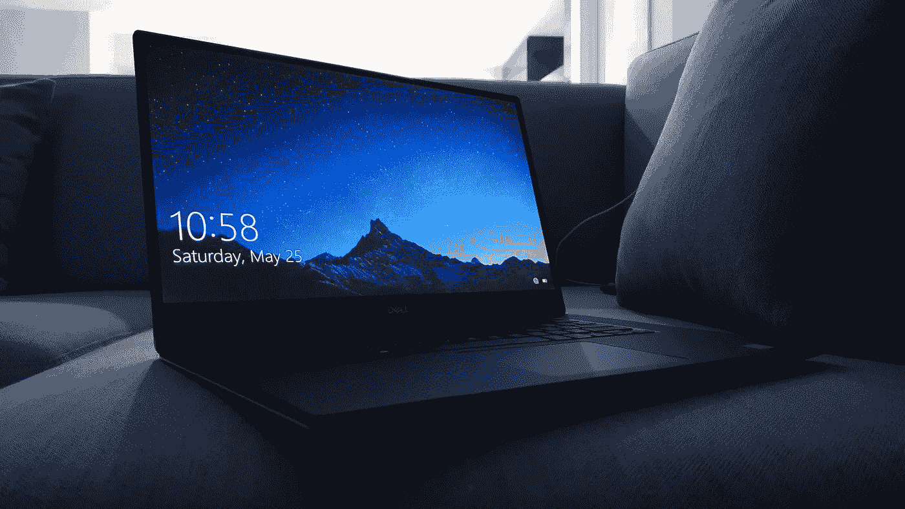

# 5 款最佳 Windows 11 生产力应用

> 原文：<https://medium.com/geekculture/5-best-windows-10-apps-for-productivity-12d713b56d8e?source=collection_archive---------10----------------------->

## 高效生活的应用和工具

Photo by [Jay Prajapati](https://unsplash.com/@jayprajapati_?utm_source=unsplash&utm_medium=referral&utm_content=creditCopyText) on [Unsplash](https://unsplash.com/s/photos/dell?utm_source=unsplash&utm_medium=referral&utm_content=creditCopyText)

Windows 10 可以说是世界上最受欢迎的桌面操作系统。即使面临来自 macOS、Chrome OS 和 Linux 的激烈竞争，微软拥有的操作系统仍然屹立不倒。从商业企业到个人电脑游戏，从专业人士到休闲用户，Windows 仍然占据着大部分市场份额。