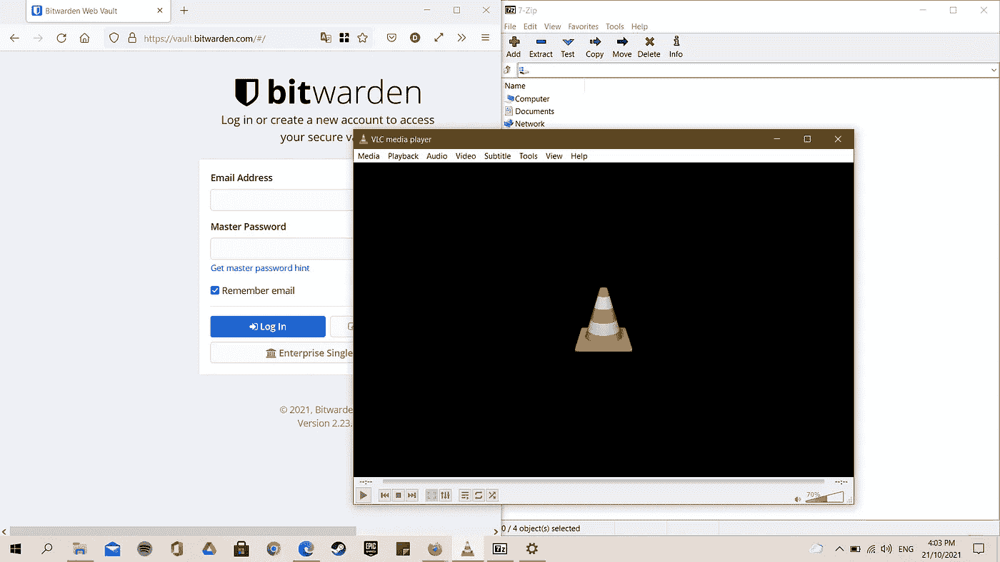

# 5 更好更酷的开源替代软件

> 原文：<https://medium.com/geekculture/5-better-cool-open-source-alternative-software-f360998257f8?source=collection_archive---------15----------------------->

Cool Open Source software running on Windows

我们从小就认为高价商品比低价免费的好。难怪大多数人认为专有和付费软件优于开源软件。这并不完全正确。开源软件通常比私有软件更安全。虽然一些开源软件缺乏令人愉快的用户界面，但它们通常功能强大，很少或没有…