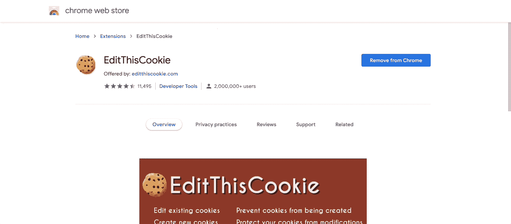
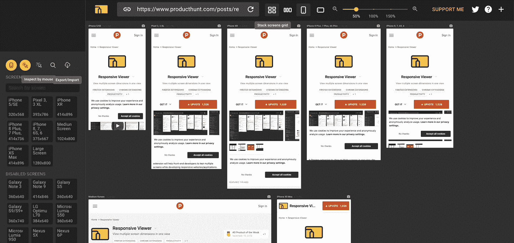
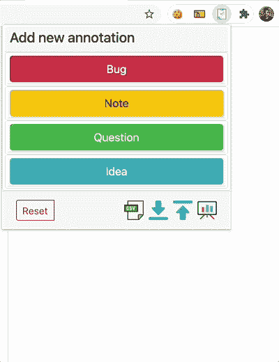
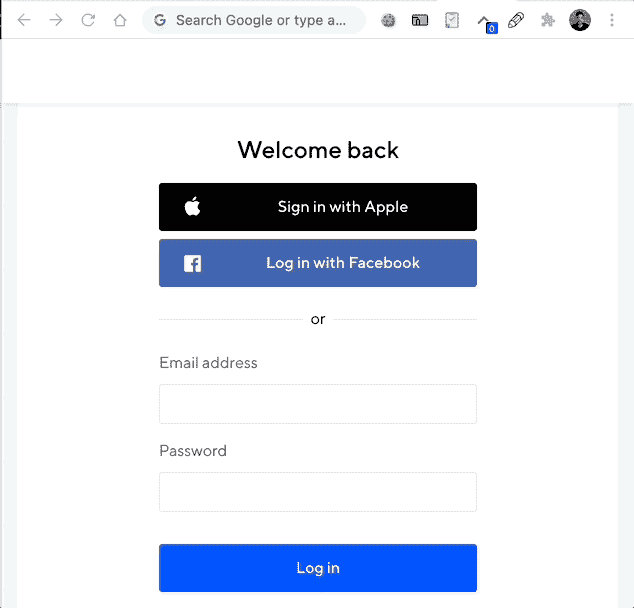

# 每个测试者有 5 个 Chrome 扩展

> 原文：<https://medium.com/geekculture/5-chrome-extensions-for-every-tester-72a144c6697b?source=collection_archive---------3----------------------->

> 打破传统的 QA 孤岛，让开发人员拥有质量检查权。

Chrome 无疑是最受欢迎的浏览器之一。据 Statista 报道，2020 年，它的受欢迎程度估计将吸引 26.5 亿全球用户。任何不在网站上为 Chrome 提供浏览器支持的品牌或公司都可能会看到潜在客户转向别处。

Photo by [Rajeshwar Bachu](https://unsplash.com/@rajeshwerbatchu7?utm_source=unsplash&utm_medium=referral&utm_content=creditCopyText) on [Unsplash](https://unsplash.com/s/photos/google?utm_source=unsplash&utm_medium=referral&utm_content=creditCopyText)

Chrome 也是开发人员和测试人员的热门选择。据 DebugBear 的[报道，它拥有数量惊人的 137，000+**T3 分机。**](https://www.debugbear.com/blog/counting-chrome-extensions)

有这么多可用的扩展，您从哪里开始呢？我收集了 5 个 Chrome 扩展，每个 QA 工程师都可以使用:

1.  [编辑 this cookie](https://chrome.google.com/webstore/detail/edit-this-cookie/fngmhnnpilhplaeedifhccceomclgfbg)

Made for Medium post with screenshot from [Chrome extensions](https://chrome.google.com/webstore/category/extensions).

浏览器 cookies 可能是一场噩梦，它们在你不需要的时候出现，在你需要的时候又不见了。但是通过“开发人员控制台”以传统方式管理它们并不容易，请看:

Created using GIPHY for medium post.

只需一次点击，“编辑 Cookie”就可以方便地编辑、添加或删除 cookie。如果你是一个经常编辑浏览器 cookies 的测试人员，这个扩展是很棒的。

EditThisCookie 的一些功能:

*   **删除**cookie。
*   **编辑**cookie。
*   锁定 cookie 值。
*   阻止特定的 cookies。
*   创建新的 cookies。
*   正在搜索现有的 cookies。
*   导入/导出 cookies。

2. [**响应式浏览器**](https://chrome.google.com/webstore/detail/responsive-viewer/inmopeiepgfljkpkidclfgbgbmfcennb)

Made for Medium post with screenshot from [Chrome extensions](https://chrome.google.com/webstore/category/extensions).

对于测试人员来说，调整浏览器大小可能是一项麻烦的任务，尤其是当试图检查两个以上的屏幕尺寸时。Chrome 提供了一个内置功能，但它仅限于一次查看一个视图。

“响应式浏览器”真的增加了同时观看多种屏幕尺寸的可能性。当然，你也可以在纵向或横向模式之间切换，还有一堆预定义的流行屏幕尺寸可供选择。

Made using GIPHY for medium post.

响应式查看器的一些功能:

*   **同步滚动**。
*   同时查看多种屏幕尺寸。
*   一堆预先定义的流行尺寸。
*   隐藏或添加屏幕尺寸。
*   定义自定义屏幕尺寸。

3. [**试探性测试 Chrome 扩展**](https://chrome.google.com/webstore/detail/exploratory-testing-chrom/khigmghadjljgjpamimgjjmpmlbgmekj)

Made for Medium post with screenshot from [Chrome extensions](https://chrome.google.com/webstore/category/extensions).

测试时记笔记可能会很麻烦，尤其是在应用程序窗口之间来回切换时。在某些情况下，你需要做一个截图，一旦你做好了，你就需要把所有的东西绑在一起。

Made using GIPHY for medium post.

为了简单起见，我将“探索性测试 Chrome 扩展”称为“ETCE”*。ETCE 很擅长捕捉所有信息，并将其存储在一个地方。*

*ETCE 的简单界面使得添加注释变得容易，注释可以分为错误、问题、想法或注释。*

*完成后，您可以在浏览器中查看生成的报告中的信息，或者将其导出为 CSV 文件。*

*ETCE 的一些特征:*

*   *从扩展创建 bug 注释。*
*   ***同时截图**。*
*   *在**生成的报告**中查看您的所有笔记。*
*   *将您的报告导出为 HTML 或 CSV 文件。*

*4. [**Ruto — XPath 查找器**](https://chrome.google.com/webstore/detail/ruto-xpath-finder/ilcoelkkcokgeeijnopjnolmmighnppp?hl=en)*

**

*Made for Medium post with screenshot from [Chrome extensions](https://chrome.google.com/webstore/category/extensions).*

*如果您喜欢使用 XPath 定位器，那么您会喜欢 Ruto 的扩展。使用开发人员窗口来收集您需要的 XPath 定位器可能会很慢而且令人厌烦。*

*Ruto XPath finder 扩展返回您正在寻找的 XPath，同时为您提供关于如何格式化它的**选项**:*

**

*Created using GIPHY for medium post.*

*你可以在 GIF 中看到，我可以选择基于*“数据 url”、*或*“href”、*复制 XPath，或者获取*“CSS”定位器。只需点击几下，就可以以自己选择的格式复制 XPath 定位器。这个工具真是省时省力。**

*像其他扩展一样，它们也有许多很酷的特性:*

*   *根据不同的属性获取 XPath。*
*   *快速启用和禁用。*
*   ***单击选择复制。***
*   ***查找嵌套的** XPath 定位器。*

*5. [**Web 开发者表单填充**](https://chrome.google.com/webstore/detail/web-developer-form-filler/gbagmkohmhcjgbepncmehejaljoclpil/related?hl=en)*

**

*Made for Medium post with screenshot from [Chrome extensions](https://chrome.google.com/webstore/category/extensions).*

*可能我最喜欢的是**网页开发者表格填充**。每天处理表单的测试人员知道多次填写表单是多么耗时。第五次之后，我们发现自己在字段中输入了[胡言乱语](https://www.dictionary.com/browse/gibberish)。*

*这就是这个表单填充扩展派上用场的地方。WDFF 扩展可以为您节省大量时间。一旦你按照你想要的方式填写了一个表格，你只需点击一下扩展就可以保存这些条目。下一次只需刷新页面，扩展扩展，并有一个恢复选项。嘭！*

**

*以下是其中一些很酷的功能:*

*   *保存自动完成的数据输入。*
*   ***编辑并更新扩展**使用的选择器。*
*   *为同一表单保存不同的条目。*
*   ***每次用随机生成的值填充表格**。*

*没有任何工具可以取代手工测试的实际需求，但是工具的使用可以极大地减少所需的手工劳动，让测试人员有时间关注真正重要的事情，也就是测试。*

***在下面留下评论，分享你最喜欢的 Chrome 扩展。***

*[***订阅***](https://qatoddy.medium.com/subscribe) *如果你喜欢你读过的？留下掌声👏敬请关注更多内容！**