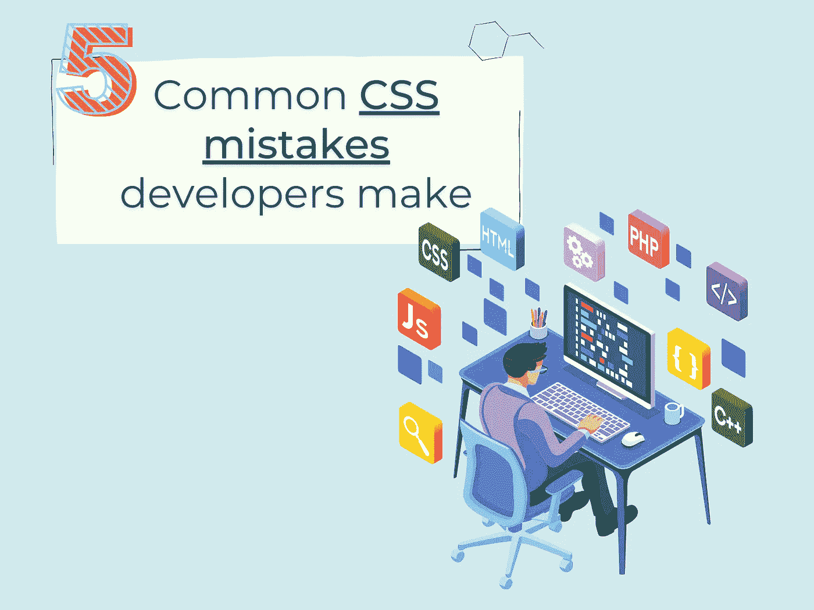

# 开发人员常犯的 5 个 CSS 错误

> 原文：<https://medium.com/geekculture/5-common-css-mistakes-developers-make-d477dc376e9e?source=collection_archive---------3----------------------->

## 你在 CSS 中犯过哪些错误？⁣

By FAM

根据我的经验，如果你是一名 web 开发人员，CSS 对许多开发人员来说是一个令人头疼的问题。学习和掌握它需要时间。本文涵盖了你在编写 CSS 代码时可能会遇到的一些常见错误。

准备好了，我们走！

# #1:在以下情况下使用 px…