# #6 数据科学👩‍💻Neo4j 和 Gephi 工具入门

> 原文：<https://medium.com/geekculture/5-data-science-getting-started-with-neo4j-graph-database-tool-3adae03dc268?source=collection_archive---------32----------------------->

# Neo4j 工具


Neo4j 以更自然、更互联的状态存储和管理数据，维护数据关系，从而提供闪电般的查询、更深入的分析上下文以及轻松的可修改数据模型。

简单来说，Neo4j 就是图形数据库的 MySQL。它提供了一个图形数据库管理系统、一种查询数据库的语言、一个密码和一个带有 neo4j 浏览器的可视化界面。

让我们开始演示，

1.  下载并安装 neo4j 桌面
2.  安装完成后，

例如，我正在运行 hello world 查询，它将创建两个名为 Neo4j 和 Hello world 的节点以及一个名为 says 的关系。

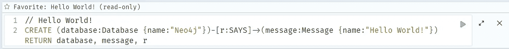

您可以看到创建了两个节点，并且使用查询创建了一个名为 says 的关系。

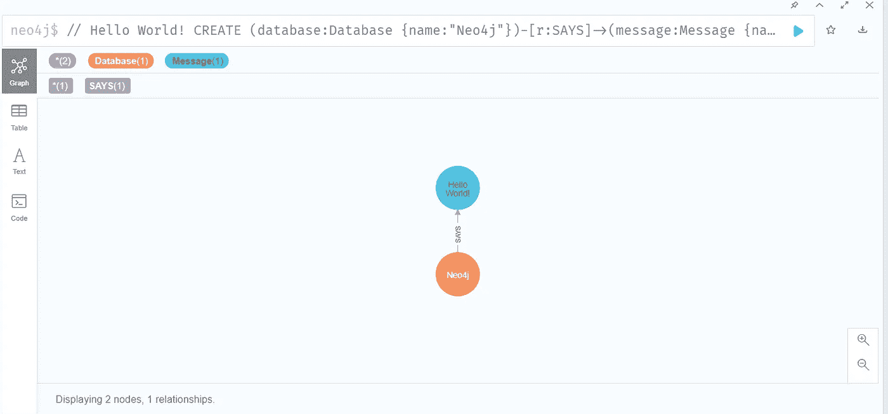

在下图中，您可以看到节点和关系的表格视图。

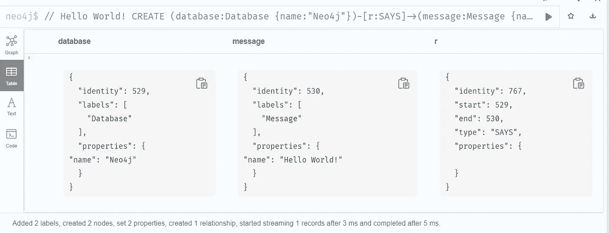

我正在使用示范项目的例子。启动电影数据库，并在 Neo4j 浏览器中查看该数据库。

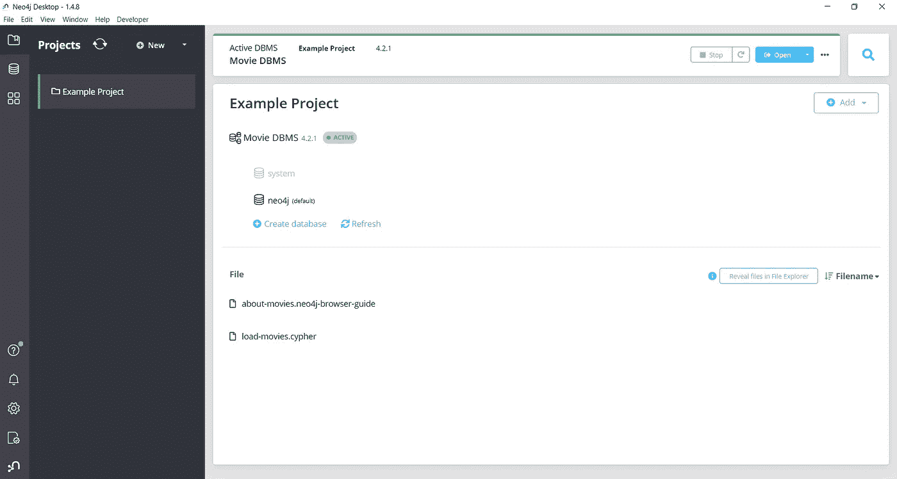

之后，将电影数据库加载到 neo4j，它将以图形格式显示数据。

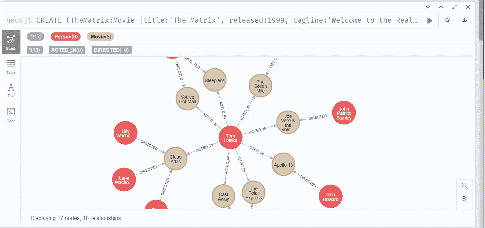

在这个数据库中，有 9 个人节点和 8 部电影节点，总共 18 个节点之间的关系。

使用查询计算总节点数，

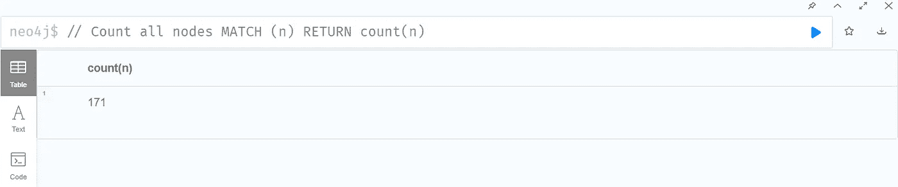

通过使用不同的查询，我们可以找到适当的信息，如有多少标签。

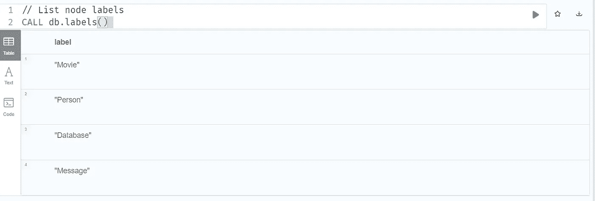

使用这个查询我们可以知道数据库中有多少种关系

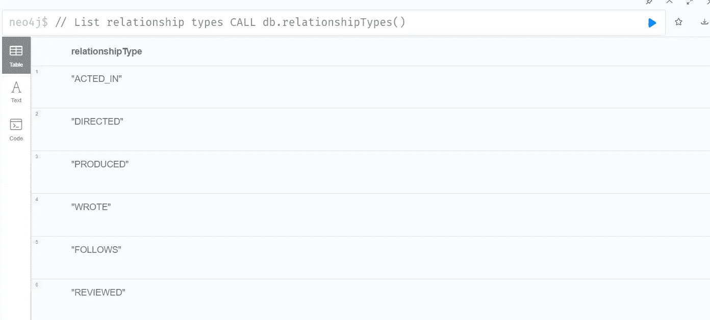

通过使用这个查询，我们可以知道这个人是如何与电影联系在一起的，谁是电影的制片人，这个人在电影中扮演了什么角色。

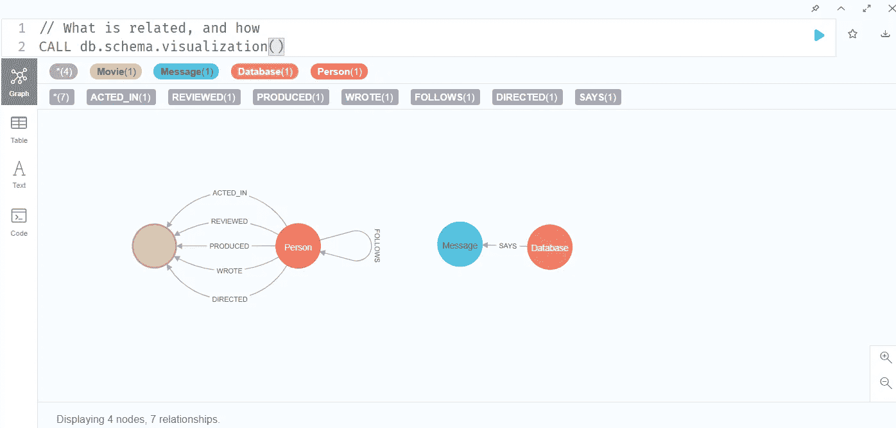

查找 20 世纪 90 年代发行的电影…

```
// query for the movies released in 1990s..MATCH (nineties:Movie) WHERE nineties.released >= 1990 AND nineties.released < 2000 RETURN nineties.title
```

这是 20 世纪 90 年代上映的电影列表，

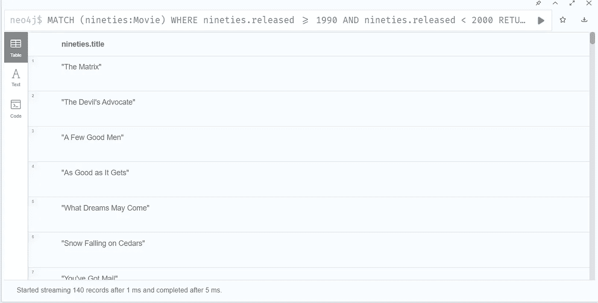

列出所有汤姆·汉克斯的电影，

```
//query for list all tom hanks movieMATCH (tom:Person {name: "Tom Hanks"})-[:ACTED_IN]->(tomHanksMovies) RETURN tom,tomHanksMovies
```

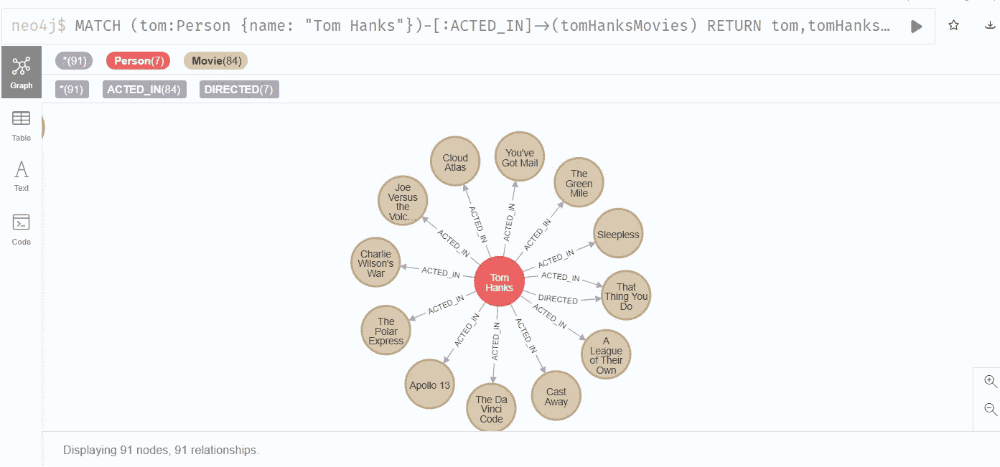

《云图》是谁执导的？

```
query for this is,MATCH (cloudAtlas {title: "Cloud Atlas"})<-[:DIRECTED]-(directors) RETURN directors.name
```

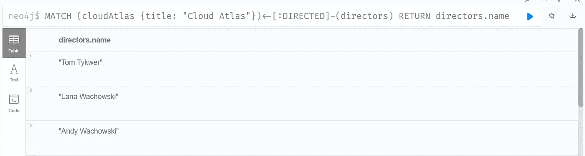

# Gephi 工具

**Gephi** 是一个开源的网络分析和可视化软件包。它主要用于从原始边和节点图数据中可视化、操作和探索网络和图形。对于数据分析师和数据科学爱好者来说，这是一个探索和理解图形的绝佳工具。

在这个演示中，我选择了一个简单的空手道. gml 数据集，并在其上执行了一些基本的 gephi 操作。所以让我们开始吧。

1.  打开 Gephi，点击**新项目**。然后选择**文件- >打开**，加载你选择的数据集，如下图所示。在加载数据集时，它会显示数据集中存在的节点和边的数量以及图形的类型。

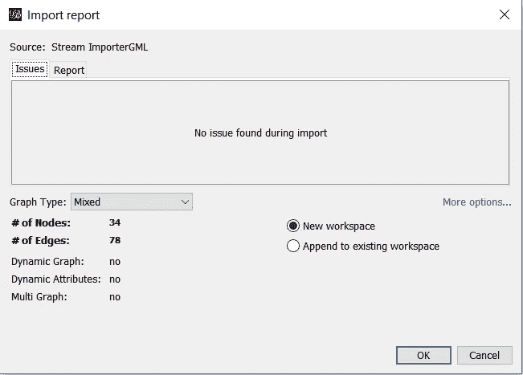

2.下面是最初加载 dat 时所有节点和边的显示方式。

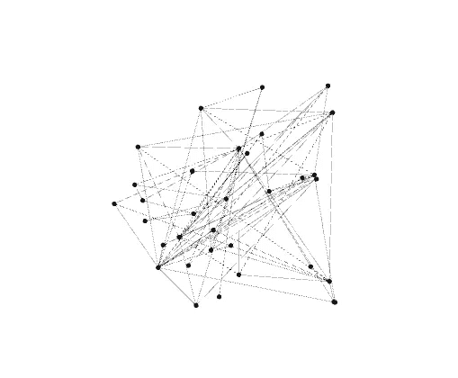

3.现在我们可以用不同的布局来表示数据。在左侧窗格中选择布局选项，并选择您选择的布局，然后点击**运行。**在下图中，我选择了 **ForceAtlas** 布局，以如下形式显示数据。


4.接下来，我们可以根据不同的排名来区分节点，如有**入度**、**出度**或**度**，并用不同的颜色显示它们。为此，在顶部左侧窗格中选择**节点- >等级**，选择如下图所示的等级**选择入度**，其中红色节点的入度低于白色，深灰色节点的入度等级最高。

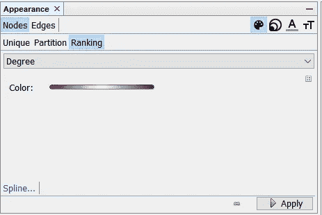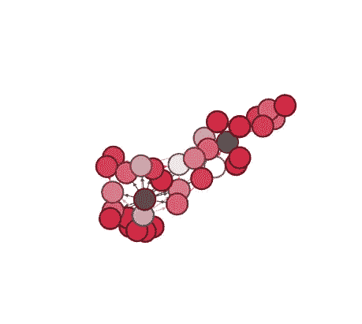

5.通过以各种尺寸显示节点，也可以得到更清晰的可视化效果。例如，在下图中，与度数较低的节点相比，度数较高的节点尺寸较大，即，与白色和红色的节点相比，深灰色的节点具有较高的度数值。

要在左侧窗格的**外观**部分以各种尺寸显示，选择**尺寸**选项，然后提及您想要显示的节点的最小和最大尺寸。我已经给了**最小尺寸**为 1 **0** 和**最大尺寸**为 3 **0** 。

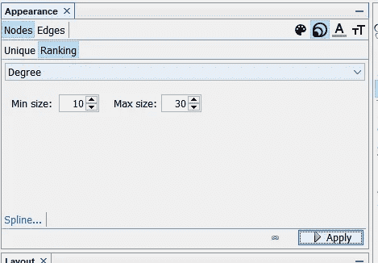

6.接下来，我们为度、入度和出度生成一个**度分布**图，并获得所有节点的平均度值。要生成图表，只需在右窗格中选择**统计**选项卡，然后在**网络概览**部分运行**平均度**。

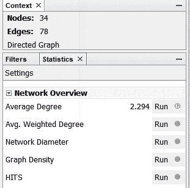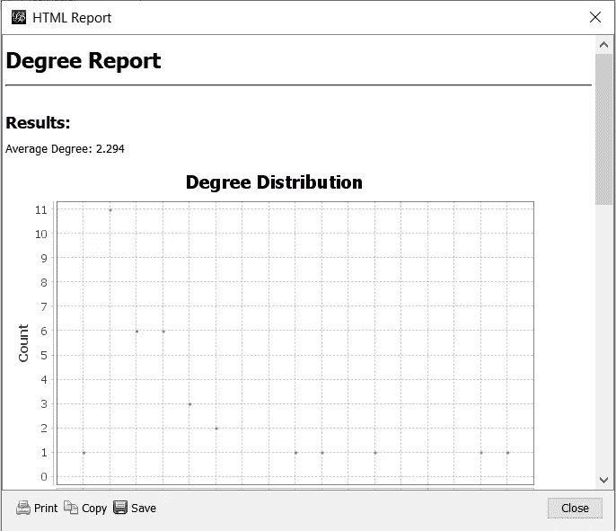

将会生成一个报告，并且“学位”列将会添加到数据集表中。

要查看顶部菜单栏中的**数据表**，选择**窗口- >数据表**，您将能够看到如上图所示的表格，其中在运行**后，为存在的每个节点添加了**入度、**出度和**度**的平均度**功能列。

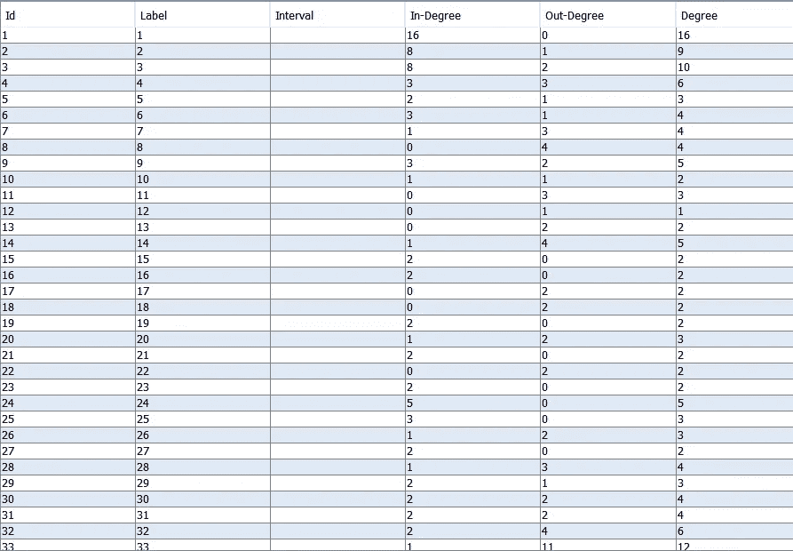

8.现在我们可以在 Gephi 工具中尝试不同的功能以及不同的布局。在下图中，我使用了**不重叠**布局。


关于 Neo4j 工具的介绍就到此为止。你可以很容易地在这个工具中看到所有的信息。希望你得到你想要的。

谢谢大家！！