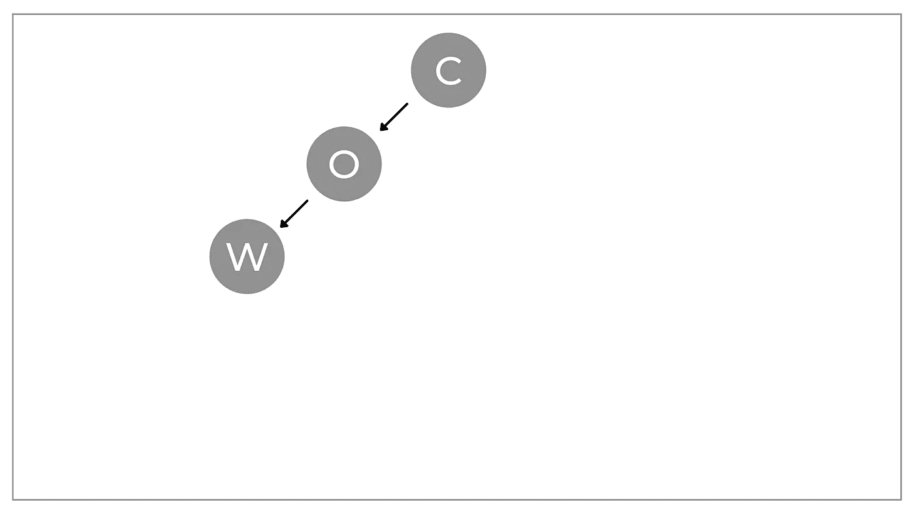
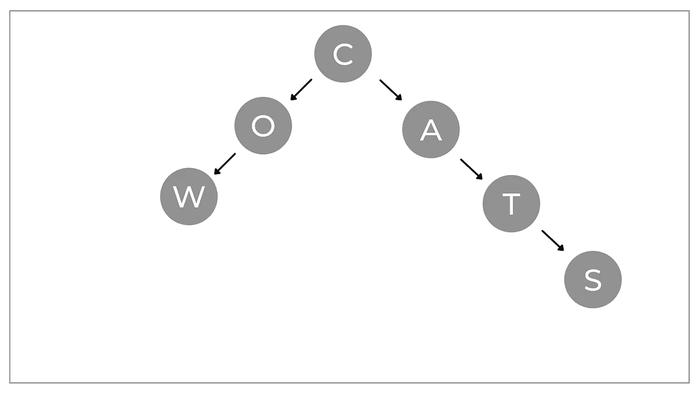
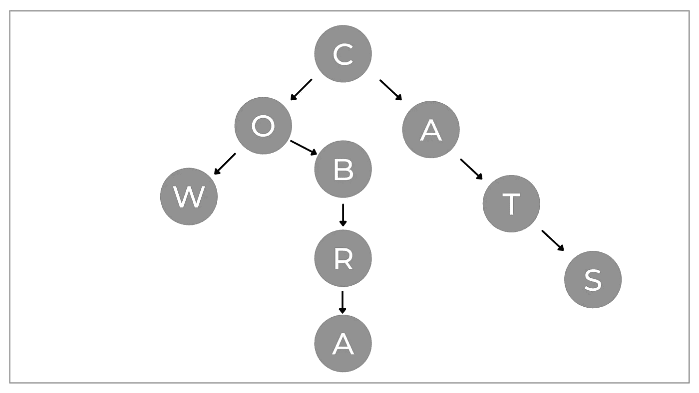
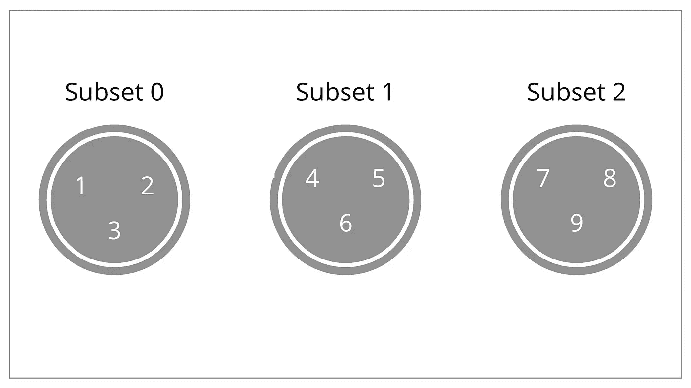
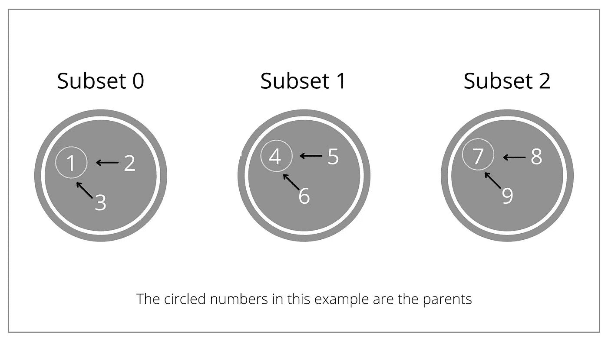
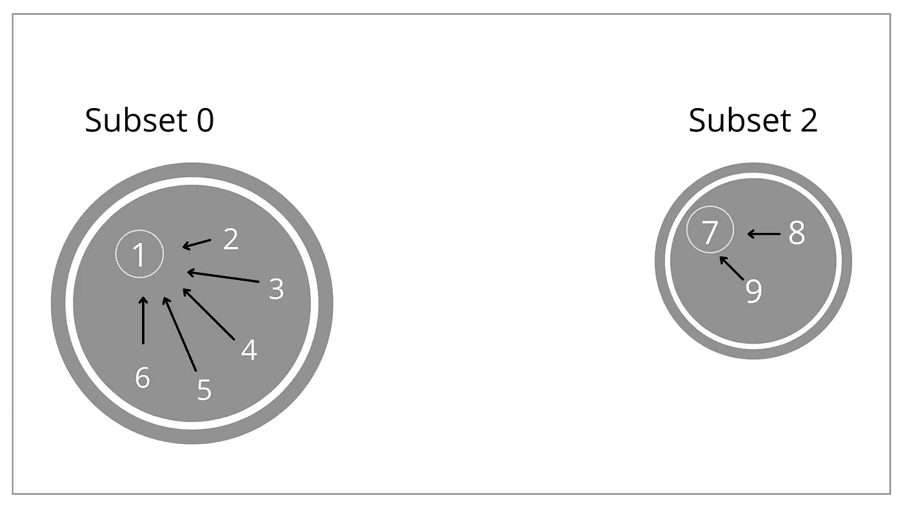
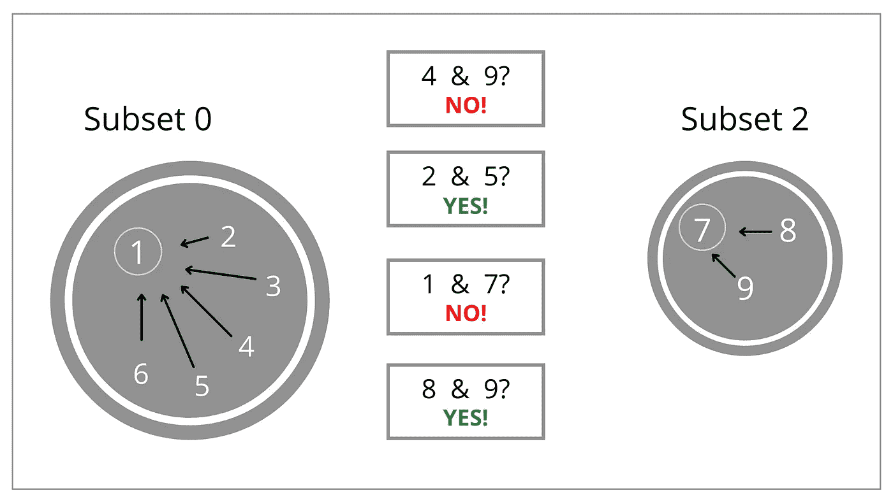
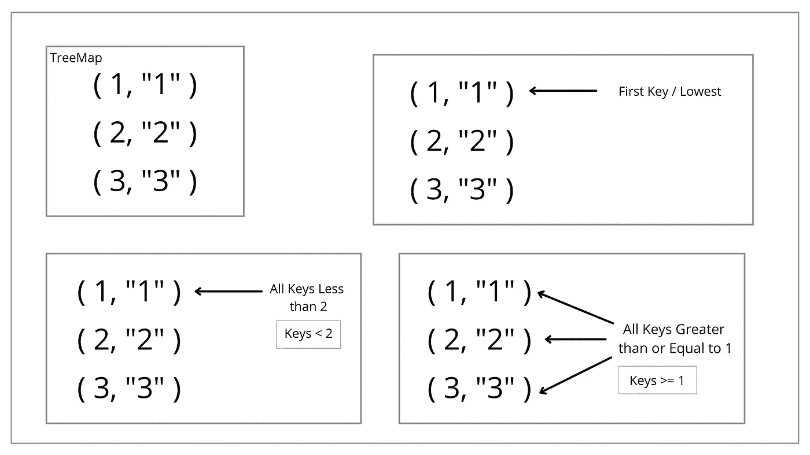
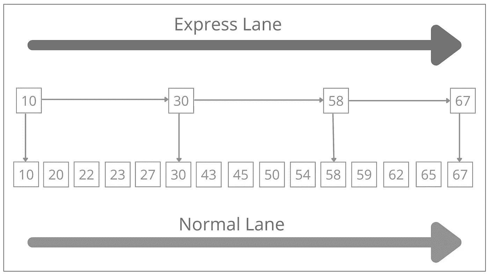

# 你可能忽略的 5 种数据结构

> 原文：<https://medium.com/geekculture/5-data-structures-you-may-have-overlooked-c8f2902059b8?source=collection_archive---------14----------------------->

Photo by [NEW DATA SERVICES](https://unsplash.com/@new_data_services?utm_source=medium&utm_medium=referral) on [Unsplash](https://unsplash.com?utm_source=medium&utm_medium=referral)

数据结构是您编写的任何程序的核心构建块，无论是前端、后端移动、游戏开发，还是您使用的任何技术堆栈。我喜欢把程序想象成数据+算法+数据结构。数据结构是至关重要的组成部分，最常见的是数组、树、图、地图和链表。在本文中，我将介绍您可能忽略的五种数据结构。

# 1.特里

Trie 是一种树形数据结构，其中节点存储字母表中的字母。它也被称为前缀树。使用这种数据结构，您可以遍历分支来搜索特定的单词或这些单词的前缀。您还可以根据数据在 Trie 中的插入方式来搜索后缀。这个数据结构有趣的地方在于，每个节点都可以有一个角色作为孩子。例如，如果我们有 230 个可用字符，那么对于 Trie 中的每个节点，我们可以有 230 个子节点。假设我们要在 Trie 中插入单词 cow、cats 和 Cobra。

如果我们想要插入单词“Cow ”,我们将首先创建 C 节点，因为它还不存在，然后我们将为 O 创建一个节点，它连接到 C，然后创建一个 W 节点，它连接到 O。

Photo by the Author

对于单词“Cat ”,我们已经为 C 创建了一个节点，这样，我们将立即转移到连接到 C 的 A 的节点，连接到 A 的 T 的节点，以及连接到 T 的 S 的节点。

Photo by the Author

对于单词“Cobra ”,我们将直接移动到 B，因为我们已经连接了前两个节点。在为 B 创建了连接到 O 的节点之后，我们可以为 R 创建一个连接到 B 的节点，然后为 A 创建一个连接到 R 的节点。

Photo by the Author

正如您所看到的，这种数据结构对于在其中存储各种各样的单词是有效的。它背后真正的力量是我们可以在里面搜索前缀。假设我们想要搜索“Cat”以查看它是否存在。我们将检查 C 是否存在。如果是，我们检查 A 是否存在，然后检查 t。如果一切都检查通过，返回值将是' true '。注意，插入单词和搜索单词都是 O(M)运算，其中 M 是单词的长度。

最常见的应用是自动完成。如果你在手机上输入文本信息，你可以弹出不同的选项来接近你想要输入的内容。类似地，另一个用途是拼写检查。如果我输入错误，Trie 可以推荐正确的单词给我使用。

# 2.不相交集

不相交的集合也称为联合查找。它将元素集跟踪成多个不相交的非重叠子集。我知道这听起来很复杂，但事实并非如此。你有两个主要功能，联合和查找。“联合”将两个子集合并成一个，然后“查找”将执行搜索以确定两个对象是否在同一子集中。假设我总共有三个子集，每个子集包含一组数字。

Photo by Author

每个子集都有一个父级，子集内的所有数字都指向那个特定的父级。

Photo by Author

我可以选择合并子集 0 和子集 1，使 0 和 1 成为一个子集。这是以一种高效的方式完成的，因为我们所要做的就是将子集 1 的父项更改为指向子集 0 的父项，现在子集 1 中的所有数字都已合并到子集 0 中。

Photo by the Author

我也可以决定检查两个数是否在同一个子集里。这是使用 Find 操作完成的。所有这些都是为了检查他们的父母是否相同。如果他们的父母最终是相同的，他们在同一个子集。

Photo by Author

这种数据结构用于 Kruskal 的最小生成树，并计算最少公共祖先。因为你并不真的需要知道 Kruskal 的最小生成树或者计算最小公共祖先，这种结构的最佳用例是解决一堆不同的面试问题。你见过的一些最常见的面试问题，如孤岛数量、朋友圈、无向图中连通分量的数量、帐户合并以及一系列其他问题都可以用不相交集合数据结构来解决。

# 3.树形图

树形图继承自散列表。不同之处在于，条目是按照键的顺序或您提供给构造函数的自定义比较类来排序的。如果我们试图将一个整数映射的条目存储到一个字符串中，那么你的 treemap 中的所有条目都将基于这个整数值按升序排序。在幕后，这种数据结构使用红黑树来有效地维护秩序。插入和查找的性能实际上是 O[log(N)]。

假设我在树形图中添加了以下条目。如果我要寻找第一个键，它是返回 1 的最低键，我也可以寻找所有小于一个数的键。所以，我可以寻找所有小于 2 的数字，然后返回并生成一个树。我也可以说，找出所有大于或等于 1 的键。这将返回我们在树形图中的所有条目。

Photo by the Author

这种数据结构非常适合执行查询，比如查找最大或最小的数字，或者查找小于或大于某个特定值的键。

# 4.Skiplist

跳过列表是在链表中搜索节点的一种更快的方法。在一个普通的链表中，如果你想让它搜索一个特定的节点，你必须搜索每一个节点，这将花费 O(N)时间，其中 N 是节点的数量。在跳转列表中，在普通链表的顶部有一个快速通道。所以，你有你的普通通道，它有到链表中每一个节点的所有连接，然后你的快速通道跳过一堆不同的节点。

假设我想在下图中搜索节点 45。

Photo by the Author

我将首先进入我的快速通道，它从节点 10 开始。这小于 45，所以我需要向前移动到节点 30。这样做的结果是，我跳过了正常通道中的一些节点。30 也小于 45，因此我将移动到大于 45 的节点 58。现在，我知道我需要在我的正常车道上从哪里开始搜索了。所以，从节点 30，我将移动到 43，然后 45。对于跳转列表，搜索、插入和删除都是 O[log(N)]。

你什么时候会用这个？如果我们在分布式环境中需要一个有序的线程安全数据结构。如果我们有一个平衡的树，我们需要在一个分布式环境中重新平衡它，在这个环境中，我们有许多不同的线程试图访问树中的内存，这就要求我们在树的很大一部分上有一个新的文本锁。这是非常低效的，因为当这棵树被重新平衡时，可能有树的大部分甚至没有被修改。然而，对于 skiplist，我们可以拥有与平衡树相同的功能，并且我们可以在每个节点上放置互斥体，因此，我们只需要锁定直接受影响的节点。

# 5.b 树

B 树是一种自平衡二叉树。在正常的二叉树中，如果树没有很好地平衡，我们有可能得到一个降级的树。我们可以在这个树里面有一堆节点，本质上就是一个链表。如果我们的树退化到这种程度，搜索、插入和删除就变成 O(N)。当一棵树被平衡时，它们变成 O[log(N)]。B 树将确保每次插入或删除发生时，我们的树总是平衡的。B 树中的每个节点都包含键，这些键只是节点中表示的数据。蜜蜂树的顺序是每个节点最多可以有多少个子节点。因此，对于一个节点中的每个键，我们可以有更多的节点作为我们的子节点，如果它们大于左边的键而小于右边的键。

您可能永远都不需要从头开始实现其中的一个。然而，B 树是大多数存储引擎的默认索引，尤其是 my SQL。就存储引擎而言，B 树背后的强大之处在于，您不必扫描所有数据来查找所需的行。

这就是你可能没听说过的五种数据结构。其中一些比其他的更容易理解。就像我说的，根据你的工作描述，你可能会在你的工作中使用结构化或者非结构化的数据。从这一点来看，如果你要从事软件开发，它们将会成为你生活的一部分。为了你的面试和工作流程，你必须理解它们。我希望这篇文章对你有用。