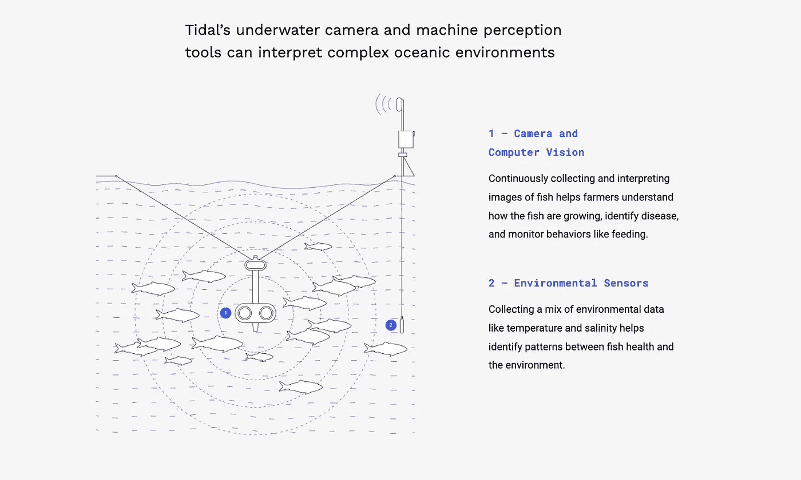
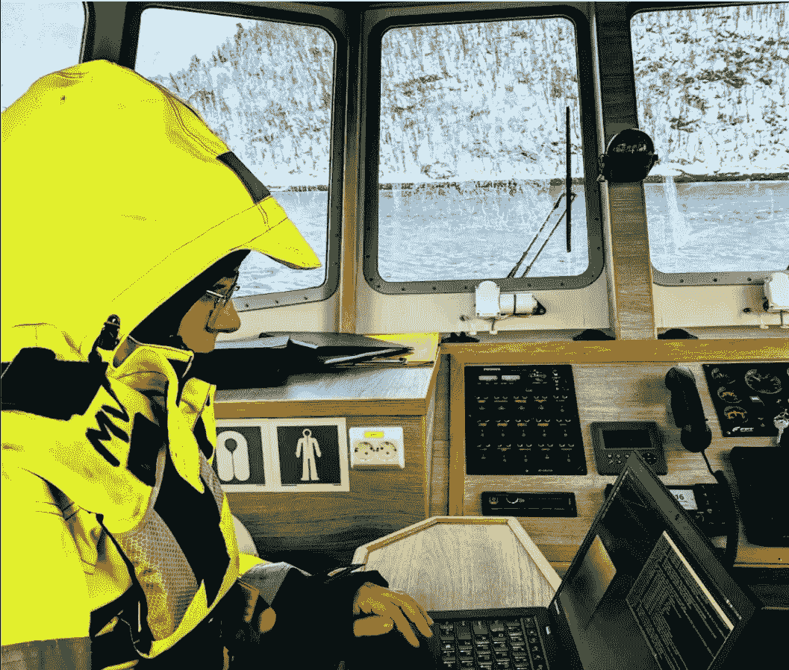
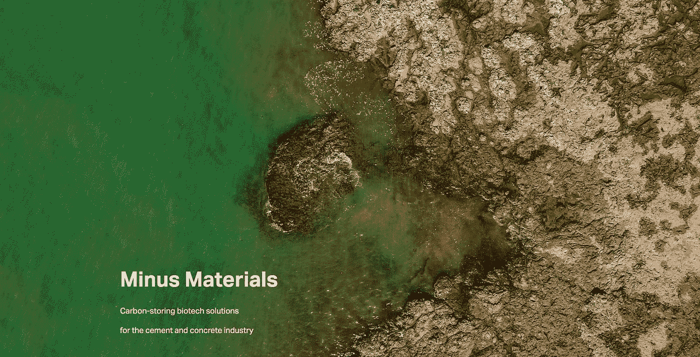
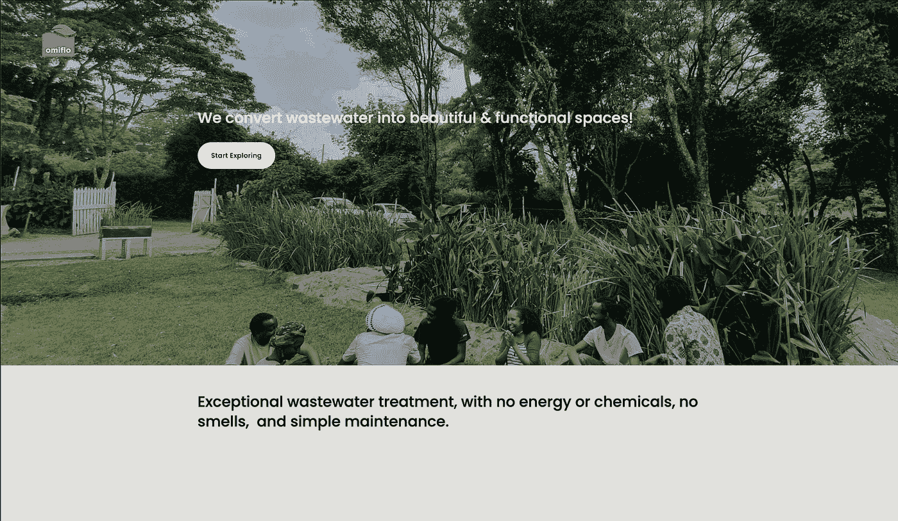
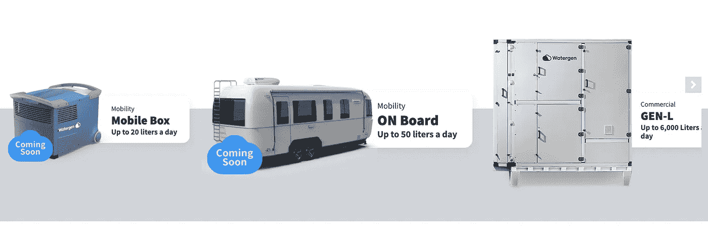
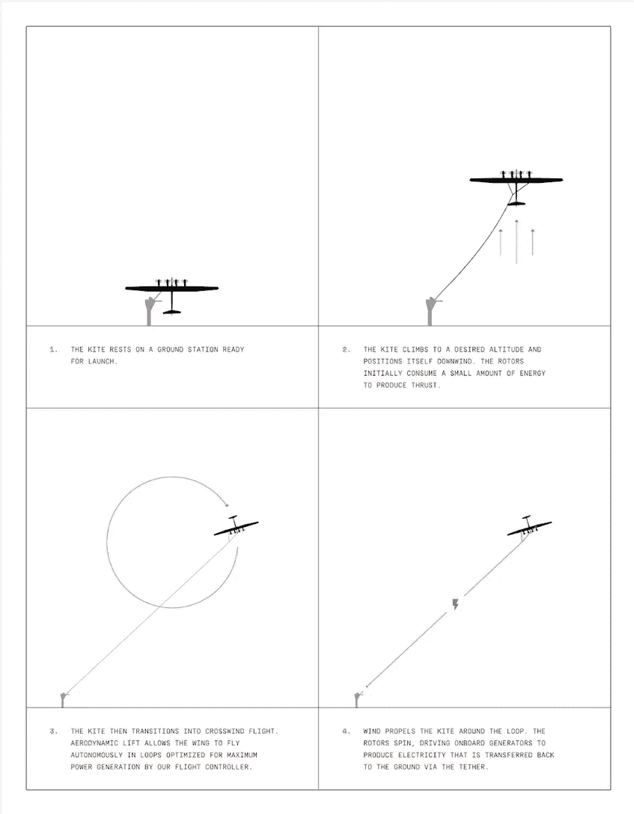

# 影响世界的 5 个设计

> 原文：<https://medium.com/geekculture/5-designs-that-impact-the-world-b8798c3c6e92?source=collection_archive---------15----------------------->

每天都有产品涌入全球市场，有些提供价值，有些是噱头或扔掉的东西。价值和影响在某些方面是主观的，对一个人有价值的东西可能不会引起另一个人的兴趣。

每天都有产品涌入全球市场，有些提供价值，有些是噱头或扔掉的东西。价值和影响在某些方面是主观的，对一个人有价值的东西可能不会引起另一个人的兴趣。然而，有一些设计，从开始到发布，唯一的目的是为一个利基或广泛的群体提供积极的影响。

这绝不是一个详尽的列表，而是 5 个我最喜欢的产品或设计，它们提供了真正的影响和价值

# [潮汐(X 的一部分)](https://x.company/projects/tidal/)

Tidal 是 Google X 公司的一部分，如果你不熟悉的话，X 是由多元化的发明家和企业家组成的，他们开发和推出技术，旨在改善数百万(如果不是数十亿)人的生活。这是一个相当大的任务，但如果你看看他们已经启动/正在启动的项目，他们的思路是正确的。

回到潮汐。Tidal 正在创造水下系统，让养鱼者更深入地了解水下的情况。他们使用相机、传感器和机器感知工具的组合，帮助我们了解海洋生态系统。*但是为什么这有帮助呢？*

嗯，我相信我们都知道，我们人类对我们的环境相当苛刻，从污染到不可持续的农业实践，在陆地和海洋上。根据联合国粮食及农业组织，30 亿人依赖海鲜作为主要的蛋白质来源。根据 Tidal 的说法，随着人口的增长，90%的野生鱼类资源已经枯竭，很明显我们需要对此做些什么。所以，总而言之，公平地说，保护海洋对我们来说很重要，潮汐正在帮助我们做到这一点。

> *用技术系统保护海洋，同时可持续地养活人类*

Tidal 的系统运行图和现场图

Tidal 的系统提供了重要的信息和持续的数据来源，以供学习和帮助了解生态系统，这使养鱼者能够了解他们的鱼的健康状况，并保护养鱼场免受害虫和污染的影响。这反过来又保护了环境，有助于保持可持续的食物来源。对我来说似乎很重要，如果这不是一个有影响力的设计，我不知道什么是。

# [减料](https://www.minusmaterials.com/) —微藻水泥

负材料已经创造了一种利用微藻生产碳中性硅酸盐水泥的方法。水泥行业约占全球排放量的 7%，是航空业的两倍。其排放如此之高的原因是水泥的制造方式。为了制造水泥，石灰石被加热，由于过程中发生的化学反应，会释放出大量的二氧化碳。

负材料公司发现，通过在水泥制造过程中使用藻类，他们可以捕获二氧化碳，同时缩短生产石灰石的时间。他们结合生物技术，工程和自然来种植负碳石灰石，大海藻！

他们能够制造的产品是波特兰水泥，这是行业标准，所以他们不仅能够制造出负碳水泥，还能制造出适合该行业的产品。这与清洁能源和碳捕获相结合，可以使水泥生产成为负碳生产。

你可以在这里查看负材料和快速公司[的一篇很棒的文章，在这里](https://www.fastcompany.com/90777102/this-starup-is-using-microalgae-to-make-carbon-neutral-cement)我发现了负材料并得到了一些信息，很值得一读。

# [奥米弗洛—废水处理](https://www.omiflo.com/)

奥米弗洛创造了水培水系统，将废水转化为美丽的绿色空间，无需使用能源或化学品。他们通过使用漂浮湿地来做到这一点，这些湿地通过根部自然地将氧气过滤到废水中。该系统不需要电力或化学物质，甚至不需要适当的园艺经验！这使得该系统对几乎任何人开放，因此他们可以在防止地面污染的同时创造美观的废水处理。

这对于没有废水处理设施的地区有着巨大的影响，并使其对那些想要一种美观和低影响的废水处理解决方案的人有用。

你可以点击查看 Omiflo

# [水创](https://www.watergen.com/)

水元素从空气中制造饮用水。简直是凭空而来。他们创造了一个利用空气中的湿度生产饮用水的系统，解决了全球饮用水日益枯竭的问题。该系统不需要复杂和过时的基础设施，并消除了地下水泵的需要和污染源的担忧。这意味着它们可以随时部署在任何地点，从农村到办公室。

这对那些饮用水有限的人以及未来的每一个人都有巨大的影响。随着不确定性围绕着我们的每一个方向，这样的创新在未来可能会被证明是至关重要的，不会太引人注目。

# 马卡尼 —荣誉奖(我的最爱)

荣誉奖，也是我最感兴趣和印象最深的一个——Makani 是 Google X 公司的另一个项目。他们用风筝来利用风能创造可再生能源。这是我最喜欢的设计之一，不仅因为它看起来很酷，而且它的应用很有效，是可再生能源领域的新事物。

> Makani 旨在通过开发能源风筝，使世界上更多的人能够获得清洁、负担得起的风能。能源风筝是一种空中风能技术，使用拴在地面站的翅膀，有效地利用风能。

你可以看到下图显示了它是如何工作的

Makami 的风筝是如何工作的图形和一个在行动中

不幸的是，2020 年，马卡尼的旅程走到了尽头。然而，本着积极而有影响力的设计精神，该团队创建并发布了“能量风筝收藏”资源组合，包括:

*   技术报告
*   Makani 的整个航空电子设备、飞行控制和[模拟代码库](https://github.com/google/makani)
*   [M600 原型机每次侧风飞行的飞行日志](https://console.cloud.google.com/marketplace/product/bigquery-public-datasets/makani-logs)
*   [技术视频](https://www.youtube.com/playlist?list=PL7og_3Jqea4VRCZmMNK4LDH64sYgkLZzv)
*   由国家可再生能源实验室开发的模拟工具 KiteFAST
*   最令人难以置信的是，Makani 的全球专利组合的免费使用的[非断言承诺](https://storage.googleapis.com/x-prod.appspot.com/files/Makani%20Non-Assertion%20Pledge.pdf)。

这意味着空中风力开发人员、研究人员、航空航天专家和工程学生可以使用这些材料来学习或开发新的空中项目。基本上圣诞节提前到来了。Makani 是一个有积极影响的设计，并且由于开源信息，它将继续这样做

你可以在这里查看[项目](https://x.company/projects/makani/)，它值得一读，团队还制作了一部[纪录片](https://www.youtube.com/watch?v=qd_hEja6bzE)。

如果你喜欢(或讨厌)这个，请告诉我，请在[www.goodripple.co.uk](http://www.goodripple.co.uk)分享和订阅更多类似的内容

在[推特](https://twitter.com/picklesandpints)上关注我