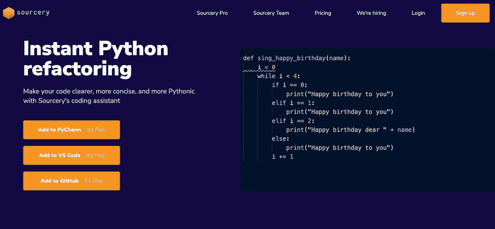
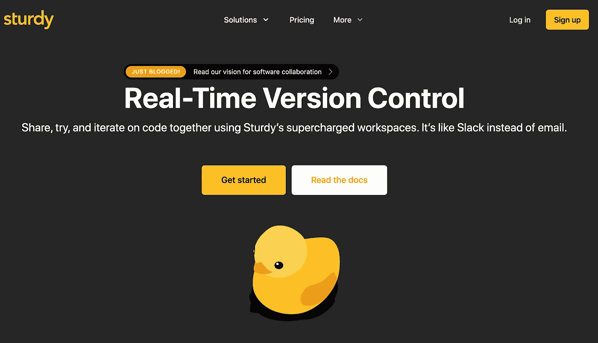
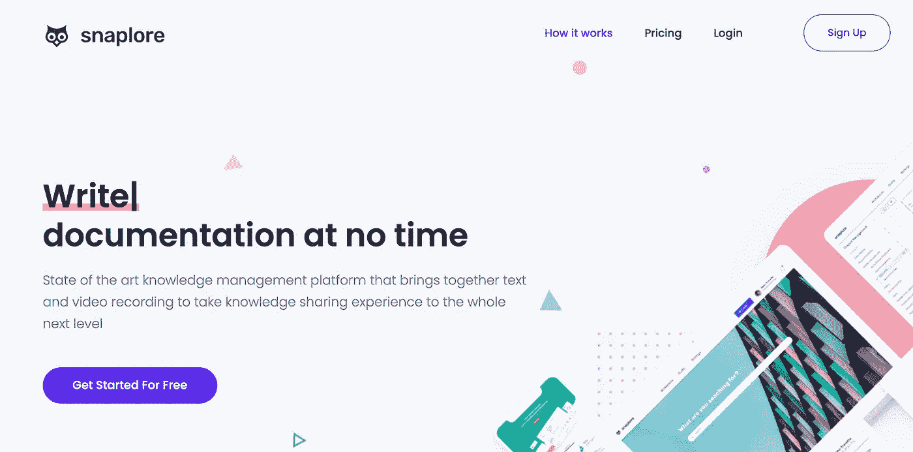
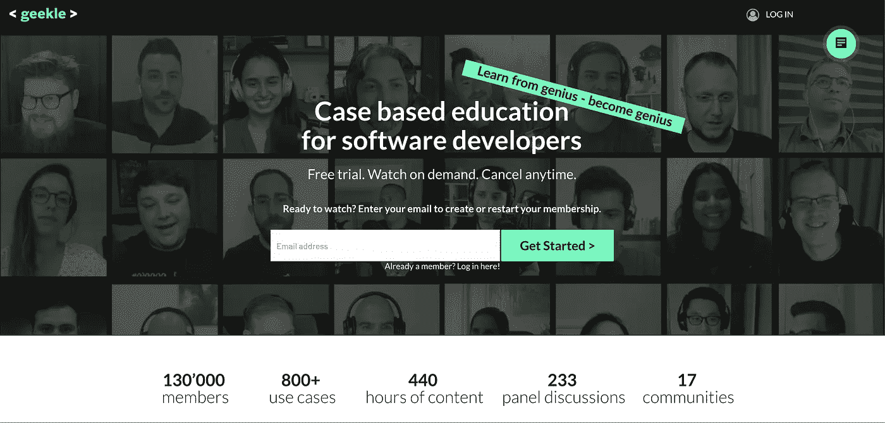
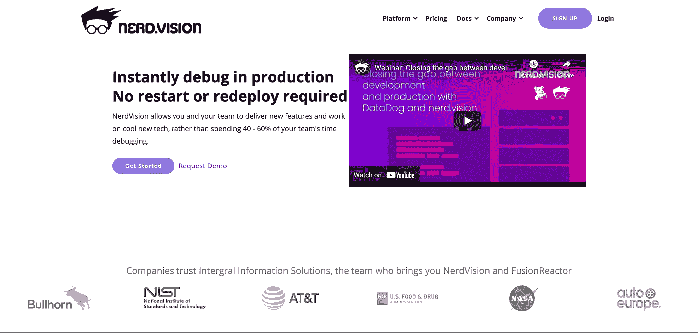

# 2021 年网络峰会上的 5 家面向开发者的创业公司

> 原文：<https://medium.com/geekculture/5-developer-oriented-startups-at-web-summit-2021-2782ac4c281e?source=collection_archive---------25----------------------->

## 开发者创业公司

## 今年在里斯本的网络峰会上，我与各种各样的初创公司进行了交谈，试图找到那些通过开发有助于提高生产力的软件来关注开发者快乐的公司

**快速补充说明**:我与这些公司没有任何关系，他们没有给我任何报酬，也没有以任何方式影响我…但是一杯免费的啤酒很有帮助，只是说…

## 1) [资源库](https://sourcery.ai)——基于人工智能的代码审查和重构

[https://sourcery.ai/](https://sourcery.ai/)

> 我们通过自动审查和重构您的代码来帮助开发人员尽最大努力。更干净的代码意味着更快的开发。

用 AI 帮助开发者写出更好、更干净的代码似乎是趋势。甚至 Github 也推出了自己版本的现场代码建议，名为 Github Copilot。

虽然 Copilot 更多的是自动完成代码，产生令人捧腹的结果，但 Sourcery 会查看您刚刚编写的代码，并给出如何改进它的建议。

听起来很酷，对吧…坏消息呢？该产品是 Alpha 版本，仅适用于 Python。我们这些 Javascript 爱好者必须再等一会儿，直到我们可以在我们最喜欢的 ide 中进行测试。

## 2) [坚固的](https://getsturdy.com) —实时版本控制和协作工具

[https://getsturdy.com/](https://getsturdy.com/)

> 使用 Sturdy 的超级工作空间，共享、尝试和迭代代码

远程工作正慢慢成为常态，公司要么完全远程化，要么采用混合模式。不管怎样，在线合作比以往任何时候都更加重要。

我们周围的一切都在加速，所以谁能说代码审查的未来会是什么样子。对于一些希望尽快将功能投入生产的公司来说，等待几天/几个小时的公关反馈可能太多了。

Sturdy 正试图用一个基于 web 的实时代码审查/配对编程工具来解决这个问题，该工具可以与任何 git 版本控制软件集成，或者使用 Sturdy 自己的版本控制系统。

## 3) [Snaplore](https://snaplore.com) —可视化文档工具

[https://snaplore.com/](https://snaplore.com/)

> 以对话的速度重塑知识分享体验。少写，多分享。

我们都知道写文档不是一件容易的工作。你必须把自己放在用户的位置上，去掉所有的上下文，试着写一些容易理解，更重要的是容易使用的东西。

Snaplore 就像 Canva for documentation，他们的软件让你可以构建一个易于使用的可视化演示，展示你的功能或你的端点，以及如何将它们集成到你的应用中。

## 4) [<极客>](https://geekle.us) —在线学习平台

[https://geekle.us/library](https://geekle.us/library)

> 哈佛风格的基于案例的软件开发人员教育平台。

对于我所在的行业，我非常欣赏的一点是我们拥有大量的学习资源。从书籍、文章到在线学习平台，教你如何用你能想到的每一种编程语言构建任何东西。

是什么让< GEEKLE >与众不同？他们有展示大型软件公司真实案例的音轨。你可以学习像网飞这样的公司如何解决你在日常工作中可能遇到的具体问题。

在我们的职业中，不断学习是必须的，还有谁比我们行业的巨头们更值得学习呢？

## 5) [神经视觉](https://nerd.vision) —可观测平台

[https://www.nerd.vision/](https://www.nerd.vision/)

> NerdVision 是一个现代化的调试和可观察性平台，结合了自主错误检测、生产调试和动态日志记录。

我们在软件开发行业的一个保证就是我们的代码会崩溃。

我们可以想写多少测试就写多少，尽可能多的测试它，但是在一天结束的时候，在狂野不羁的生产世界中，用户会做一些与你的软件不一致的事情。

也许他正在使用一个你甚至没有听说过的浏览器，更不用说测试了，所以我们必须测量生产中发生的一切，并持续观察不完美之处。

NerdVision 集成到您的代码库中，并报告所有故障，甚至还能让您实时调试产品。

网络峰会很有趣，气氛很好，看到所有这些创业公司都在可持续发展/人工智能/医疗保健/隐私等领域工作，令人耳目一新，这让我对未来和行业发展方向感到非常乐观。

Photo by [Nick Fewings](https://unsplash.com/@jannerboy62?utm_source=medium&utm_medium=referral) on [Unsplash](https://unsplash.com?utm_source=medium&utm_medium=referral)

作为一名软件工程师，你通常不会与其他人进行太多的互动，尤其是我们行业泡沫之外的其他人，这种类型的会议迫使你走出自己的舒适区，学习新的东西，探索新的小工具或软件，听取你可能同意或不同意的其他意见。

令人耳目一新的是，看到所有这些工程师都有勇气走出去，实现他们的想法，并在众多观众面前展示出来。就我个人而言，它给了我这样一种冲动，去编码，去创造一些新的东西，去给我正在工作的所有产品带来一层额外的关怀，谁知道呢，也许明年我会在一个小摊位前尝试向你解释我的创业想法。