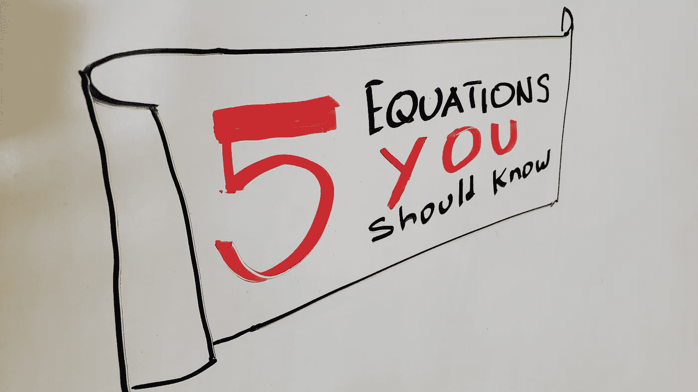

# 开发产品或服务时你应该知道的 5 个等式

> 原文：<https://medium.com/geekculture/5-equations-you-should-know-when-developing-products-or-services-429affd26ae2?source=collection_archive---------21----------------------->

下面的等式是我不时遇到的奇闻，也许你也见过。这篇文章的目的是将它们整合在一个简洁的小包装中，以便能够提醒自己它们的存在并与你分享。希望你能在日常工作中运用它们。

## 等式 1 -团队=产品