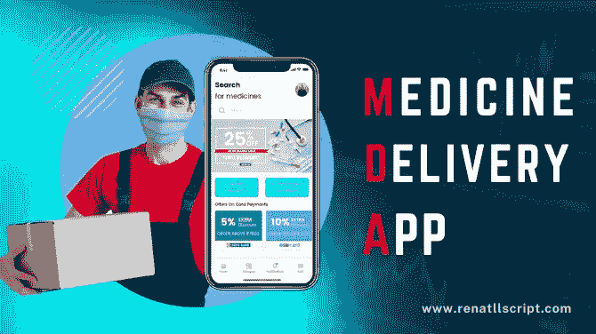

# 影响药品配送应用开发成本的 5 个因素？

> 原文：<https://medium.com/geekculture/5-factors-impacting-the-cost-to-develop-a-medicine-delivery-app-15b3bfdfb4a2?source=collection_archive---------23----------------------->

Medicine delivery app

随着科技的日新月异，人们的生活变得越来越容易和舒适。人们现在可以在自己舒适的家中在线订购商品。这些订单在指定的时间范围内送货上门。类似地，按需送药应用程序通过将所需药物送到家门口，让人们的生活变得更加轻松。

此外，运行这些应用的公司发现了一种利用统计数据和大数据满足用户需求的好方法。它们产生了巨大的利润，越来越多的人开始涉足电子商务网站和应用程序。另一方面，没有对整体成本和所需投资的估计，按需应用程序开发就无法开始。

因此，本文将带您了解开发按需送药应用程序的成本。

# 影响在线送药应用开发成本的因素

由于需求上升，大多数药店或经销商正在开发药品配送应用程序，以在线提供他们的产品。如果希望您创建自己的送药应用程序，您应该记住以下几点。

## 您的药房配送应用程序的特性和功能

创建按需送药应用程序的成本由应用程序中包含的特性和功能决定。因此，整合能够满足受众需求的功能对你来说变得至关重要。因此，这里有一些你应该在应用中包含的重要特性:

*   咨询:该功能允许用户通过与医生联系来收集更多关于健康问题、药物等的信息。
*   多语言:在应用程序中包含多种语言是非常重要的，因此用户可以访问他们喜欢的语言。
*   实验室搜索:该功能允许用户找到他们所在位置附近的实验室以寻求医疗帮助。
*   上传处方:这将允许用户上传处方，以购买他们所需的药物。
*   云存储:该功能允许用户访问商店数据、以前的订单和将来的交货细节。

## 应用程序开发公司的声誉

当你与一个声誉良好的药物输送应用程序开发合作时，应用程序开发的成本可能会降低。该公司可以处理所有的基本方面，让你以固定的价格创建一个应用程序，让它对你来说更具成本效益。确保检查类似的应用程序开发或更多他们的投资组合。

## 药房配送应用的开发平台

一旦你决定了要在应用中包含的特性和规格，你就需要选择应用将要部署的开发平台。如果你希望你的应用程序在 Android 和 iOS 平台上都可用，你将不得不进行跨平台或原生应用程序开发。

## 启动应用程序的位置

位置是决定构建一个应用程序成本的另一个重要方面。项目开发人员、设计人员和其他开发团队成员的位置取决于您选择构建医药应用程序的位置，这对开发成本有很大影响。一个应用程序需要项目经理、QA 测试人员、图形设计人员、开发人员、UI/UX 设计人员以及其他人员。

所以，要时刻关注你的移动应用会在哪里开发，你的团队在哪里。

## 创建应用程序所需的时间

构建药房交付应用程序所需的时间对您的投资有很大影响。因此，建立一个有能力管理开发过程的团队对你来说会更划算和容易。

# 开发按需送药 app 需要多少钱？

如上所述，构建按需送药应用的成本由许多不同的因素决定。总体而言，开发一款送药应用的成本将在 1 万美元至 5 万美元之间。也可以超过 5 万美元。这也取决于您选择在应用程序中包含的附加应用程序功能。

因此，大多数初创公司更喜欢现成的应用解决方案，以便在几天内构建他们的应用。一个 [**现成的送药 app 开发**](https://www.rentallscript.com/uber-for-medicine-delivery-app-development/) 的主要优势是一个 100%可定制、高性价比的解决方案。

## 结论

此外，药品配送应用程序的开发成本受到未来营销成本、维护和更新的影响。因此，在开始开发之前，请确保一切正常。你也可以雇一个专家为你做评估，以防止以后出现问题。